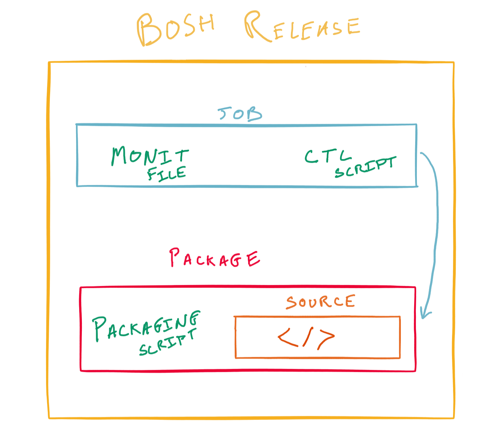

## Goal

Deploying software systems with BOSH is done with BOSH Releases. Releases abstract code away from the underlying OS and create a specific packing structure all software systems must adhere to. Lets explore what a BOSH Release is by using a very simple release that prints log messages.

## Prerequisites

1. Obtain your workshop jumpbox public IP, Username, and Password 

## Exploring the BOSH Releases

1. Utilize your SSH Client to connect to your jumpbox.

  - `ssh username@jumpbox-ip`

1. Download the [sample-bosh-release](https://github.com/Oskoss/bosh-release) using `wget` - You might already have this from [Upload Stemcell]()

  - `wget https://github.com/Oskoss/bosh-release/releases/download/v1.1/sample_release.tgz`

1. Make a temporary folder to extract the BOSH release into using `tar` and extract it

  - `mkdir sample_release`
  - `tar -xvf sample_release.tgz -C sample_release/`

1. Change directory and extract both the `jobs` and `packages` tarballs under the `sample_release` folder.

  - `cd sample_release/jobs`
  - `tar -xvf sample_job.tgz`
  - `cd sample_release/packages`
  - `tar -xvf sample_app.tgz`

##  Notice a few things

1. The application we are running is a simple bash script which prints to `STDOUT`.

    **cat sample_release/packages/sample_app/app**

            #!/bin/bash
            while true
            do
            	echo "Sample APP STDOUT!!!"
            	sleep 1
            done

1. The application source code is located under the packages directory.

  `ls packages/sample_app/*`

1. The `sample_app` package itself needs to be installed. This is what the `packaging` script is for.

1. Since this release only has a bash script which does not require compilation we will just copy the script into the compiled code location allow us to use later.

    **cat sample_release/packages/packaging**

            set -e -x

            cp -a sample_app/* ${BOSH_INSTALL_TARGET}

1. The application is controlled via the `sample_job`, specifically the `ctl.erb` template which can start and stop the application.

    **cat sample_release/jobs/templates/ctl.erb**

            #!/bin/bash

            RUN_DIR=/var/vcap/sys/run/sample_job
            LOG_DIR=/var/vcap/sys/log/sample_job
            PIDFILE=${RUN_DIR}/pid

            case $1 in

              start)
                mkdir -p $RUN_DIR $LOG_DIR
                chown -R vcap:vcap $RUN_DIR $LOG_DIR

                echo $$ > $PIDFILE

                cd /var/vcap/packages/sample_app

                  exec ./app \
                  >>  $LOG_DIR/sample_app.stdout.log \
                  2>> $LOG_DIR/sample_app.stderr.log

                ;;

              stop)
                kill -9 `cat $PIDFILE`
                rm -f $PIDFILE

                ;;

              *)
                echo "Usage: ctl {start|stop}" ;;

            esac

1.  The script is of the `erb` format, this allows us to add variables such as `<%= properties.web_ui.port %>` that BOSH can interpolate when deploying the job. In this case we have no variables.

1. In order for BOSH to monitor the health of our running job it utilizes [monit](https://en.wikipedia.org/wiki/Monit).

1. To configure monit for our process we create a `monit` file that explains what `processid` corresponds to our application we are asking to be monitored and how to `start`/`stop` the application.

    **cat sample_release/jobs/monit**

            check process sample_app
            with pidfile /var/vcap/sys/run/sample_job/pid
            start program "/var/vcap/jobs/sample_job/bin/ctl start"
            stop program "/var/vcap/jobs/sample_job/bin/ctl stop"
            group vcap

1. That's it! You have now seen all the parts of a full BOSH release! Take a moment to look at the following diagram and see if you understand how all parts of a BOSH release interact together.

