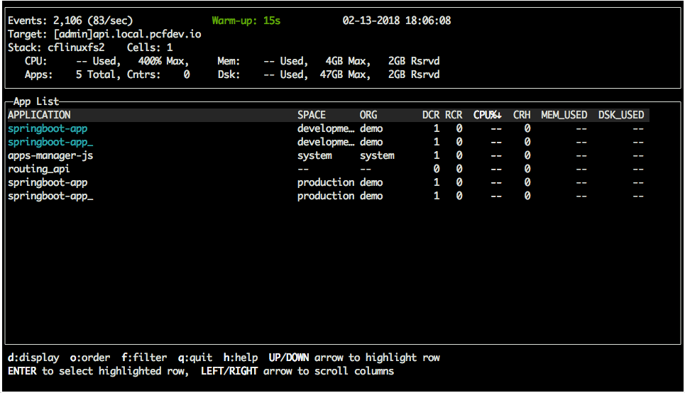

#  Our First Application Deployment

### Prerequisites

1. Golang - v1.9+
2. Cloud Foundry CLI - v6.29+
3. PCF Dev -  v.28+ for local demo. Or, you can target any CF environment

### Getting Started with "paap" command line interface

1. Make sure your GOPATH is set properly (It is best to set in your profile)
```
    export GOPATH=[YOUR_GOLANG_PATH]
    export PATH=$PATH:$GOPATH/bin
```

2. Install "paap" golang package

```
    mkdir $GOPATH/src 
    cd $GOPATH/src
    git clone https://github.com/Pivotal-Field-Engineering/paap
    go get gopkg.in/urfave/cli.v1
    go install paap
```

3. Make sure you set the following ENVIRONMENT VARIABLES. The settings below are defaults
for PCF Dev, except for **CF_REFRESH_TOKEN**. You can obtain this token 
here: <https://network.pivotal.io/users/dashboard/edit-profile>. 


```
    export CF_USER=admin
    export CF_PASS=admin
    export CF_API=https://api.local.pcfdev.io
    export CF_ORG=demo
    export CF_SPACE=development
    export CF_REFRESH_TOKEN=[API-TOKEN]
 ```

4. Test "paap" cli

```
    paap help
```

The display should look like this:

```
    ----------------------------------------------------------------------
    jtwgator% paap help
    NAME:
       paap - A new cli application
    
    USAGE:
       paap [global options] command [command options] [arguments...]
    
    VERSION:
       0.0.1
    
    DESCRIPTION:
       Demo CLI for cloud ops
    
    COMMANDS:
         help, h  Shows a list of commands or help for one command
       Buildpack Demo:
         login               login to cloud foundry using env vars for api, username, password
         create-lob          create pre-defined org with 2 spaces and small quotas
         deploy-app          deploy application to the 'development' or 'production' space based on $CF_SPACE env variable
         run-smoketest       HTTP GET smoke test that runs until error and loops every 3 seconds
         install-plugins     Install 'buildpack-usage', 'do-all' and 'top' cf plugins
         upgrade-middleware  upgrade to java v4.8 buildpack and restage all apps in $CF_SPACE
         teardown            delete pre-defined org including spaces and applications
    
    GLOBAL OPTIONS:
       --help, -h     show help
       --version, -v  print the version
```

### Extend cf command line interface with plugins

Install "do-all", "buildpack-usage", and "top" CF-Community plugins. These plugins make 
the cf CLI more powerful.

```
    paap install-plugins
```

The output should include these plugins:

```
    Listing installed plugins...
    
    plugin            version   command name           command help
    bg-restage        1.0.0     bg-restage             Perform a zero-downtime restage of an application over the top of an old one
    buildpack-usage   1.0.4     buildpack-usage        Show all apps using a given buildpack
    do-all            1.1.2     do-all                 Run the identified command on every app in a space. If the app name is a parameter in the command, use '{}'
```

### Create LOB(Line of Business) tenant, also known as "org"

1. Open a new console tab and source "development" environment variables

```
    cd ./paap
    source env_development
```

2. Login to Cloud Foundry 

```
    paap login
```

The display should look like this:
```
    COMMAND: cf login -a $CF_API -u $CF_USER -p $CF_PASS --skip-ssl-validation
    
    API endpoint: https://api.local.pcfdev.io
    Authenticating...
    OK
    
    Select an org (or press enter to skip):
    1. pcfdev-org
    2. system
    
    Org>
    
    
    API endpoint:   https://api.local.pcfdev.io (API version: 2.82.0)
    User:           admin
    No org or space targeted, use 'cf target -o ORG -s SPACE'
    
    ----------------------------------------------------------------------
```

3. Create Line of Business(LOB) tenant

```
    paap create-lob
```

The display should look like this:

```
    ----------------------------------------------------------------------
    COMMAND: cf org demo
    
    Getting info for org demo as admin...
    
    name:                 demo
    domains:              local.pcfdev.io, tcp.local.pcfdev.io
    quota:                small-org
    spaces:               development, production
    isolation segments:
    
    ----------------------------------------------------------------------
    COMMAND: cf quota small-org
    
    Getting quota small-org info as admin...
    OK
    
    Total Memory           10G
    Instance Memory        unlimited
    Routes                 100
    Services               0
    Paid service plans     disallowed
    App instance limit     10
    Reserved Route Ports   0
    
    ----------------------------------------------------------------------
```

### Deploy Spring Boot application to "development" and "production"

1. In "development" console tab 

```
    paap deploy-app
```

This command will run for a couple minutes. If deploy is successful:

```
    App started
    
    
    OK
    
    App springboot-app_ was started using this command `CALCULATED_MEMORY=$($PWD/.java-buildpack/open_jdk_jre/bin/java-buildpack-memory-calculator-2.0.2_RELEASE -memorySizes=metaspace:64m..,stack:228k.. -memoryWeights=heap:65,metaspace:10,native:15,stack:10 -memoryInitials=heap:100%,metaspace:100% -stackThreads=10 -totMemory=$MEMORY_LIMIT) && JAVA_OPTS="-Djava.io.tmpdir=$TMPDIR -XX:OnOutOfMemoryError=$PWD/.java-buildpack/open_jdk_jre/bin/killjava.sh $CALCULATED_MEMORY -Djavax.net.ssl.trustStore=$PWD/.java-buildpack/container_certificate_trust_store/truststore.jks -Djavax.net.ssl.trustStorePassword=java-buildpack-trust-store-password" && SERVER_PORT=$PORT eval exec $PWD/.java-buildpack/open_jdk_jre/bin/java $JAVA_OPTS -cp $PWD/. org.springframework.boot.loader.WarLauncher`
    
    Showing health and status for app springboot-app_ in org demo / space development as admin...
    OK
    
    requested state: started
    instances: 1/1
    usage: 384M x 1 instances
    urls: springboot-app-development.local.pcfdev.io
    last uploaded: Tue Feb 13 05:39:53 UTC 2018
    stack: cflinuxfs2
    buildpack: container-certificate-trust-store=2.0.0_RELEASE container-customizer=1.1.0_RELEASE java-buildpack=v3.13-offline-https://github.com/cloudfoundry/java-buildpack.git#03b493f java-main open-jdk-like-jre=1.8.0_121 open-jdk-like-memory-calculator=2.0.2_RELEA...
    
         state     since                    cpu      memory           disk           details
    #0   running   2018-02-13 12:40:54 AM   122.5%   212.6M of 384M   137M of 512M
    
    ----------------------------------------------------------------------
```

Notice the buildpack version is **v3.13**. Later, we will upgrade this middleware version to **v4.8**.

2. Open a new console tab and start a "development" environment smoke test

```
    paap run-smoketest
```

You should see a new response line every 3 seconds:

```
    {"response":"1.8.0_121"}
    {"response":"1.8.0_121"}
    {"response":"1.8.0_121"}
    {"response":"1.8.0_121"}
```

3. Open a new console tab and source "production" environment variables

```
    source env_production
    paap deploy-app
```

Notice the buildpack version is **v3.13**. Later, we will **NOT** upgrade this middleware version to **v4.8**.

```
    App started
    
    
    OK
    
    App springboot-app_ was started using this command `CALCULATED_MEMORY=$($PWD/.java-buildpack/open_jdk_jre/bin/java-buildpack-memory-calculator-2.0.2_RELEASE -memorySizes=metaspace:64m..,stack:228k.. -memoryWeights=heap:65,metaspace:10,native:15,stack:10 -memoryInitials=heap:100%,metaspace:100% -stackThreads=10 -totMemory=$MEMORY_LIMIT) && JAVA_OPTS="-Djava.io.tmpdir=$TMPDIR -XX:OnOutOfMemoryError=$PWD/.java-buildpack/open_jdk_jre/bin/killjava.sh $CALCULATED_MEMORY -Djavax.net.ssl.trustStore=$PWD/.java-buildpack/container_certificate_trust_store/truststore.jks -Djavax.net.ssl.trustStorePassword=java-buildpack-trust-store-password" && SERVER_PORT=$PORT eval exec $PWD/.java-buildpack/open_jdk_jre/bin/java $JAVA_OPTS -cp $PWD/. org.springframework.boot.loader.WarLauncher`
    
    Showing health and status for app springboot-app_ in org demo / space production as admin...
    OK
    
    requested state: started
    instances: 1/1
    usage: 384M x 1 instances
    urls: springboot-app.local.pcfdev.io
    last uploaded: Tue Feb 13 05:45:57 UTC 2018
    stack: cflinuxfs2
    buildpack: container-certificate-trust-store=2.0.0_RELEASE container-customizer=1.1.0_RELEASE java-buildpack=v3.13-offline-https://github.com/cloudfoundry/java-buildpack.git#03b493f java-main open-jdk-like-jre=1.8.0_121 open-jdk-like-memory-calculator=2.0.2_RELEA...
    
         state     since                    cpu      memory           disk           details
    #0   running   2018-02-13 12:47:12 AM   119.3%   250.1M of 384M   137M of 512M
    
    ----------------------------------------------------------------------

```

4. Run "top" command on the org

```
    cf top
```

   


5. Run buildpacks commands
```
    cf buildpacks
```

```
    Getting buildpacks...
    
    buildpack               position   enabled   locked   filename
    java_buildpack          1          true      false    java-buildpack-offline-v3.13.zip
    ruby_buildpack          2          true      false    ruby_buildpack-cached-v1.6.37.zip
    nodejs_buildpack        3          true      false    nodejs_buildpack-cached-v1.5.32.zip
    go_buildpack            4          true      false    go_buildpack-cached-v1.8.1.zip
    python_buildpack        5          true      false    python_buildpack-cached-v1.5.18.zip
    php_buildpack           6          true      false    php_buildpack-cached-v4.3.31.zip
    staticfile_buildpack    7          true      false    staticfile_buildpack-cached-v1.4.5.zip
    binary_buildpack        8          true      false    binary_buildpack-cached-v1.0.11.zip
    dotnet-core_buildpack   9          true      false    dotnet-core_buildpack-cached-v1.0.15.zip
```

Let's see which apps are using the **java_buildpack**

```
    cf buildpack-usage -b java_buildpack 
```

```
    Checking which apps use buildpack java_buildpack ...
    
    OK
    
    org    space         application
    demo   development   springboot-app
    demo   development   springboot-app_
    demo   production    springboot-app
    demo   production    springboot-app_
```

Notice all of our app instances in this org that use the **java_buildpack**