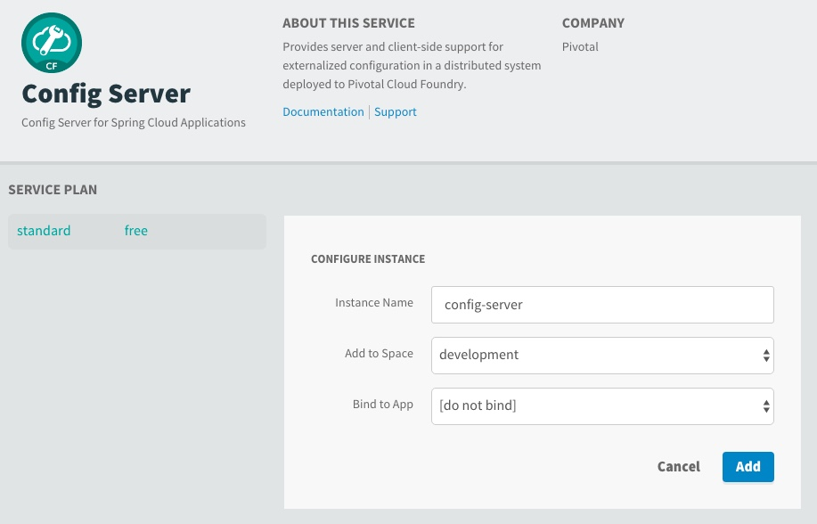
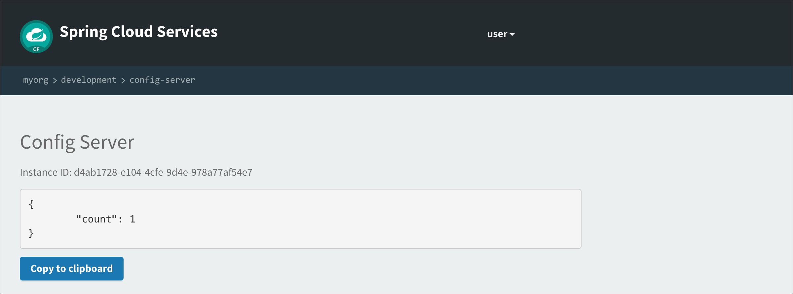

# Adding Spring Cloud Config to Boot Application

In this lab we'll utilize Spring Boot and Spring Cloud to configure our application from a configuration dynamically retrieved from a Git repository. We'll then deploy it to Pivotal Cloud Foundry and auto-provision an instance of a configuration server using Pivotal Spring Cloud Services.

## Update _Hello_ REST service

These features are added by adding _spring-cloud-services-starter-config-client_ to the classpath.  

* Lets Add a few changes to our pom.xml file. First Up , update the properties to include the spring cloud version.

```xml
	<properties>
		<java.version>1.8</java.version>
		<spring-cloud.version>Greenwich.SR1</spring-cloud.version>
	</properties>
```
* Add  a Dependency management section as  below

```xml
    <dependencyManagement>
        <dependencies>
            <dependency>
                <groupId>org.springframework.cloud</groupId>
                <artifactId>spring-cloud-dependencies</artifactId>
                <version>${spring-cloud.version}</version>
                <type>pom</type>
                <scope>import</scope>
            </dependency>
        </dependencies>
    </dependencyManagement>
```

* Next , add the spring-cloud-starter-config dependency.

```xml
    <dependencies>
        <dependency>
            <groupId>org.springframework.boot</groupId>
            <artifactId>spring-boot-starter-web</artifactId>
        </dependency>
        <dependency>
            <groupId>org.springframework.data</groupId>
            <artifactId>spring-data-rest-hal-browser</artifactId>
        </dependency>
        <dependency>
            <groupId>org.springframework.boot</groupId>
            <artifactId>spring-boot-starter-data-rest</artifactId>
        </dependency>
        <dependency>
            <groupId>org.springframework.boot</groupId>
            <artifactId>spring-boot-starter-hateoas</artifactId>
        </dependency>
        <dependency>
            <groupId>com.h2database</groupId>
            <artifactId>h2</artifactId>
            <scope>runtime</scope>
        </dependency>
        <dependency>
            <groupId>org.flywaydb</groupId>
            <artifactId>flyway-core</artifactId>
            <version>5.2.4</version>
        </dependency>
        <dependency>
            <groupId>com.zaxxer</groupId>
            <artifactId>HikariCP</artifactId>
            <version>3.3.0</version>
        </dependency>

        <dependency>
            <groupId>org.projectlombok</groupId>
            <artifactId>lombok</artifactId>
            <optional>true</optional>
        </dependency>
        <dependency>
            <groupId>org.springframework.boot</groupId>
            <artifactId>spring-boot-starter-test</artifactId>
            <scope>test</scope>
        </dependency>
        <dependency>
            <groupId>org.springframework.boot</groupId>
            <artifactId>spring-boot-starter-data-jpa</artifactId>
        </dependency>
        <dependency>
            <groupId>org.springframework.boot</groupId>
            <artifactId>spring-boot-starter-actuator</artifactId>
        </dependency>
        <dependency>
            <groupId>io.pivotal.spring.cloud</groupId>
            <artifactId>spring-cloud-services-starter-config-client</artifactId>
            <version>2.1.1.RELEASE</version>
        </dependency>
        <dependency>
            <groupId>org.springframework.cloud</groupId>
            <artifactId>spring-cloud-context</artifactId>
            <version>2.1.1.RELEASE</version>
        </dependency>

        <dependency>
            <groupId>org.springframework.security</groupId>
            <artifactId>spring-security-config</artifactId>
        </dependency>
    </dependencies>
```
* Updated pom file should look as below

```xml
<?xml version="1.0" encoding="UTF-8"?>
<project xmlns="http://maven.apache.org/POM/4.0.0" xmlns:xsi="http://www.w3.org/2001/XMLSchema-instance"
	xsi:schemaLocation="http://maven.apache.org/POM/4.0.0 http://maven.apache.org/xsd/maven-4.0.0.xsd">
	<modelVersion>4.0.0</modelVersion>
	<parent>
		<groupId>org.springframework.boot</groupId>
		<artifactId>spring-boot-starter-parent</artifactId>
		<version>2.1.3.RELEASE</version>
		<relativePath/> <!-- lookup parent from repository -->
	</parent>
	<groupId>io.pivotal</groupId>
	<artifactId>cloud-native-spring</artifactId>
	<version>0.0.1-SNAPSHOT</version>
	<name>cloud-native-spring</name>
	<description>Demo project for Spring Boot</description>

	<properties>
		<java.version>1.8</java.version>
		<spring-cloud.version>Greenwich.SR1</spring-cloud.version>
	</properties>

	<dependencies>
		<dependency>
			<groupId>org.springframework.boot</groupId>
			<artifactId>spring-boot-starter-web</artifactId>
		</dependency>
		<dependency>
			<groupId>org.springframework.data</groupId>
			<artifactId>spring-data-rest-hal-browser</artifactId>
		</dependency>
		<dependency>
			<groupId>org.springframework.boot</groupId>
			<artifactId>spring-boot-starter-data-rest</artifactId>
		</dependency>
		<dependency>
			<groupId>org.springframework.boot</groupId>
			<artifactId>spring-boot-starter-hateoas</artifactId>
		</dependency>
		<dependency>
			<groupId>com.h2database</groupId>
			<artifactId>h2</artifactId>
			<scope>runtime</scope>
		</dependency>
		<dependency>
			<groupId>org.flywaydb</groupId>
			<artifactId>flyway-core</artifactId>
			<version>5.2.4</version>
		</dependency>
		<dependency>
			<groupId>com.zaxxer</groupId>
			<artifactId>HikariCP</artifactId>
			<version>3.3.0</version>
		</dependency>

		<dependency>
			<groupId>org.projectlombok</groupId>
			<artifactId>lombok</artifactId>
			<optional>true</optional>
		</dependency>
		<dependency>
			<groupId>org.springframework.boot</groupId>
			<artifactId>spring-boot-starter-test</artifactId>
			<scope>test</scope>
		</dependency>
		<dependency>
			<groupId>org.springframework.boot</groupId>
			<artifactId>spring-boot-starter-data-jpa</artifactId>
		</dependency>
		<dependency>
			<groupId>org.springframework.boot</groupId>
			<artifactId>spring-boot-starter-actuator</artifactId>
		</dependency>
		<dependency>
			<groupId>io.pivotal.spring.cloud</groupId>
			<artifactId>spring-cloud-services-starter-config-client</artifactId>
		</dependency>
		<dependency>
			<groupId>org.springframework.cloud</groupId>
			<artifactId>spring-cloud-context</artifactId>
		</dependency>

	</dependencies>
	<dependencyManagement>
		<dependencies>
			<dependency>
				<groupId>org.springframework.cloud</groupId>
				<artifactId>spring-cloud-dependencies</artifactId>
				<version>${spring-cloud.version}</version>
				<type>pom</type>
				<scope>import</scope>
			</dependency>
		</dependencies>
	</dependencyManagement>

	<build>
		<plugins>
			<plugin>
				<groupId>org.springframework.boot</groupId>
				<artifactId>spring-boot-maven-plugin</artifactId>
			</plugin>
			<plugin>
				<groupId>pl.project13.maven</groupId>
				<artifactId>git-commit-id-plugin</artifactId>
			</plugin>
		</plugins>
	</build>

	<pluginRepositories>
		<pluginRepository>
			<id>sonatype-snapshots</id>
			<name>Sonatype Snapshots</name>
			<url>"https://oss.sonatype.org/content/repositories/snapshots/"</url>
		</pluginRepository>
	</pluginRepositories>
</project>
```
* Add an _@Value_ annotation, private field, and update the existing _@GetMapping_ annotated method to employ it in _io.pivotal.controller.GreetingController_ (/cloud-native-spring/src/main/java/io/pivotal/controller/GreetingController.java):

```java
    @Value("${greeting:Hola}")
    private String greeting;

    @GetMapping("/hello")
    public String hello() {
        return String.join(" ", greeting, "World!");
    }
```

* Add a [@RefreshScope](https://cloud.spring.io/spring-cloud-static/spring-cloud-commons/2.1.0.RELEASE/single/spring-cloud-commons.html#refresh-scope) annotation to the top of the _GreetingController_ class declaration

```java
@RefreshScope
@RestController
public class GreetingController {
```

Completed:

```java
package io.pivotal.controller;

import org.springframework.web.bind.annotation.RestController;
import org.springframework.web.bind.annotation.GetMapping;
import org.springframework.beans.factory.annotation.Value;
import org.springframework.cloud.context.config.annotation.RefreshScope;

@RefreshScope
@RestController
public class GreetingController {

    @Value("${greeting:Hola}")
    private String greeting;

    @GetMapping("/hello")
    public String hello() {
        return String.join(" ", greeting, "World!");
    }

}
```

* When we introduced the Spring Cloud Services Starter Config Client dependency Spring Security will also be included at runtime (Config servers will be protected by OAuth2).  However, this will also enable basic authentication to all our service endpoints.  We will need to add the following to conditionally open security (to ease local workstation deployment).

In **pom.xml**, we'll need to add a dependency

```xml
		<dependency>
			<groupId>org.springframework.security</groupId>
			<artifactId>spring-security-config</artifactId>
		</dependency>
```
In **cloud-native-spring/src/main/java/io/pivotal/CloudNativeSpringApplication.java** right underneath the `public static void main` method implementation, add

```java
	@Order(105)
    @Profile("!cloud")
    @Configuration
	static class ApplicationSecurityOverride extends WebSecurityConfigurerAdapter {

    	@Override
    	public void configure(HttpSecurity web) throws Exception {
			web.authorizeRequests().antMatchers("/**").permitAll();
    	}
	}
```
Examine this [Spring Boot reference](https://docs.spring.io/spring-boot/docs/2.1.3.RELEASE/reference/htmlsingle/#boot-features-security-mvc) for further details. (Note: the @Profile annotation above will be activated when the cloud_native_spring application is deployed to PAS because the cloud profile is activated by default).

* Another thing we'll have to allow is for bean definitions to be overridden.  Add this line indented exactly two-spaces underneath `spring:` in **cloud-native-spring/src/main/resources/application.yml**

```yaml
  main:
    allow-bean-definition-overriding: true
```

* We'll also want to give our Spring Boot App a name so that it can lookup application-specific configuration from the config server later.  Add the following configuration to */cloud-native-spring/src/main/resources/bootstrap.yml*. (You'll need to create this file.)

```yml
spring:
  application:
    name: cloud-native-spring
```

## Run the _cloud-native-spring_ Application and verify dynamic config is working

* Run the application

<details>
	<summary>gradle</summary>
	```
	gradle clean bootRun
	```
</details>

<details>
	<summary>maven</summary>
	```
	mvn clean spring-boot:run
	```
</details>

<br>

* Browse to http://localhost:8080/hello and verify you now see your new greeting.

* Stop the _cloud-native-spring_ application

## Create Spring Cloud Config Server instance

* Now that our application is ready to read its config from a Cloud Config server, we need to deploy one!  This can be done through Cloud Foundry using the services Marketplace.  Browse to the Marketplace in Pivotal Cloud Foundry Apps Manager, navigate to the Space you have been using to push your app, and select Config Server:


* In the resulting details page, select the _trial_, single tenant plan.  Name the instance *config-server*, select the Space that you've been using to push all your applications.  At this time you don't need to select an application to bind to the service:



* After we create the service instance you'll be redirected to your _Space_ landing page that lists your apps and services.  The config server is deployed on-demand and will take a few moments to deploy.  Once the messsage _The Service Instance is Initializing_ disappears click on the service you provisioned.  Select the Manage link towards the top of the resulting screen to view the instance id and a JSON document with a single element, count, which validates that the instance provisioned correctly:



* We now need to update the service instance with our GIT repository information.

Create a file named `config-server.json` and update its contents to be:

```json
{
  "git": {
    "uri": "https://github.com/honnuanand/app-config"
  }
}
```
Note: If you choose to replace the value of `"uri"` above with another Git repository that you have commit privileges to, you should make a copy of the *cloud-native-spring.yml* file. Then, as you update configuration in that file, you can test a POST request to the *cloud-native-spring* application's **/refresh** end-point to see the new configuration take effect without restarting the application!

Using the Cloud Foundry CLI execute the following update service command:

```bash
cf update-service config-server -c config-server.json
```

* Refresh you Config Server management page and you will see the following message.  Wait until the screen refreshes and the service is reintialized:


* We will now bind our application to our config-server within our Cloud Foundry deployment manifest.  Add these entries to the bottom of */cloud-native-spring/manifest.yml*

```yaml
  services:
  - config-server
```
Complete:

```yaml
---
applications:
- name: cloud-native-spring
  host: cloud-native-spring-${random-word}
  memory: 1024M
  instances: 1
  path: ./target/cloud-native-spring-1.0-SNAPSHOT-exec.jar
  buildpacks:
  - java_buildpack_offline
  stack: cflinuxfs3
  timeout: 180
  env:
    JAVA_OPTS: -Djava.security.egd=file:///dev/urandom
  services:
  - config-server
```

## Deploy and test application

* Build the application

```bash
mvn clean package
```
. Push application into Cloud Foundry

```bash
cf push
```

* Test your application by navigating to the **/hello** endpoint of the application.  You should now see a greeting that is read from the Cloud Config Server!

Ohai World!

*What just happened??*

-> A Spring component within the Spring Cloud Starter Config Client module called a _service connector_ automatically detected that there was a Cloud Config service bound into the application.  The service connector configured the application automatically to connect to the Cloud Config Server and downloaded the configuration and wired it into the application

* If you navigate to the Git repo we specified for our configuration, https://github.com/pacphi/config-repo, you'll see a file named _cloud-native-spring.yml_.  This filename is the same as our _spring.application.name_ value for our Boot application.  The configuration is read from this file, in our case the following property:

```yaml
greeting: Ohai
```
* Next we'll learn how to register our service with a Service Registry and load balance requests using Spring Cloud components.
