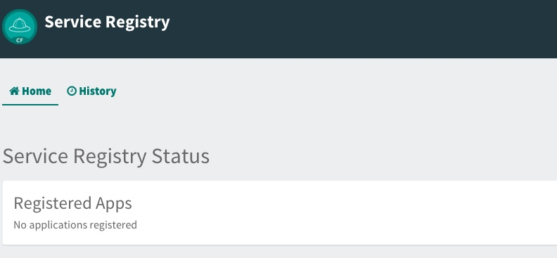
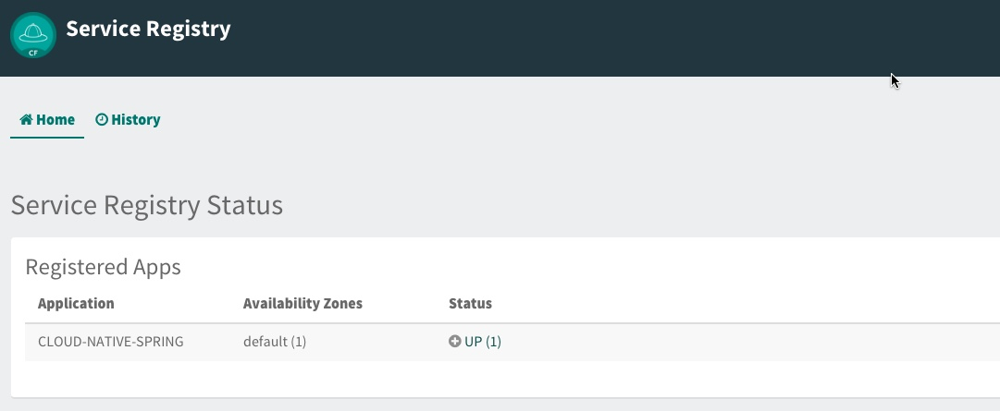

# Adding Service Registration and Discovery with Spring Cloud

In this lab we'll utilize Spring Boot and Spring Cloud to configure our application register itself with a Service Registry.  To do this we'll also need to provision an instance of a Eureka service registry using Pivotal Cloud Foundry Spring Cloud Services.  We'll also add a simple client application that looks up our application from the service registry and makes requests to our Cities service.

## Update _Cloud-Native-Spring_ Boot Application to Register with Eureka

* These features are added by adding _spring-cloud-services-starter-service-registry_ to the classpath. Open your Gradle build file, found here: */cloud-native-spring/build.gradle*. Add the following spring cloud services dependency:

```groovy
dependencies {
	// add this dependency
	implementation('io.pivotal.spring.cloud:spring-cloud-services-starter-service-registry')
}
```

* Thanks to Spring Cloud instructing your application to register with Eureka is as simple as adding a single annotation to your app! Add an _@EnableDiscoveryClient_ annotation to the class _io.pivotal.CloudNativeSpringApplication_ (/cloud-native-spring/src/main/java/io/pivotal/CloudNativeApplication.java):

```java
@SpringBootApplication
@EnableDiscoveryClient
public class CloudNativeSpringApplication {
```

## Create Spring Cloud Service Registry instance and deploy application

* Now that our application is ready to registr with an Eureka instance, we need to deploy one!  This can be done through Cloud Foundry using the services Marketplace.  Previously we did this through the Marketplace UI. This time around we will use the Cloud Foundry CLI:

```bash
cf create-service p-service-registry trial service-registry
```

* After you create the service registry instance navigate to your Cloud Foundry space in the Apps Manager UI and refresh the page.  You should now see the newly create Service Registry instance.  Select the Manage link to view the registry dashboard.  Note that there are not any registered applications at the moment:



* We will now bind our application to our service-registry within our Cloud Foundry deployment manifest.  Add an additional reference to the service at the bottom of */cloud-native-spring/manifest.yml* in the services list:

```yaml
  services:
  - config-server
  - service-registry
```

## Deploy and test application

* Build the application

```bash
gradle build
```

* Push application into Cloud Foundry

```bash
cf push
```

* If we now test our application URLs we will notice no significatnt changes.  However, if we view the Service Registry dashboard (accessible from the _Manage_ link in Apps Manager) you will see that a service named cloud-native-spring has registered:



* Next we'll create a simple UI application that will read from the Service Registry to discover the location of our cities REST service and connect.


## Create another Spring Boot Project as a Client UI

As in Lab 1 we will start with a project that has most of what we need to get going.

* Open a Terminal (e.g., _cmd_ or _bash_ shell)

* Change the working directory to be _devops-workshop/labs/my_work/cloud-native-spring-ui_
```bash
  cd /devops-workshop/labs/my_work/cloud-native-spring-ui
```
* Open this project in your editor/IDE of choice.

*_STS Import Help_*

Select _File > Import…_. In the susequent dialog choose _Gradle > Existing Gradle Project_ then click the _Next_ button. In the _Import Gradle Project_ dialog browse to the _cloud-native-spring_ directory (e.g. _devops-workshop/labs/my_work/cloud-native-spring-ui_) then click the _Open_ button, then click the _Finish_ button.

* As before, we need to add _spring-cloud-services-starter-service-registry_ and some collaborating dependencies to the classpath.  Add this to your _build.gradle_:

```groovy
dependencies {
	// add these dependencies
	implementation('io.pivotal.spring.cloud:spring-cloud-services-starter-service-registry')
	implementation('org.springframework.cloud:spring-cloud-starter-openfeign')
	implementation('org.springframework.cloud:spring-cloud-starter-netflix-ribbon')
	implementation('org.hibernate:hibernate-core:5.4.1.Final')
}

```
* Next, we're going to add some annotations to enable service discovery and hypermedia support.  In addition, we're going to embed configuration and implementation for handling marshalling/unmarshalling of http://stateless.co/hal_specification.html[hal+json].
Finally, we'll override security behavior just as we did in  `cloud-native-spring`, adding exceptions for static resources provided by Vaadin.

* Open *cloud-native-spring-ui/src/main/java/io/pivotal/CloudNativeSpringUiApplication.java* for editing and make sure the contents look like so

```java
@SpringBootApplication
@EnableDiscoveryClient
@EnableFeignClients
@EnableHypermediaSupport(type = EnableHypermediaSupport.HypermediaType.HAL)
public class CloudNativeSpringUiApplication {

    public static void main(String[] args) {
        SpringApplication.run(CloudNativeSpringUiApplication.class, args);
    }

    @Configuration
    static class ClientConfig implements WebMvcConfigurer {

        @Autowired
        private HalHttpMessageConverter halHttpMessageConverter;

        @Override
        public void configureMessageConverters(List<HttpMessageConverter<?>> converters) {
            converters.add(halHttpMessageConverter);
        }
    }

	@Configuration
	static class ApplicationSecurityOverride extends WebSecurityConfigurerAdapter {

    @Override
    public void configure(HttpSecurity web) throws Exception {
      web.csrf().disable();
      web.authorizeRequests().antMatchers("/**").permitAll();
    }

		@Override
    	public void configure(WebSecurity web) throws Exception {
			  web.ignoring().antMatchers(
          // Vaadin Flow static resources
          "/VAADIN/**",

          // the standard favicon URI
          "/favicon.ico",

          // the robots exclusion standard
          "/robots.txt",

          // web application manifest
          "/manifest.webmanifest",
          "/sw.js",
          "/offline-page.html",

          // (development mode) static resources
          "/frontend/**",

          // (development mode) webjars
          "/webjars/**",

          // (production mode) static resources
          "/frontend-es5/**", "/frontend-es6/**");
    	}
	}

}
```

Don't forget to adjust the imports!

* Since this UI is going to consume REST services it's an awesome opportunity to use Feign.  Feign will handle *ALL* the work of invoking our services and marshalling/unmarshalling JSON into domain objects.  We'll add a Feign Client interface into our app.  Take note of how Feign references the downstream service; it's only the name of the service it will lookup from Eureka Service Registry.  Create a new interface that resides in the same package as _CloudNativeSpringUiApplication_:

```java
package io.pivotal;

import org.springframework.cloud.openfeign.FeignClient;
import org.springframework.hateoas.Resources;
import org.springframework.web.bind.annotation.DeleteMapping;
import org.springframework.web.bind.annotation.GetMapping;
import org.springframework.web.bind.annotation.PathVariable;
import org.springframework.web.bind.annotation.PostMapping;
import org.springframework.web.bind.annotation.PutMapping;
import org.springframework.web.bind.annotation.RequestBody;
import org.springframework.web.bind.annotation.RequestParam;

import io.pivotal.domain.City;

@FeignClient(name = "https://cloud-native-spring")
public interface CityClient {

  @GetMapping(value = "/cities")
  Resources<City> findAll(@RequestParam("page") int page, @RequestParam("size") int limit);

  @PostMapping(value = "/cities")
  City add(@RequestBody City company);

  @PutMapping(value = "/cities/{id}")
  City update(@PathVariable("id") Long id, @RequestBody City city);

  @DeleteMapping(value = "/cities/{id}")
  void delete(@PathVariable("id") Long id);
}
```

* Next we'll create a https://vaadin.com/docs/flow/Overview.html[Vaadin Flow] UI for rendering our data.  The point of this workshop isn't to go into detail on creating UIs; for now suffice to say that Vaadin is a great tool for quickly creating User Interfaces.  Our UI will consume our Feign client we just created.  Create the class _io.pivotal.AppUi_ (/cloud-native-spring-ui/src/main/java/io/pivotal/AppUi.java) and into it paste the following code:

```java
package io.pivotal;

import java.util.Collection;
import java.util.Collections;

import javax.annotation.PostConstruct;

import com.vaadin.flow.component.html.H2;
import com.vaadin.flow.component.orderedlayout.VerticalLayout;
import com.vaadin.flow.router.Route;
import com.vaadin.flow.server.PWA;
import com.vaadin.flow.theme.Theme;
import com.vaadin.flow.theme.material.Material;

import org.springframework.beans.factory.annotation.Autowired;
import org.springframework.hateoas.Resources;
import org.vaadin.crudui.crud.impl.GridCrud;

import io.pivotal.domain.City;
import lombok.extern.slf4j.Slf4j;

@Slf4j
@Route(value = "")
@Theme(Material.class)
@PWA(name = "Cities UI, Vaadin Flow with Spring", shortName = "Cities UI")
public class CitiesUI extends VerticalLayout {

    private static final long serialVersionUID = 1L;

    private final CityClient client;
    private final GridCrud<City> crud;

    @Autowired
    public CitiesUI(CityClient client) {
        this.client = client;
        this.crud = new GridCrud<>(City.class);
    }

    @PostConstruct
    protected void init() {
        H2 title = new H2("Cities");
        crud.getGrid().setColumns("id", "name", "county", "stateCode", "postalCode", "latitude", "longitude");
        crud.getCrudFormFactory().setVisibleProperties("name", "county", "stateCode", "postalCode", "latitude", "longitude");
        crud.getCrudFormFactory().setUseBeanValidation(true);
        crud.setFindAllOperation(this::getCities);
        crud.setAddOperation(this::addCity);
        crud.setUpdateOperation(this::updateCity);
        crud.setDeleteOperation(this::deleteCity);
        add(title, crud);
        setSizeFull();
    }

    private Collection<City> getCities() {
        Resources<City> resources = client.findAll(0, 500);
        Collection<City> cities = Collections.emptyList();
        if (resources != null) {
            log.trace(resources.toString());
            cities = resources.getContent();
            log.debug("Fetched {} cities.", cities.size());
            if (!cities.isEmpty()) {
                crud.getGrid().setHeightByRows(true);
            }
        }
        return cities;
    }

    private City addCity(City city) {
        log.trace("City to be added is {}", city.toString());
        return client.add(city);
    }

    private City updateCity(City city) {
        log.trace("City to be updated is {}", city.toString());
        return client.update(city.getId(), city);
    }

    private void deleteCity(City city) {
        log.trace("City to be deleted", city.toString());
        client.delete(city.getId());
    }
}
```

* We'll also want to give our UI App a name so that it can register properly with Eureka and potentially use cloud config in the future.  Add the following configuration to */cloud-native-spring-ui/src/main/resources/bootstrap.yml*:

```yaml
spring:
  application:
    name: cloud-native-spring-ui
```

## Deploy and test application

* Build the application.  We have to skip the tests otherwise we may fail because of having 2 spring boot apps on the classpath

```bash
gradle build -x test
```

-> Note that we're skipping tests here (because we now have a dependency on a running instance of _cloud-native-spring_).

* Create an application manifest in the root folder /cloud-native-spring-ui

```bash
touch manifest.yml
```

* Add application metadata

```yaml
---
applications:
- name: cloud-native-spring-ui
  memory: 1024M
  random-route: true
  instances: 1
  path: ./build/libs/cloud-native-spring-ui-1.0-SNAPSHOT.jar
  buildpacks:
  - java_buildpack_offline
  stack: cflinuxfs3
  timeout: 180 # to give time for the data to import
  env:
    JAVA_OPTS: -Djava.security.egd=file:///dev/urandom
  services:
  - service-registry
```

* Push application into Cloud Foundry

```bash
cf push
```

* Test your application by navigating to the `/` endpoint, which will invoke the Vaadin UI.  You should now see a table listing the first set of rows returned from the cities microservice:


* From a commandline stop the cloud-native-spring microservice (the original City service, not the new UI)

```bash
cf stop cloud-native-spring
```

* Refresh the UI app.

*What happens?*

Now you get a nasty error that is not very user friendly!

-> Next we'll learn how to make our UI Application more resilient in the case that our downstream services are unavailable.
