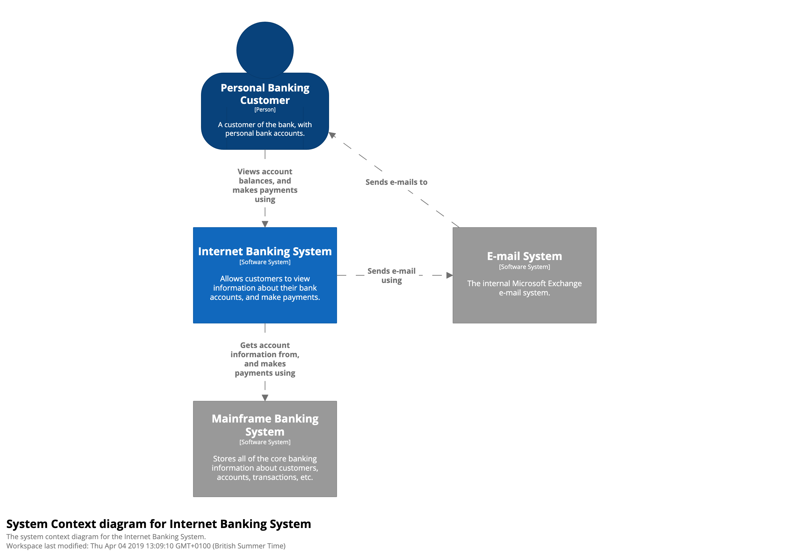

# State Map
We are going to whiteboard your current state application architecture. Time permitting,
we will also delve into Future and Transition state architecture.

## C4 Model
The [C4 model](https://c4model.com/) was created as a way to help software development teams 
describe and communicate software architecture, both during up-front 
design sessions and when retrospectively documenting an existing codebase. It's a way to create maps of your code, at various levels of detail, in the same way you would use something like Google Maps to zoom in and out of an area you are interested in.

For this session, we recommend staying in level 1 and level 2. 
We will draw System and Container diagrams on the whiteboard to get
a high level view of your overarching systems and key containers.

### Abstractions

### System

### Container

**Below are a list of subject areas that are of interest**

## Programming Platform

1. Languages
1. Frameworks
1. Development Tools
1. Build Tools

## Data / Integration

1. Database 
1. Messaging 
1. Event Sourcing
1. Caching / Data Grid 
1. Integration patterns

## Runtime Platforms

1. Application Runtimes
1. Noteworthy runtime dependencies 
1. Software/Hardware Load Balancers
1. Service Mesh Technologies 

## Release Management 

1. Continuous Integration Tools
1. Continuous Deployment Tools
1. Human workflow
1. Release variants - blue/green, canary, rollbacks...

## Security

1. Vulnerability Detection/Reporting
1. Network Security
1. CVE Patch Management
