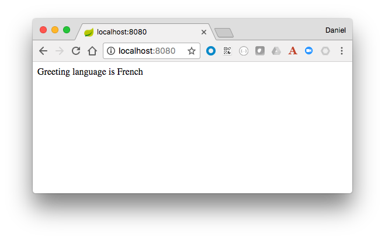
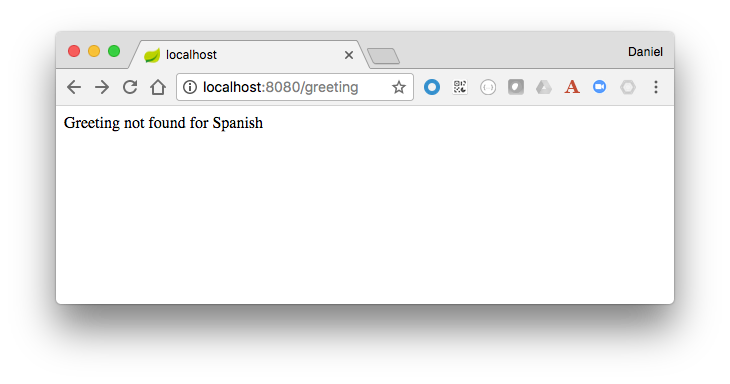
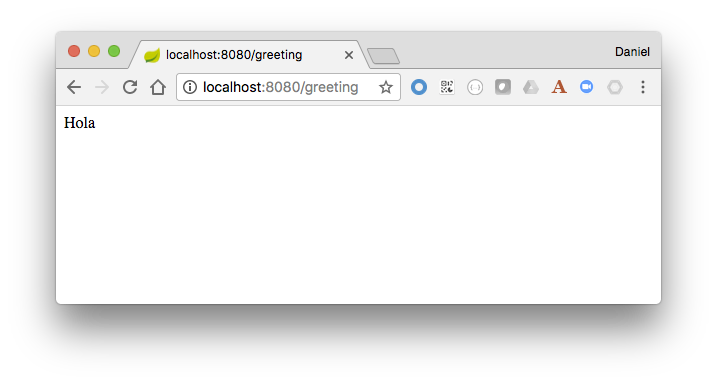
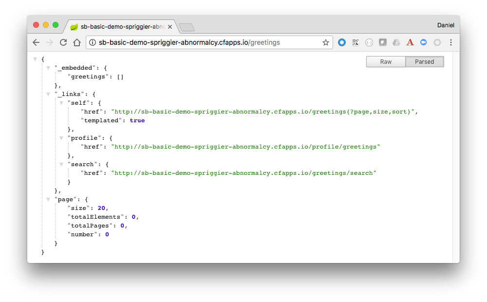
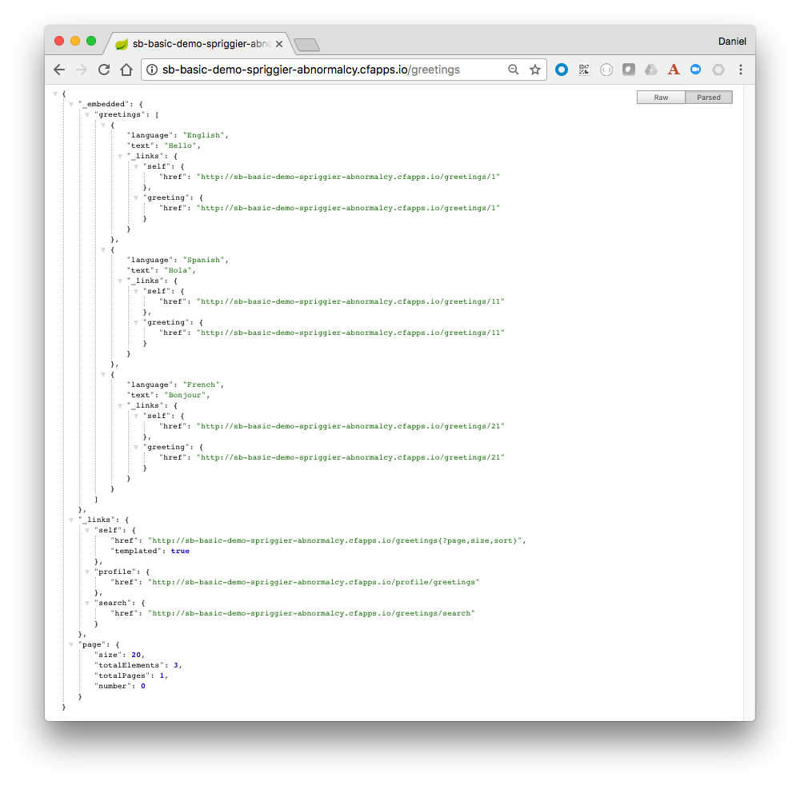

Creating a Basic Spring Boot application
========================================

The purpose of this workshop is to introduce some basic features of
Spring Boot via a code demo/tour.

1. Open a terminal and clone workshop demo github repo: <https://github.com/Pivotal-Field-Engineering/pace-cnd-java>

1. Change to the "cloud-native-development" folder

```
    cd ./cloud-native-development
```

1.  Navigate to <http://start.spring.io/>, and provide a general
    overview of the site. Be sure to mention the following:

    -   Point out the site can generate Maven or Gradle projects.

    -   It’s possible to create shell projects for Java and other
        languages.

    -   Click on the *Show Version* link to display the full set of
        available options, directing attention to the numerous
        dependencies available.
        
    -   Make sure audience is aware that the demo project we cloned was created with <http://start.spring.io/>. 

1.  Open the `pom.xml` file, and draw attention to the included
    dependencies, relating them back to the ones selected in the
    Initializer.

1.  Open the **SBController** class and explain the code. 
    
1.  Open the **SbBasicDemoApplicationTests** and explain the code.

1.  Open the `src/main/resources/application.yml` file and explain the configuration.

1.  Run the application from the IDE, navigate to
    <http://localhost:8080>.

    

1.  From the IDE, right-click on the `SbBasicDemoApplicationTests` class
    and run it as a J-Unit test. The test should pass.

2.  Demonstrate building and running from the command line. Emphasize
    the fact that an executable JAR is created, that can be run as a
    Java app from the command line.

    ```
    mvn clean package
    .
    .
    .
 
    GREETINGLANGUAGE=English java -jar target/cloud-native-development-0.0.1-SNAPSHOT.jar
    ```

Properties and Profiles
=======================

1.  Demonstrate how you can override property values in a Spring Boot
    application using environment variable settings.

    From the command line, override the `greetingLanguage` property by
    setting the `GREETINGLANGUAGE` environment variable to `Spanish`.

    ```
    GREETINGLANGUAGE=Spanish java -jar target/cloud-native-development-0.0.1-SNAPSHOT.jar
    ```

    Emphasize the fact that this ability to override property values with 
    environment variables will be important when we later deploy our application to PCF.

1.  Back in the IDE, open `application.yml` file. Explain the **dev** and **prod**. 

    **application.yml**
    ```
    greetingLanguage: English
    ---
    spring:
      profiles: dev
      greetingLanguage: French
    ---
    spring:
      profiles: prod
    greetingLanguage: Spanish
    ```

1.  Rebuild and launch the application again from the command line, this
    time changing the active profile and observing the result in the
    browser.

    ```
    java -jar target/cloud-native-development-0.0.1-SNAPSHOT.jar --spring.profiles.active=dev
    ```

    

Add a Database Repository
=========================

1.  Explain domain object class, `Greeting.java`

1.  Explain `GreetingRepository.java` class.

1.  Explain `greeting` endpoint to our `SBController` class to
    return the greeting from the repository, based on the language. 

1.  Open the `application.yml` and explain how Spring 
    updates (creating if necessary) the DB repository table on startup.

1.  Hit the <http://localhost:8080/greeting> endpoint, you’ll see that
    we don’t have any greetings yet.

    

1.  Let’s add some greetings. Run the `create-greeting.sh`
    shell script. 
   
    ```
    ./create-greetings.sh
    ```
    
1.  Now, let’s see if we have any greetings by hitting the
    <http://localhost:8080/greeting> endpoint again.

    

1.  Finally, since we are using Spring Data Rest, we can query the
    repository as a native REST endpoint. From the browser, navigate to
    `http://localhost:8080/greetings`. Note that all the entries are
    visible in the greetings repository.

    

Running on PCF
==============

1.  Push the app to PCF.

    ```
    cf push cloud-native-demo -p target/cloud-native-development-0.0.1-SNAPSHOT.jar --random-route
    ```

    Walk the audience through the output of the push process, describing what 
    is happening at various points. Open the Apps Manager and provide a tour of the interface. Examine the logs.

1.  Hit the application endpoint, demonstrating the app running now on
    PCF.

Manifests
---------

1.  Extract the manifest for the app.

    ```
    cf create-app-manifest cloud-native-demo
    ```

    Examine the contents of the manifest file.

    **cloud-native-demo_manifest.yml**

1.  Change the contents of the manifest file, setting the memory to
    768M, set jar path and push the app again this time using the updated manifest
    file.

    **cloud-native-demo_manifest.yml**
    ```
    applications:
    - name: cloud-native-demo
      memory: 768M
      path: ./target/cloud-native-development-0.0.1-SNAPSHOT.jar
    ```

    ```
    cf push -f cloud-native-demo_manifest.yml
    ```

1.  Point out the updated memory setting in the Apps Manager.

Create and Bind a MySQL Service
-------------------------------

1.  Create a MySQL service instance, and bind the app to it. In another
    terminal window, tail the logs of the app as you restart it.

    ```
    cf create-service cleardb spark demo-db
    cf bind-service cloud-native-demo demo-db
    cf restage cloud-native-demo
    ```

1.  Hit the REST repository endpoint to demonstrate no greetings are
    currently in the database.

    

1.  Run the script to populate the greeting entries in the MySQL
    database, substituting your app URL endpoint accordingly.
    
    ```
    ./create-greetings.sh http://[CF_APP_URL]
    ```

1.  Refresh the browser page to demonstrate the repository has now been
    populated.

    

1.  Restart the application and verify that the repository is still
    being populated from the persistent MySQL service.

    ```
    cf restart cloud-native-demo
    ```

Scale the application
---------------------

Scale the application out to 2 instances. Hit the app from Apps Manager,
and in another window or tab navigate to the `Trace` tab of the
application in the Apps Manager to demonstrate the requests alternating
betweeen application instances.
