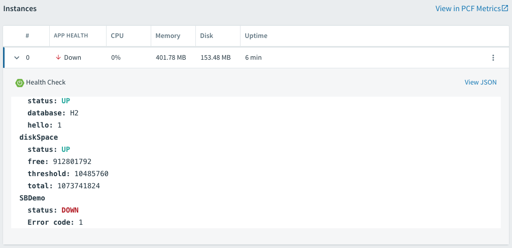

Ops Friendly Apps
========================================

The purpose of this workshop is to demonstrate how Spring Boot can help with monitoring applications..

1. Open a terminal and clone workshop demo github repo: <https://github.com/Pivotal-Field-Engineering/pace-cnd-java>

1. Change to the "ops-friendly-apps" folder

```
    cd ./ops-friendly-apps
```

## Enable Actuator

1. Open the project pom.xml file, and verify it includes the spring-boot-starter-actuator dependency:

1. By default, the actuator endpoints are secured and not accessible. Open application.yml and explain the management.security.enabled=false property,
 to disable security on the endpoints for the purposes of the demo. 
 
## Adding a Custom Health Indicator
 
1. Show the custom health check by opening SBDemoHealthIndicator.java. 
The check() method contains application specific health check.

1. Build and run the application, and hit the health endpoint again several times. 
Note the new SBDemo status that now appears from the custom indicator. The status
will change from "DOWN" to "UP" in a random fashion. 

```
    mvn clean package
    java -jar ./target/ops-friendly-demo-0.0.1-SNAPSHOT.jar
```

## Metrics

Spring Boot Actuator also has a Metrics endpoint, which provides useful system, 
datasource, cache, and Tomcat session information. Hit the metrics endpoint of the 
application, and observe the set of values returned. 
Note the **counter.status.200.<endpoint>** values, which show the number of times each 
endpoint has been invoked and returned an HTTP 200 response code.

Deploy the application to PWS, hit the application URL several times, 
and demonstrate PCF Metrics. Pause the live metrics, select a point on one of the 
graphs, and point out how the logs scroll to that point in time.

```
    cf push ops-friendly-demo -p ./target/ops-friendly-demo-0.0.1-SNAPSHOT.jar --random-route
```



