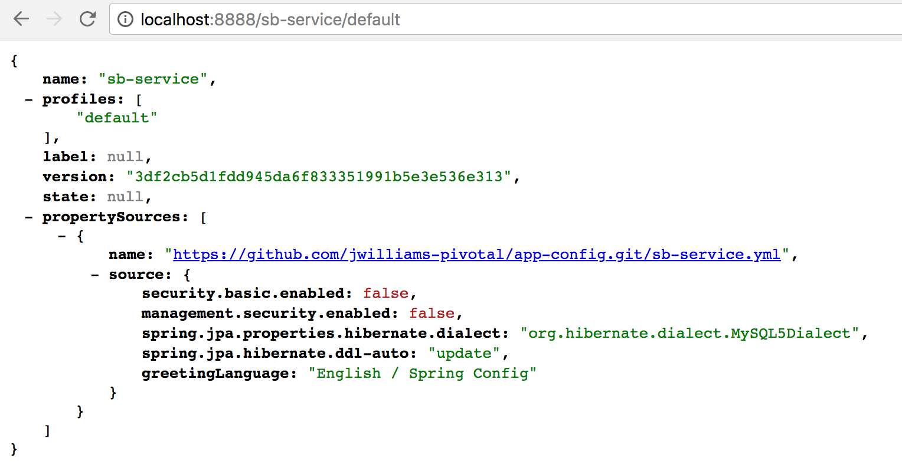
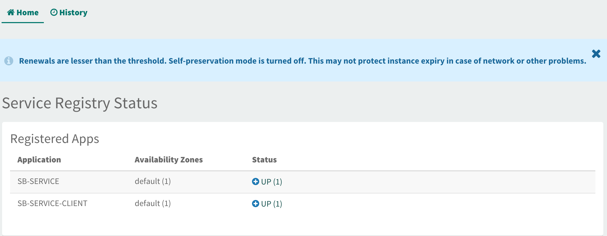
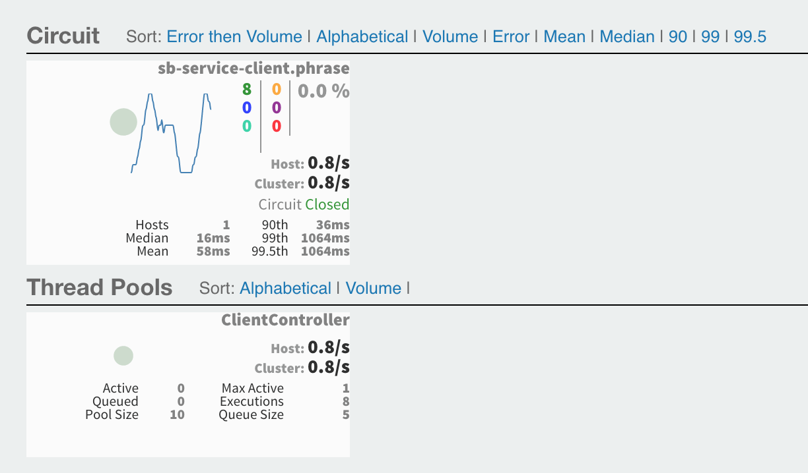
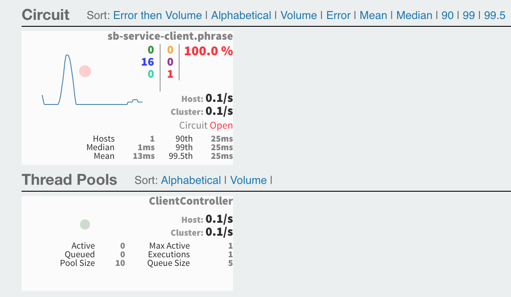

# Enterprise Microservices with Spring Cloud Workshop

The purpose of this workshop is demonstrate how Spring Cloud can help 
developers create robust cloud native microservice applications.

1. Open a terminal and clone workshop demo github repo: <https://github.com/Pivotal-Field-Engineering/pace-cnd-java>

1. Change to the `enterprise-microservices` folder

## Spring Cloud Config Server

### Configure and Start a Local Config Server

1. In your Github account, create a new, "public" github
repository named `app-config` to hold the application configuration properties.

1. Create an `sb-service.yml` and push it to the repository top
level folder.

```
management:
  endpoints:
    web:
      exposure:
        include: "*"
 
spring: 
  jpa: 
    properties: 
      hibernate: 
        dialect: org.hibernate.dialect.MySQL5Dialect
    hibernate: 
      ddl-auto: update
 
greetingLanguage: English / Spring Config
---
spring: 
  profiles: dev
greetingLanguage: French / Spring Config
---
spring: 
  profiles: prod
greetingLanguage: Spanish / Spring Config
```

1. Open the application.yml in the `config-server/src/main/resources` 
directory, and change the  `spring.cloud.config.server.git.uri` to point to the new 
repository you just created above.

1. In a command window, build and run the local `config-server`. 
Leave it running for the duration of the demo:

```
cd ./config-server
mvn clean package -DskipTests spring-boot:run

```

1. In a browser, navigate to the local Config Server endpoint for the application properties, 
<http://localhost:8888/sb-service/default>, to verify the properties are now 
being read from the Github repository.



### Create the Config Server Client

1. In a command window, build and run the `sb-service` application.

```
cd ./sb-service
mvn clean package -DskipTests spring-boot:run

```

1. Hit <http://localhost:8080> and verify you are 
seeing the correct greeting language, which should be `English / Spring Config`.


1. The fallback local setting is `English` and it can be verified by stopping `config-server`
and restarting `sb-service`. 

1. Explain the @RefreshScope annotation to our app in the `SBController.java` class.

1. Post to http://localhost:8080/actuator/refresh, to re-load the values from the config server.

```
curl -X POST http://localhost:8080/actuator/refresh
```

1. Hit <http://localhost:8080> and verify you are 
seeing the correct greeting language, which should be `English / Spring Config`.
We just refreshed our spring configuration without restarting the application!


### Use Spring Cloud Services Config Server in PCF

Now that we’ve seen how the config server works locally, let’s deploy the app to PWS 
and use the SCS config server.

1. Package the application for deployment to PCF.

```
mvn clean package
```

1. Create config server instance and push app

```
cf create-service -c '{"git": { "uri": "https://github.com/<my-repo>/app-config" }, "count": 2 }' p-config-server standard config-server
cf push
```

1. Start the app, and hit the endpoint to see that it is picking up the configuration from the config server.


### Use Spring Cloud Service Discovery (Eureka)

1. Show the `spring-cloud-services-starter-service-registry` dependency in `sb-service/pom.xml`

1. Open `SBController.java` in `sb-service` and uncomment `@EnableDiscoveryClient`. This will enable Eureka
for this controller.

1. Open `manifest.yml` in `sb-service` and add the following services entry:

```
    - service-registry
```

1. Package the application for deployment to PCF.

```
mvn clean package
```

1. Create service registry instance and push app

```
cf create-service p-service-registry standard service-registry
cf push
```

1. Open Apps Manager and show `sb-service` is bound to the service registry

 


1. Open the `ClientController.java` class in `sb-service-client` application and
explain the RestTemplate.

1. Package the `sb-service-client` application for deployment to PCF.

```
mvn clean package
```

1. Push the `sb-service-client` application

```
cf push
```

1. Open Apps Manager and show `sb-service-client` is bound to the service registry

 

1. From the browser, hit the client endpoint URL.

 

### Use Spring Cloud Circuit Breaker

1. Show and uncomment the `spring-cloud-services-starter-circuit-breaker` dependency in `sb-service-client/pom.xml`

1. Open `ClientController.java` in `sb-service-client` and uncomment `@HystrixCommand(fallbackMethod = "fallbackPhrase")` and `import com.netflix.hystrix.contrib.javanica.annotation.HystrixCommand;`. This will enable Hystrix for this controller.

1. Open `ClientApplication.java` in `sb-service-client` and uncomment `@EnableCircuitBreaker` and `import org.springframework.cloud.client.circuitbreaker.EnableCircuitBreaker;`. This will enable Hysrix for the client application

1. Create the Circuit Breaker Dashboard service instance in PWS.

```cf create-service p-circuit-breaker-dashboard standard circuit-breaker-dashboard```

1. Package the `sb-service-client` application for deployment to PCF.

```
mvn clean package
```
1. Open `manifest.yml` in `sb-service-client` and add the following services entry:

```
    - circuit-breaker-dashboard
```

1. Push the `sb-service-client` application

```
cf push
```

1. In a browser, hit the home URL of the client app a few times (refresh the page). Make sure it shows the 
text Greeting language is English.

1. In the Apps Manager, navigate to the list of services, select the Circuit Breaker Dashboard, and click the manage 
button in the upper right corner.

 

Note that the circuit should show Closed at this time.

1. Stop the `sb-service` app.

```
cf stop sb-service
```

Now go back and try to hit the URL of the client app. You should now see Greeting Language is gibberish!!, 
with the number of service call failures in red on the dashboard.

 

The service is unreachable, so the default message is shown.


