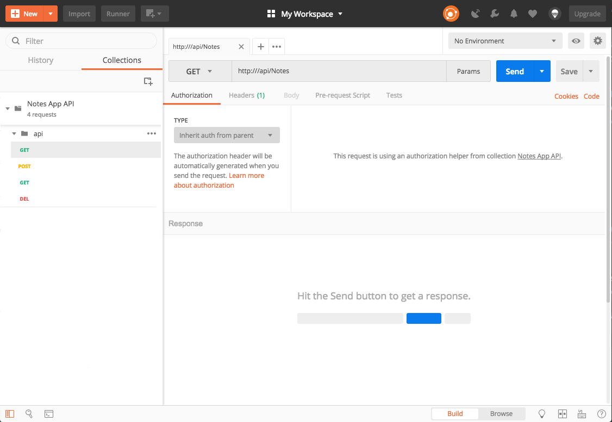
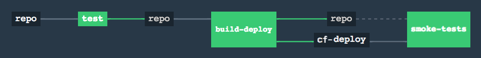

# Smoke Tests

**Previous:** [Connect to a DB on CF](../connect-to-a-db-on-cf)

In this section, we'll add smoke tests to run against our deployed app.

### Swagger

As a slight detour that will actually be of benefit later, [Swagger](https://swagger.io/) documentation will be added to this project. It generates API documentation that can be interacted with, calling the actual endpoints.

For the purposes of .NET Core, a go-to library is [SwashBuckle.AspNetCore](https://github.com/domaindrivendev/Swashbuckle.AspNetCore). At the time of this writing, version `4.0.1` is the latest and is what will be used here. Add the dependency to the `NotesApp` project and follow the setup instructions on their GitHub repository.

**Git Tag:** [adding-swagger](https://github.com/xtreme-steve-elliott/NotesApp/tree/adding-swagger)

### Postman 

A decent way to get started with Postman is to download the API JSON file from Swagger. There should be a link on the page when viewing `https://notes.dev.cfdev.sh/swagger`. `swagger.json` can be imported into Postman to get a bare-bones setup of endpoints.

<details>
    <summary>It should look something like this:</summary>
    <a href="smoke-tests-postman-import-result.png" target="_blank">
        
    </a>
</details>

***

Postman gives us the ability to setup tests for endpoints via minor Javascript. These can be accessed from the **Tests** tab of a Postman request. Let's look a simple test for the `/api/notes` endpoint when there are no `Note` objects in the database:
```js
pm.test("Returns status code OK", function () {
    pm.response.to.have.status(200);
});

pm.test("Returns empty array", function () {
    var jsonData = pm.response.json();
    pm.expect(jsonData).to.eql([]);
});
```

Some tests are fairly straight-forward, but let's take a look at a more complicated one. The situation we're testing is that there is a `Note` in the database, and so we should expect to receive a list of `Note` objects containing that `Note`.

In this case, we'll need to make use of a **Pre-Request Script** to populate the data before the tests run.
```js
pm.sendRequest({
   url: pm.environment.get("BASE_URL") + "/notes",
   method: "POST",
   header: {
       "Content-Type": "application/json"
   },
   body: {
       mode: 'raw',
       raw: JSON.stringify({"body": "Test Note"})
   }
}, function(err, res) {
    pm.environment.set("CREATED_NOTE_ID", res.json().id)
});
```
As you can see, there's a bunch going on here. Postman is well integrated for making use of environment variables, as detailed [here](https://www.getpostman.com/docs/v6/postman/environments_and_globals/intro_to_environments_and_globals). We make a request to the `PostAsync(Note note)` endpoint to create a `Note`, and when the request returns, we store the id of the created `Note`, for later verification purposes, in the environment.

On the **Tests** tab, we have
```js
pm.test("Returns status code OK", function () {
    pm.response.to.have.status(200);
});

pm.test("Returns array with note in it", function () {
    var notes = pm.response.json();
    pm.expect(notes).to.have.length(1);
    var note = notes[0];
    pm.expect(note).to.have.property("id");
    pm.expect(note.id).to.eql(pm.environment.get("CREATED_NOTE_ID"));
    pm.expect(note).to.have.property("body");
    pm.expect(note.body).to.eql("Test Note");
});

pm.sendRequest({
   url: pm.environment.get("BASE_URL") + "/notes/" + pm.environment.get("CREATED_NOTE_ID"),
   method: "DELETE",
   header: {
       "Content-Type": "application/json"
   }
}, function(err, res) {
    pm.environment.unset("CREATED_NOTE_ID");
});
```
The first test is self-explanatory. The second test verfies the structure and data of the response to ensure it matches that of the `Note` we created in the **Pre-Request Scripts**. Afterwards, the created `Note` is deleted so as to not pollute other tests.

Testing of the other endpoints is left as an exercise for the reader (they will be very similar to the integration tests), but if you get stuck, you can try to import [NotesApp.postman_collection.json](https://github.com/xtreme-steve-elliott/NotesApp/tree/smoke-tests/ci/newman/NotesApp.postman_collection.json) as a reference.

Once all of the tests are written, the collection can be exported as a JSON file.

### Newman

No, I don't mean Wayne Knight. Newman is the command line tool for running Postman tests. It's particularly useful for integrating Postman with pipelines like Concourse. You can read more about it [here](https://www.getpostman.com/docs/v6/postman/collection_runs/command_line_integration_with_newman). For the purposes of this guide, a Docker image with Newman already installed will be used to run the tests.

Start by adding a new job to the pipeline, `smoke-tests` that is triggered only by `cf-deploy` and ensures both `repo` and `cf-deploy` have passed in `build-deploy`. It should look something like
```yaml
jobs:
  # ... (test job)
  # ... (build-deploy job)
  - name: smoke-test
    plan:
      # ... (get repo task)
      # ... (get cf-deploy task)
      - task: newman-test
        file: repo/ci/tasks/newman-test.yml
        params:
          COLLECTION_URL: repo/ci/newman/NotesApp.postman_collection.json
          ENVIRONMENT_URL: repo/ci/newman/NotesApp.postman_environment.json # An environment has been setup for the tests in the repository
```

`ci/tasks/newman-test.yml`:
```yaml
platform: linux

image_resource:
  type: docker-image
  source:
    repository: postman/newman_alpine33

inputs:
  - name: repo

run:
  path: ./repo/ci/tasks/newman-test.sh
```

`ci/tasks/newman-test.sh`:
```yaml
#!/bin/bash

set -ex

newman run $COLLECTION_URL --folder api -e $ENVIRONMENT_URL --bail --no-color --reporters cli
```
**Note:** Newman is pointed to our collection and told to run the `api` folder, which was created when we imported the endpoints from Swagger originally. The `bail` flag ensures that if a failure is encountered, it will immediately fail the test suite.

Update the pipeline and push up the code.

<details>
  <summary>It should now look like this.</summary>
  <a href="pipeline-smoke-test.png" target="_blank">
    
  </a>
</details>

***

**Git Tag:** [smoke-tests](https://github.com/xtreme-steve-elliott/NotesApp/tree/smoke-tests)

**Up Next:** [Zero-Downtime Deployment](../zero-downtime-deployment)

**Resources**  
[Postman Test Scripts](https://www.getpostman.com/docs/v6/postman/scripts/test_scripts)
