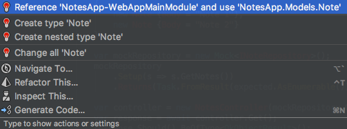
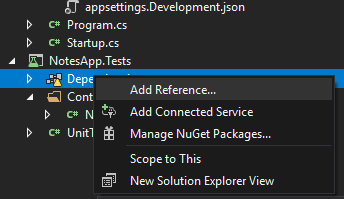
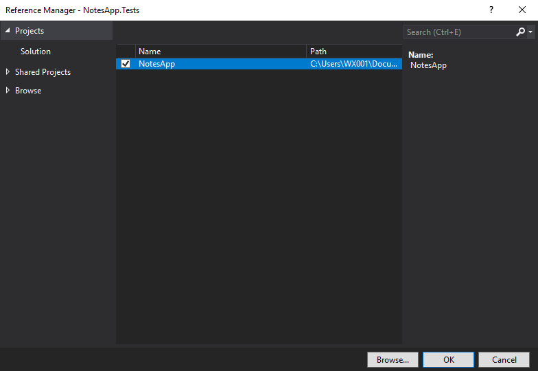

# Creating a RESTful API

**Previous:** [Setting Up xUnit](../setting-up-xunit)

In this section, we'll build a RESTful endpoint for our project. When the new project was created, an auto-generated `ValuesController` class was created. This class has an attribute (similar to annotations in Java) of `[Route]` with a parameter of `api/[controller]`. This routes requests for `/api/values` through this class. In .NET Core 2.2, controllers are also annotated with `[ApiController]`, allowing them access to more functionality.

There are also methods marked with `[HttpGet]`, `[HttpPost]`, `[HttpPut]`, and `[HttpDelete]` indicating the basic **CRUD** operations for the API. Try running the app from the IDE and opening `http://localhost:5000/api/values` to verify it returns `["value1", "value2"]`.

**Note:** Visual Studio may prompt you to trust a self-signed certificate for running the app.

Let's first rename this class to `NotesController` as we are making a notes app. For the sake of simplicity, we're going to remove all the auto-generated endpoints other than `Get()` for now (feel free to remove the comments). We're going to need to have a `Note` model to return, so let's make that class now.

***

In the `NotesApp` project, create a `Models` folder and add a `Note` class, as follows:
```c#
public class Note
{
    public long Id { get; set; }
    public string Body { get; set; }
}
```

We've got two fields, an `Id` for a unique id, and `Body` for the contents.

***

Let's go ahead and start making our first meaningful test.

In the `NotesApp.Tests` project, add a `Controllers` directory to mirror the `NotesApp` project. In the `Controllers` directory, add our test class `NotesControllerTests`.

Let's add a test to get a list of notes. We'll, for the time being, have our API return one note by default.

```c#
[Fact]
public void Get_ShouldReturnNoteList()
{
    var expected = new List<Note>
    {
        new Note { Id = 1, Body = "Note 1" }
    };

    // ...
}
```

At this point, you'll probably encounter some errors from the IDE, complaining about missing references. `Fact` and `List` should be easily resolvable, but `Note` is a little bit trickier to get working.

**Rider:**
<details>
    <summary>To resolve this, follow the suggestion provided on the <strong>ALT+ENTER</strong> menu, and add a reference to the main project.</summary>
    <a href="restapi-rider-reference-project.png" target="_blank">
        
    </a>
</details>

***

**Visual Studio:**
<details>
    <summary>To resolve this, right-click on the <strong>Dependencies</strong> section and select <strong>Add Reference</strong>. From there, select the <strong>NotesApp</strong> project and hit <strong>OK</strong>.</summary>
    <a href="restapi-visual-studio-add-reference-menu.png" target="_blank">
        
    </a>
    <a href="restapi-visual-studio-add-reference-dialog.png" target="_blank">
        
    </a>
</details>

***

**CLI:**

To resolve this, run the following:

```bash
dotnet add "NotesApp.Tests/NotesApp.Tests.csproj" reference "NotesApp/NotesApp.csproj"
```

***

There's a bit of a quirk that occurs when our `NotesApp.Tests` project references our `NotesApp` project. In order for the test project to understand which version of `Microsoft.AspNetCore.App` the main project is dependent on, you will need to manually set the version in `NotesApp.csproj`. For the purposes of this guide, we will be using version `2.2.2`.

<details>
    <summary>To do this, make the following changes:</summary>
    <a href="restapi-dependency-version.png" target="_blank">
        
    </a>
</details>

***

Now that we have some of the dependencies sorted out, let's continue writing the test.

```c#
[Fact]
public void Get_ShouldReturnNoteList()
{
    // ...
    
    var controller = new NotesController();
    
    // Make the request
    var response = controller.Get();
    // Ensure that we get back a result
    Assert.NotNull(response);
    Assert.NotNull(response.Result);
    // Ensure that we received an Ok
    Assert.IsType<OkObjectResult>(response.Result);

    var value = ((OkObjectResult) response.Result).Value;
    // Ensure the the value of the ActionResult is an enumerable of type Note
    Assert.NotNull(value);
    Assert.IsAssignableFrom<IEnumerable<Note>>(value);

    var actual = ((IEnumerable<Note>) value).ToList();
    // Ensure that we have the correct values in the list
    Assert.NotNull(actual);
    Assert.NotEmpty(actual);
    Assert.Equal(actual.Count, expected.Count);
    Assert.Equal(actual[0].Id, expected[0].Id);
    Assert.Equal(actual[0].Body, expected[0].Body);
}
```

Let's take a look at the test. We've got a `[Fact]` attribute, to denote this method as a test, similar to `@Test` in jUnit.

We make a call to the controller's endpoint directly (as this is a unit test rather than an integration test). The response is validated against what we expect back, including length and `Id`/`Body` for the first item in the list. In .NET Core 2.2, the type `ActionResult<T>` was introduced to allow for more meaningful return types from methods. A description of them can be found [here](https://docs.microsoft.com/en-us/aspnet/core/web-api/action-return-types?view=aspnetcore-2.2#actionresultt-type).

Now, let's get that test to pass. In the `NotesController`, update the `Get()` method as follows:

```c#
[HttpGet]
public ActionResult<IEnumerable<Note>> Get()
{
    return Ok(new[] { new Note { Id = 1, Body = "Note 1" } });
}
```

`Ok` automatically gets transformed into an `ActionResult`.

Run the test again and it should pass.

If you run the main app (either from the IDE or via `dotnet run "NotesApp/NotesApp.csproj"`) and open `http://localhost:5000/api/notes` in your browser, you should see

```json
[{"id": 1, "body": "Note 1"}]
```

Congratulations! You now have a working API.

**Git Tag:** [creating-a-restful-api](https://github.com/xtreme-steve-elliott/NotesApp/tree/creating-a-restful-api)

**Up Next:** [Introducing Fluent Assertions](../introducing-fluent-assertions)

**References**  
[Comparing xUnit.net to other frameworks](https://xunit.github.io/docs/comparisons.html#assertions)  
[Build web APIs with ASP.NET Core](https://docs.microsoft.com/en-us/aspnet/core/web-api/index?view=aspnetcore-2.2)  
[Controller action return types with ASP.NET Core](https://docs.microsoft.com/en-us/aspnet/core/web-api/action-return-types?view=aspnetcore-2.2)
