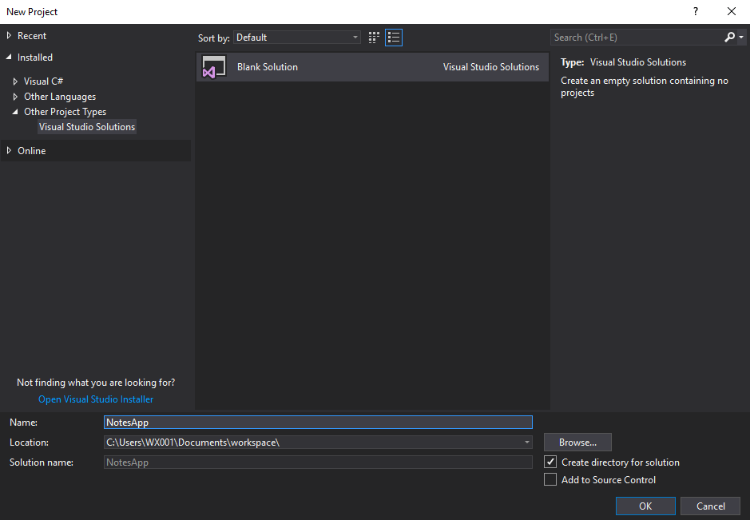
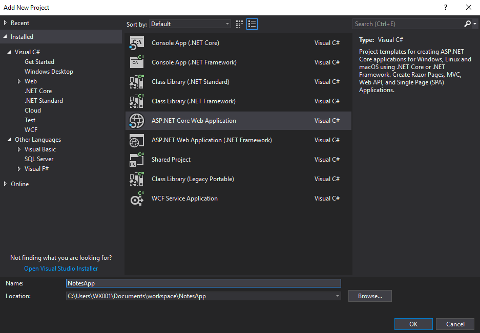

# Setting Up the App in Visual Studio

**Previous:** [.NET Core App](/workshop/#net-core-app)

In this section, we'll describe how to start your first app using [[Microsoft Visual Studio]]. We'll be building a Notes RESTful API where multiple users can add and retrieve notes.

    
Run <strong>Visual Studio</strong> and select the <strong>File</strong> menu.

    

***

    
Click <strong>New > Project</strong>. The template for an <strong>Empty Solution</strong> can be found until the <strong>Other Project Types</strong> section. Select it and name the solution <strong>NotesApp</strong>.

    

***

    
Right-click on the solution and add a new project.

    

***

    
Select <strong>ASP.NET Core Web Application</strong> template and name the project <strong>NotesApp</strong>.

    

***

    
You'll be presented with another dialog at this point, giving you different setups for an <strong>ASP.NET Core Web Application</strong>. Select <strong>API</strong> and hit <strong>OK</strong>.

    

***

    
Let's take a look at the generated project in the <strong>Solution Explorer</strong>.

    

***

First is `Solution 'NotesApp' (1 project)`. This is the top-level *solution* that contains one *project*. The solution file is not one that is usually modified manually, and in Visual Studio, it cannot be edited directly.

Next is the `NotesApp` project. A *project* is part of a *solution*. This file may be accessed by right-clicking the project and then going to `Edit NotesApp.csproj` in the **Solution Explorer**.

In the **Dependencies** section, you'll find a number of sections, listing out what the project relies on, including `Microsoft.NETCore.App (2.2)` in the **SDK** section, indicating that we are using .NET Core 2.2 for our project.

The **NuGet** section provides a deep-dive into what dependencies we have included in our project. You can also view these by looking at the `NotesApp.csproj`.

**Note:** The Visual Studio generation of the project adds an additional dependency of `Microsoft.AspNetCore.Razor.Design`. As we will not be creating rendered pages, this dependency can be removed.

The `Controllers` directory contains an auto-generated `ValuesController.cs` which we'll be updating/replacing in this tutorial.

The `Properties` directory and the `launchSettings.json` file within are not needed for this guide, and should be deleted.

The `wwwroot` directory is for publishing a static website. It will not be used in this guide and should be deleted.

The `appsettings.json` file is the default configuration file for the project. `appsettings.Development.json`, which will be rendered as child of `appsettings.json`, contains configurations used only in the `Development` environment. You can specify additional configuration files with `appsettings.{enviroment}.json`.

`Program.cs` contains the Main program, which runs a web server built with our `Startup` class. `Startup.cs` is where we'll define a lot of the setup for our database, our injectable classes, and various Cloud Foundry integrations.

**Git Tag:** [setting-up-the-app](https://github.com/xtreme-steve-elliott/NotesApp/tree/setting-up-the-app)

**Up Next:** [Setting Up xUnit](../setting-up-xunit)
