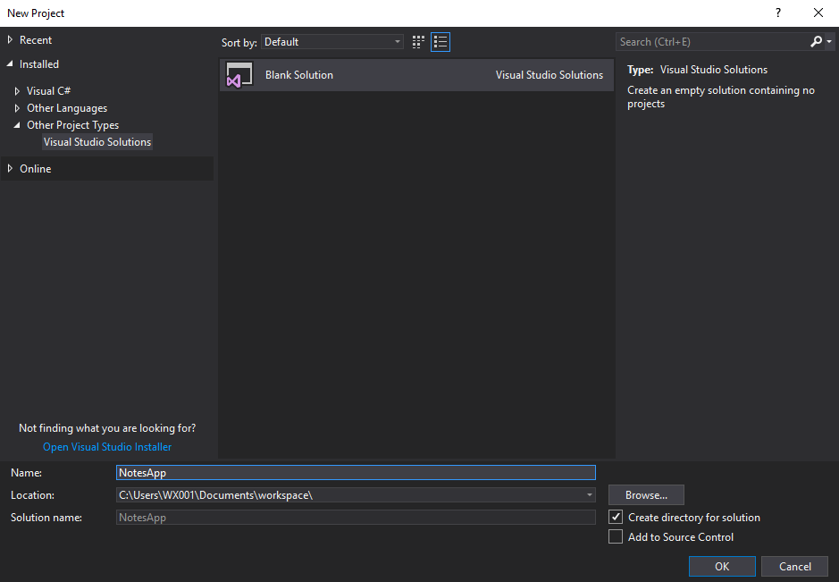

# Setting Up the App

**Previous:** [.NET Core App](/workshop/#net-core-app)

In this section, we'll describe how to start your first app. We'll be building a Notes RESTful API where multiple users can add and retrieve notes.

The steps vary slightly based on which tools you're using, so follow along with the IDE you're using:

### Rider

<details>
    <summary>Rider Instructions</summary>
    <blockquote>

<details>
    <summary>Run <strong>Rider</strong>.</summary>
    <a href="intro-rider-welcome.png" target="_blank">
        
    </a>
</details>

***

<details>
    <summary>Click <strong>New Solution</strong> and choose <strong>Empty Solution</strong>. Name it <strong>NotesApp</strong>.</summary>
    <a href="intro-rider-new-solution.png" target="_blank">
        
    </a>
</details>

***

<details>
    <summary>Right-click on the solution and add a new project.</summary>
    <a href="intro-rider-new-project-menu.png" target="_blank">
        
    </a>
</details>

***

<details>
    <summary>Select <strong>ASP.NET Core Web Application</strong> from the <strong>.NET Core</strong> section. Name it <strong>NotesApp</strong>.</summary>
    <a href="intro-rider-new-project.png" target="_blank">
        
    </a>
</details>

***

<details>
    <summary>Let's take a look at the generated project in the <strong>Solution Explorer</strong>.</summary>
    <a href="intro-rider-solution-explorer.png" target="_blank">
        
    </a>
</details>
    </blockquote>
</details>

### Visual Studio

<details>
    <summary>Visual Studio Instructions</summary>
    <blockquote>

<details>
    <summary>Run <strong>Visual Studio</strong> and select the <strong>File</strong> menu.</summary>
    <a href="intro-visual-studio-new-menus.png" target="_blank">
        
    </a>
</details>

***

<details>
    <summary>Click <strong>New > Project</strong>. The template for an <strong>Blank Solution</strong> can be found under the <strong>Other Project Types</strong> section. Select it and name the solution <strong>NotesApp</strong>.</summary>
    <a href="intro-visual-studio-new-solution.png" target="_blank">
        
    </a>
</details>

***

<details>
    <summary>Right-click on the solution and add a new project.</summary>
    <a href="intro-visual-studio-new-project-menu.png" target="_blank">
        
    </a>
</details>

***

<details>
    <summary>Select <strong>ASP.NET Core Web Application</strong> template and name the project <strong>NotesApp</strong>.</summary>
    <a href="intro-visual-studio-new-project.png" target="_blank">
        
    </a>
</details>

***

<details>
    <summary>You'll be presented with another dialog at this point, giving you different setups for an <strong>ASP.NET Core Web Application</strong>. Select <strong>API</strong> and hit <strong>OK</strong>.</summary>
    <a href="intro-visual-studio-new-project-2.png" target="_blank">
        
    </a>
</details>

***

<details>
    <summary>Let's take a look at the generated project in the <strong>Solution Explorer</strong>.</summary>
    <a href="intro-visual-studio-solution-explorer.png" target="_blank">
        
    </a>
</details>
    </blockquote>
</details>

### VS Code / CLI

<details>
    <summary>VS Code / CLI Instructions</summary>
    <blockquote>

On the command-line, in your workspace, within a folder of your choice, run:

```bash
dotnet new sln -n "NotesApp"
```

This will create a new empty solution with the name `NotesApp`.

***

Next we'll create our project:

```bash
dotnet new webapi -n "NotesApp" -o "NotesApp"
```

This will create a new ASP.NET Core Web API project called `NotesApp` and place it in a directory called `NotesApp`. We still need to add it to the solution, though, so you'll need to run:

```bash
dotnet sln "NotesApp.sln" add "NotesApp/NotesApp.csproj"
```
to link it to the solution.

***

Now you should be able to open the directory containing your `NotesApp.sln` in VS Code to take a look through the files that were created.
    </blockquote>
</details>

***

Let's run through what we have now.

First is the *solution* `NotesApp`. Usually, solution files aren't modified directly. Currently, our solution references one *project*, `NotesApp`, our Web API.

Within Rider and Visual Studio, expanding the project reveals the **Dependencies** section. Within that, you'll find a number of sections, listing out what the project relies on, including **.NETCoreApp 2.2** (Rider)/**Microsoft.NETCoreApp (2.2)** (Visual Studio), indicating that we are using .NET Core 2.2 for our project. The **Packages** (Rider)/**NuGet** (Visual Studio) section provides a deep-dive into what dependencies we have included in our project. You can also view these by looking at `NotesApp.csproj`.

**Note:** The Visual Studio generation of the project adds an additional dependency of `Microsoft.AspNetCore.Razor.Design`. As we will not be creating rendered pages, this dependency can be removed.

The `Controllers` directory contains an auto-generated `ValuesController.cs` which we'll be updating/replacing in this tutorial.

The `Properties` directory and the `launchSettings.json` file within are not needed for this guide, and should be deleted.

The `wwwroot` directory is for publishing a static website. It will not be used in this guide and should be deleted.

The `appsettings.json` file is the default configuration file for the project. `appsettings.Development.json`, which will be rendered as child of `appsettings.json`, contains configurations used only in the `Development` environment. You can specify additional configuration files with `appsettings.{enviroment}.json`.

`Program.cs` contains the `Main` program, which runs a web server built with our `Startup` class. `Startup.cs` is where we'll define a lot of the setup for our database, our injectable classes, and various Cloud Foundry integrations.

**Git Tag:** [setting-up-the-app](../tree/setting-up-the-app)

**Up Next:** [Setting Up xUnit](../setting-up-xunit)
