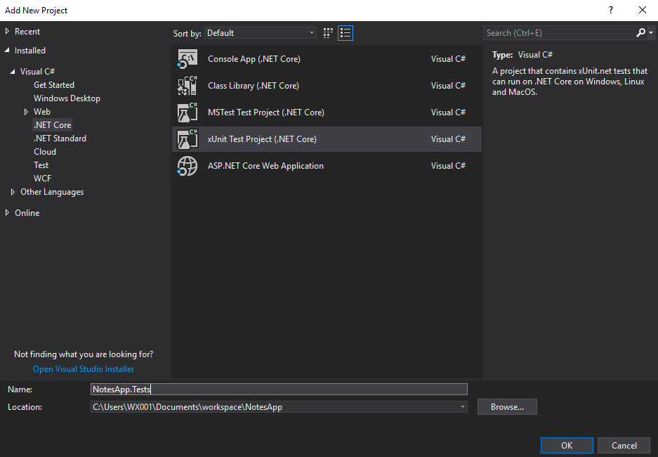

# Setting Up xUnit

**Previous:** [Setting Up the App](../setting-up-the-app)

In this section, we'll be adding unit tests and running them from the dotnet CLI and Rider/Visual Studio.

### Adding the Tests Project

We'll be adding tests in a separate project called `NotesApp.Tests`. With a separate project, it will be easier to run unit tests separately from other types of tests.

**CLI:**

Run the following to create your project:

```bash
dotnet new xunit "NotesApp.Tests" -o "NotesApp.Tests"
```

and to add it to your solution

```bash
dotnet sln "NotesApp.sln" add "NotesApp.Tests/NotesApp.Tests.csproj"
```

**IDEs:**

Right-click the `NotesApp` solution and select `Add > New Project`.

**Rider:**

<details>
    <summary>Select <strong>Unit Test Project</strong> under the <strong>.NET Core</strong> section.</summary>
    <a href="xunit-rider-setup-new-tests-project.png" target="_blank">
        
    </a>
</details>

***

**Visual Studio:**

<details>
    <summary>Select <strong>xUnit Test Project (.NET Core)</strong> from the <strong>Visual C# > .NET Core</strong> section.</summary>
    <a href="xunit-visual-studio-setup-new-tests-project.png" target="_blank">
        
    </a>
</details>

***

<details>
    <summary>Your project should now look like this (approximately the same in both Rider and Visual Studio):</summary>
    <a href="xunit-setup-project-structure.png" target="_blank">
        
    </a>
</details>

***

### The Simplest Test

In `UnitTest1.cs`, let's add a simple test to see the test framework running.
```c#
[Fact]
public void Test1()
{
    Assert.True(true);
}
```

If using VS Code, you can try installing a plug-in for tests, or you can skip to [Running With the CLI](#running-with-the-cli).

In Rider, run the test by right clicking on `NotesApp.Tests` and click **Run Unit Tests**.

In Visual Studio, you first need to enable the **Test Explorer**. Go to the `Test` menu, and then `Windows > Test Explorer`. From there, test can be run.
 
In either case, verify that the test we setup succeeds.

***

### Running With the CLI

Now let's try it from the dotnet CLI. This is important to understand since we won't be using the IDE to run the tests when we're in the CI environment.

```bash
cd <your user directory>/workspace/NotesApp/NotesApp.Tests
dotnet test
```

You should see something like:
```bash
Build started, please wait...
Build completed.

Test run for <your user directory>/workspace/NotesApp/NotesApp.Tests/bin/Debug/netcoreapp<.NET Core version>/NotesApp.Tests.dll(.NETCoreApp,Version=v<.NET Core version>)
Microsoft (R) Test Execution Command Line Tool Version <CLI Version>
Copyright (c) Microsoft Corporation.  All rights reserved.

Starting test execution, please wait...

Total tests: 1. Passed: 1. Failed: 0. Skipped: 0.
Test Run Successful.
Test execution time: 1.3465 Seconds
```

With this, we'll be able to run tests from the command line in our CI environment.

**Having Problems?**

You may receive this error when using `dotnet test`:
```bash
No test is available in <your user directory>/workspace/NotesApp/NotesApp.Tests/bin/Debug/netcoreapp<.NET Core version>/NotesApp.Tests.dll.
Make sure that test discoverer & executors are registered and platform & framework version settings are appropriate and try again.
```

This may occur on Mac OS X, and admittedly, a potential solution isn't very obvious. Edit your `/etc/profile` and add the following line to it, saving afterwards:
```bash
ulimit -n 4096
```
Make sure to open a new terminal window after doing this. This setting allows the OS to have more files open at the same time. It's not currently known why running tests from command-line requires this, but running it from Rider does not.

**Git Tag:** [setting-up-xunit](https://github.com/xtreme-steve-elliott/NotesApp/tree/setting-up-xunit)

**Up Next:** [Creating a RESTful API](../creating-a-restful-api)

**References**  
[Getting started with xUnit.net (.NET Core / ASP.NET Core)](https://xunit.github.io/docs/getting-started-dotnet-core)  
[Issue regarding ulimit](https://github.com/Microsoft/vstest/issues/578)  
[dotnet core MacOS Prerequisites](https://github.com/dotnet/docs/blob/master/docs/core/macos-prerequisites.md)
