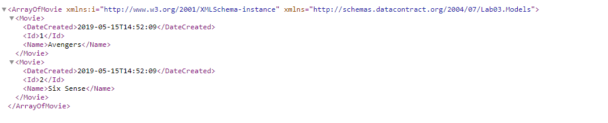

# 
Workshop highlighting how showcase Bindings, specifically MySQL binding to deployed .net application. This lab goes through the steps of using Steeltoe to bind to local database and then publishing to PCF and binding a MySQL Service.

The Github repo is: 
#### 1. Create new visual studio Project (MVC and API) as highlighted in Lab01

#### 2. Add the following Nuget Packages:
```
Autofac
Steeltoe.CloudFoundry.ConnectorAutofac
Steeltoe.CloudFoundry.ConnectorBase
```
#### 3. Add the following under app_start:
`
ServerConfig.cs
`
#### 4. update Application_Start 
```csharp
		  /*add server configuration*/
            ServerConfig.RegisterConfig("development");
            var builder = new ContainerBuilder();

            // Register all the controllers with Autofac
            builder.RegisterControllers(typeof(WebApiApplication).Assembly);
            builder.RegisterApiControllers(typeof(WebApiApplication).Assembly);
            
            builder.RegisterMySqlConnection(ServerConfig.Configuration);
            
            builder.RegisterDbContext<MovieContext>(ServerConfig.Configuration);
            
          
            // Create the Autofac container
            var container = builder.Build();
            DependencyResolver.SetResolver(new AutofacDependencyResolver(container));
            
            GlobalConfiguration.Configuration.DependencyResolver = new AutofacWebApiDependencyResolver((IContainer)container); //Set the WebApi DependencyResolver
```

#### 5. Update References in global.asax
```csharp
using System.Web.Http;
using System.Web.Mvc;
using System.Web.Optimization;
using System.Web.Routing;

using Autofac;
using Autofac.Integration.Mvc;
using Autofac.Integration.WebApi;
using Steeltoe.CloudFoundry.ConnectorAutofac;
using Steeltoe.CloudFoundry.Connector.EF6Autofac;
using Lab03.Models;
```
#### 6. Add new movies controller

#### 7. add MySqlDbContextContainerBuilderExtensions outlined in Extensions folder

#### 8. For local debugging solution can use a local MySQL, once deployed we will go through the process of provisiniong a service

#### 9. Create a MySQL Service on the PCF platform to allow the binding of that service. to your application
```
cf create-service p.mysql db-small lab03-db
cf bind-service lab03 lab03-db
```


#### 10. At this point the application uses the deployed service in PCF, this happens because of this code it detects the connection string in order, and once service is deployed in PCF, it will used the deployed db.
```csharp
public static void RegisterConfig(string environment)
        {

            // Set up configuration sources.
            var builder = new ConfigurationBuilder()
                .SetBasePath(GetContentRoot())
                .AddJsonFile("appsettings.json", optional: false, reloadOnChange: false)
                .AddJsonFile($"appsettings.{environment}.json", optional: true)
                .AddCloudFoundry()
                .AddEnvironmentVariables();

            Configuration = builder.Build();
        }
```


#### 11. CF Push

#### 12. Browse to api (in my case) : https://lab03.apps.pcfone.io/api/movies and this list movies from db:

