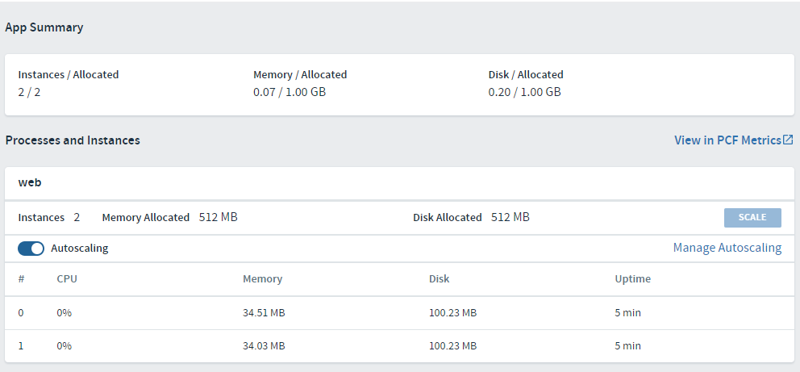

# Explore Application Manager

## Goal

From the home page of your app, in App Manager, attache an autoscaler service to it with scaling rules.

## Prerequisites

- Pushed app
- Internet Access
- Web Browser (Chrome, Firefox, Edge, Safari)(Not Internet Explorer)

## Find the autoscaler service and bind to a space

1. Open the "Markeplace" of services within App Manager.

1. Locate the "App Autoscaler" service and choose. This will show you the "plans" associated with that service. In this case pland aren't really applicable, so theres only one choice "Standard".

1. Click the "Select This Plan" button.

1. For instance configuration, provide the following:
 - Instance Name: `my-autoscaler`
 - Add To Space: `<choose your student space name>`
 - Bind To App: [do not bind]

1. Once completed, click the "Create" button to create the service instance. You should see a green confirmation message at the top.

1. The window refreshed to the services listing for your chosen Space.

## Bind your app to the autoscaler

1. From the home page of your app, choose the "Service" tab.

1. Click the "Bind Service" button to bring up a list of available services for binding.

1. In the "Service to Bind" drop down, choose your new `my-autoscaler` service.

1. Click "Bind" buton to complete the binding and close the window.

1. Now your newly bound service is listed but it has not been activated.

1. Click the "Overview" tab and now you should see an "Autoscaling" slider in the "web" panel.

## Activate the autoscaler and set a scaling rule

1. Activate the autoscaler service by clicking the slider to the "on" position. Notice the "Manage Autoscaling" link is now active.

1. Click the "Manage Autoscaling" link to bring up the manage window. The Window has the following areas:
 - Instance limits minimum: the minimum number of instances that your app should be running. (In production this number should match the number of Availability Zones)
 - Instance limits maximum: the maximum number of instance that you app could possibly scale to.
 - Scaling rules: how PAS descides to scale your app up and down.
 - Scheduled limits: optionaly you can schedule dates and times of a certain instance count
 - Event history: a log of scaling events for your app.

1. The minimum should be set to `2` and the maximum should set to `3`. Click the "Apply Changes" button if necessary. Close the Window.

1. If it hasn't happened already, in a few moments you will see your app instance increase from 1 to 2! Now your app is on the road to being highly available and resilient. Congrats!

If you turned the autoscaling off or changed the minimum instances to be 1, PAS will take care of every else. Just sit back and watch the show.