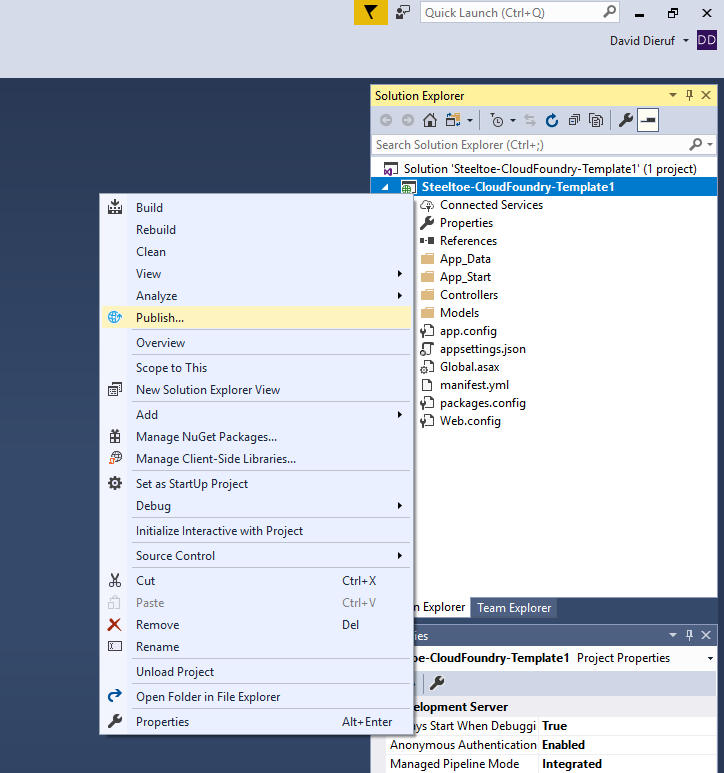
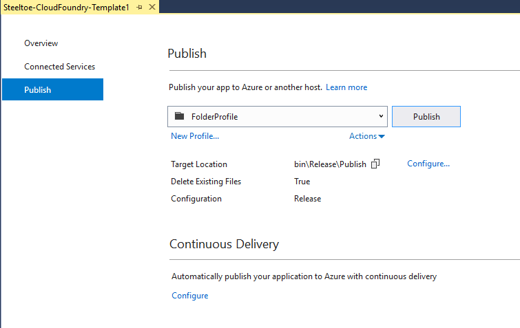

# Push the Microservice to PASW

## Goal

Using Visual Studio, compile the app to create an artifact. Then push the artifact to PASW, for deployment.

## Prerequisites

- Visual Studio (min 2015)
- PAS API Access
- PAS App Manager Access

## Create the App Artifact

1. With the Steeltoe Microservice app opened in Visual Studio, right click on the project name and choose `publish`. (No need to `build` or `restore`, it will happen automatically)
     

1. The "Publish" window will open where you can choose the `FolderProfile`. Let the other settings remain as default.
     

1. Click the `Publish` button to create a new app artifact. Visual Studio will provide feedback about restoring packages and building the project. Something simiar to:

     ```
     1>  Steeltoe-CloudFoundry-Template1 -> C:\tmp\Steeltoe-CloudFoundry-Template1\bin\Steeltoe-CloudFoundry-Template1.dll
     2>------ Publish started: Project: Steeltoe-CloudFoundry-Template1, Configuration: Release x64 ------
     2>Connecting to C:\tmp\Steeltoe-CloudFoundry-Template1\bin\Release\Publish...
     2>Deleting existing files...
     2>Publishing folder /...
     2>Publishing folder bin...
     2>Web App was published successfully file:///C:/tmp/Steeltoe-CloudFoundry-Template1/bin/Release/Publish
     2>
     ========== Build: 1 succeeded, 0 failed, 0 up-to-date, 0 skipped ==========
     ========== Publish: 1 succeeded, 0 failed, 0 skipped ==========
     ```

1. In the output window, note the location of the newly created artifact `C:/tmp/Steeltoe-CloudFoundry-Template1/bin/Release/Publish`. This folder has the compiled DLL, runtime dependencies, and the PAS manifest. Thats your artifact!

## Log in to PAS

1. Open a powershell window and `cd` into the directory holding the artifact.

1. Log in to PAS `cf login -a $env:cf_api -u $env:cf_username -p $env:cf_password`

1. Then you will prompted to choose an Org and Space. Choose the number corresponding to your student account.

1. To confirm you have targeted the correct area, type `cf target`. This is confirm the Org and Space your app will be pushed to.

## Push the Artifact

1. With the app Artifact created, the appropriate Org and Space targeted in PAS, you are ready to push!

1. In the powershell window (still located in the directory holding the Artifact), type the command `cf push`.

1. Your Artifact will be staged in a temporary place on PAS, containerized, deployed, and a route bound to it. Easy!

     ```bash
     requested state: started
     instances: 1/1
     usage: 1G x 1 instances
     urls: my-app-host-name.domain.com
     last uploaded: Mon Jan 7 01:01:10 UTC 2000
     stack: windows2016
     buildpack: binary

          state     since                    cpu      memory         disk           details
     #0   running   2000-01-01 01:01:01 PM   231.0%   498.1M of 1G   161.9M of 1G (10)
     ```

Congratuations! You've pushed your first app! To confirm, open a browser and navigate to the the URL provided in the previous step and add `/api/values/5` on the end. In example, the above output had the URL as `my-app-host-name.domain.com`. You could open a browser and go to `https://my-app-host-name.domain.com/api/values/5` to see the app in action.