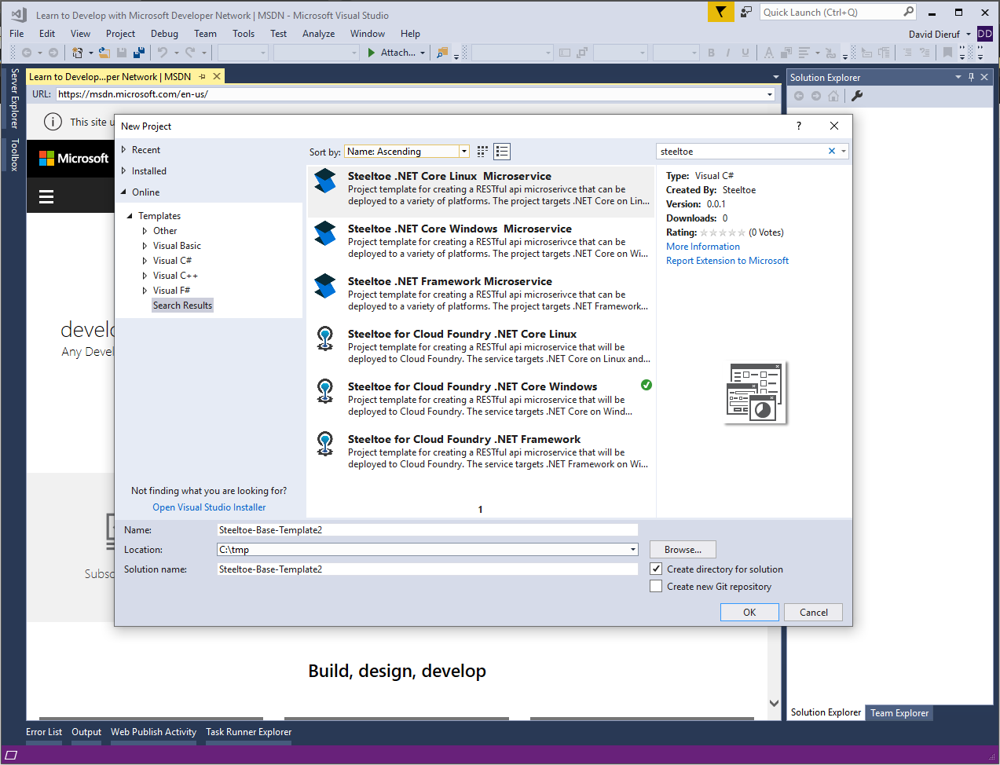

# Setup Desktop Environment

## Goal

The labs in this workshop make use of Powershell, the Cloud Foundry cli (cf cli), and local environment variables. The following steps will confirm you have the correct configuration.

## Prerequisites

- Visual Studio (min 2015)
- Web Browser (Chrome, Firefox, Edge, Safari)(Not Internet Explorer)
- Powershell
- Internet connection

## Download and Validate cf cli
<!--
Another option for downloading the CF CLI would be to have them login to apps manager, click on "Tools" and download. This would ensure the CLI version is lined up with the platform they are working on. 
-->

1. Download [the cli](https://cli.run.pivotal.io/stable?release=windows64&source=github).

1. Unpack the zip file.

1. Double click `cf-installer.exe` to begin installation.

1. When prompted, click **Install**, then **Finish**

1. To verify your installation, open powershell and type `cf --version`. If your installation was successful, the cf cli version is returned. You may need to restart your powershell window for the cli to work properly.

#### If you don't have permission to install the cli, download the cli executable

1. Download the [cli exe](https://packages.cloudfoundry.org/stable?release=windows64-exe&source=github).

1. Unpack the zip file.

1. Copy the `cf.exe` executable to `c:\Windows\System32` folder. (this is to add `cf` to your path env variable)

1. To verify your installation, open powershell and type `cf`. If your installation was successful, the cf CLI help listing appears. You may need to restart the powershell window to see the cf cli help listing appear.

## Save your creds and API URL to environment variables
<!--
If the user were to retrieve and install the CLI from app manager tools, then this step could be revised to retrieve the API URL from the same location. The user would also assured that thier credentials worked because the have already logged into the applicatino manager.
-->

1. Open a powershell window and type in the following commands. Remember to replace the values below with your student creds that were assigned to you.

  ```bash
  $env:cf_api = "<PAS API URL>"
  $env:cf_username = "<Student User Name>"
  $env:cf_password = "<Student Password>"
  ```

## Install the Steeltoe Visual Studio project templates

1. Download the VSIX [templates installer](https://github.com/SteeltoeOSS/Tooling/releases/tag/templates-0.0.1).

1. With Visual Studio closed, double click the downloaded file to install the templates.

1. Once complete, open Visual Studio and choose `File > New > Project > C#` there should be additional Steeltoe and Cloud Foundry template listed.



## Complete

With the cf cli installed, your foundation credentials saved, and the Visual Studio templates loaded, you are ready to get started. Head on to the next lab.