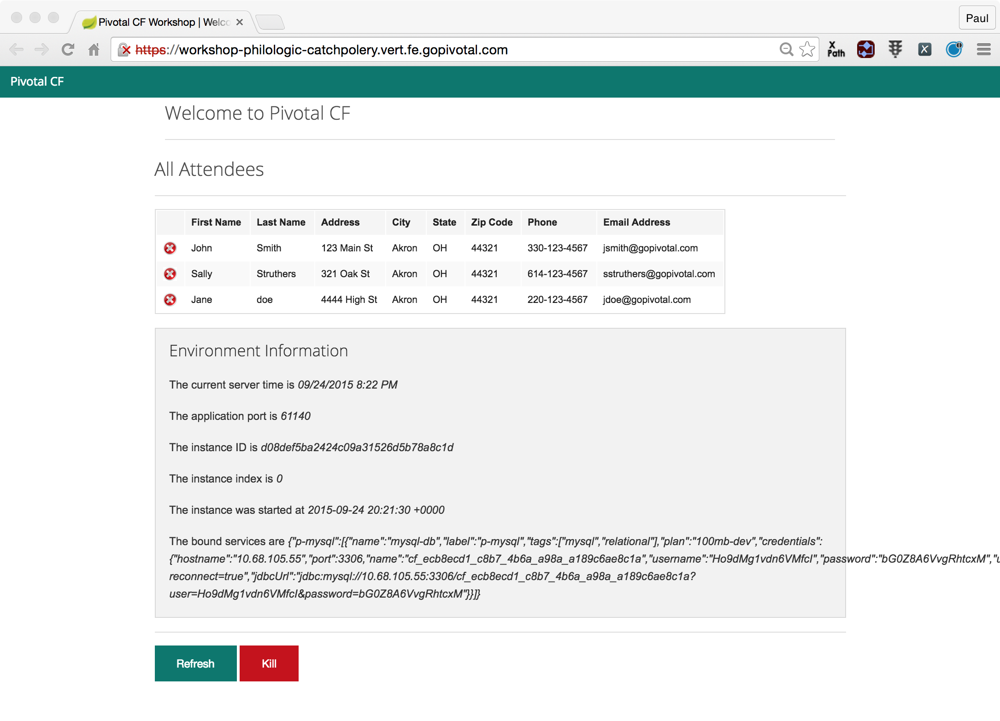

Target the Environment
======================

1.  Follow the instructions to [Get Environment Access](/concepts/pcf-101-workshop-setup)

Push It!
========

1.  Clone the repo  [spring-cf-sample-app](https://github.com/Pivotal-Field-Engineering/spring-cf-sample-app.git) :

        $ cd $BOOTCAMP_HOME/spring-cf-sample-app

2.  Push the application!

        $ cf push

    You should see output similar to the following listing. Language specific output has been omitted for clarity. Take a look at the listing callouts for a play-by-play of what's happening:

        Using manifest file /Users/phopper/workspace/NBCU-PCF-Workshop-101/cf-spring-mvc-boot/manifest.yml

        Creating app workshop in org TELCO / space hopper as phopper@pivotal.io...
        OK

        Creating route workshop-philologic-catchpolery.vert.fe.gopivotal.com...
        OK

        Binding workshop-philologic-catchpolery.vert.fe.gopivotal.com to workshop...
        OK

        Uploading workshop...
        Uploading app files from: /Users/phopper/workspace/NBCU-PCF-Workshop-101/cf-spring-mvc-boot/target/cf-spring-mvc-boot-0.0.1-SNAPSHOT.jar
        Uploading 10.6M, 153 files
        Done uploading
        OK

        Starting app workshop in org TELCO / space hopper as phopper@pivotal.io...
        -----> Downloaded app package (27M)
        -----> Java Buildpack Version: v3.1.1 (offline) | https://github.com/cloudfoundry/java-buildpack#7a538fb
        -----> Downloading Open Jdk JRE 1.8.0_51 from https://download.run.pivotal.io/openjdk/trusty/x86_64/openjdk-1.8.0_51.tar.gz (found in cache)
               Expanding Open Jdk JRE to .java-buildpack/open_jdk_jre (1.5s)
        -----> Downloading Open JDK Like Memory Calculator 1.1.1_RELEASE from https://download.run.pivotal.io/memory-calculator/trusty/x86_64/memory-calculator-1.1.1_RELEASE (found in cache)
               Memory Settings: -Xss995K -Xmx382293K -Xms382293K -XX:MaxMetaspaceSize=64M -XX:MetaspaceSize=64M
        -----> Downloading Spring Auto Reconfiguration 1.7.0_RELEASE from https://download.run.pivotal.io/auto-reconfiguration/auto-reconfiguration-1.7.0_RELEASE.jar (found in cache)

        -----> Uploading droplet (72M)

        0 of 1 instances running, 1 starting
        0 of 1 instances running, 1 starting
        1 of 1 instances running

        App started

        OK

        App workshop was started using this command `CALCULATED_MEMORY=$($PWD/.java-buildpack/open_jdk_jre/bin/java-buildpack-memory-calculator-1.1.1_RELEASE -memorySizes=metaspace:64m.. -memoryWeights=heap:75,metaspace:10,stack:5,native:10 -totMemory=$MEMORY_LIMIT) && SERVER_PORT=$PORT $PWD/.java-buildpack/open_jdk_jre/bin/java -cp $PWD/.:$PWD/.java-buildpack/spring_auto_reconfiguration/spring_auto_reconfiguration-1.7.0_RELEASE.jar -Djava.io.tmpdir=$TMPDIR -XX:OnOutOfMemoryError=$PWD/.java-buildpack/open_jdk_jre/bin/killjava.sh $CALCULATED_MEMORY -Djava.security.egd=file:///dev/urandom org.springframework.boot.loader.JarLauncher`

        Showing health and status for app workshop in org TELCO / space hopper as phopper@pivotal.io...
        OK

        requested state: started
        instances: 1/1
        usage: 512M x 1 instances
        urls: workshop-philologic-catchpolery.vert.fe.gopivotal.com
        last uploaded: Thu Sep 24 20:15:27 UTC 2015
        stack: cflinuxfs2
        buildpack: java-buildpack=v3.1.1-offline-https://github.com/cloudfoundry/java-buildpack#7a538fb java-main java-opts open-jdk-like-jre=1.8.0_51 open-jdk-like-memory-calculator=1.1.1_RELEASE spring-auto-reconfiguration=1.7.0_RELEASE

             state     since                    cpu    memory           disk           details
        #0   running   2015-09-24 02:16:11 PM   2.4%   392.6M of 512M   151.6M of 1G

    -   The CLI is using a manifest to provide necessary configuration
        details such as application name, memory to be allocated, and
        path to the application artifact. Take a look at `manifest.yml`
        to see how.

    -   In most cases, the CLI indicates each Cloud Foundry API call as
        it happens. In this case, the CLI has created an application
        record for *Workshop* in your assigned space.

    -   All HTTP/HTTPS requests to applications will flow through Cloud
        Foundry’s front-end router called
        [(Go)Router](http://docs.cloudfoundry.org/concepts/architecture/router.html).
        Here the CLI is creating a route with random word tokens
        inserted (again, see `manifest.yml` for a hint!) to prevent
        route collisions across the default `devcloudwest.inbcu.com`
        domain.

    -   Now the CLI is *binding* the created route to the application.
        Routes can actually be bound to multiple applications to support
        techniques such as [blue-green
        deployments](http://www.mattstine.com/2013/07/10/blue-green-deployments-on-cloudfoundry).

    -   The CLI finally uploads the application bits to Pivotal
        Cloudfoundry. Notice that it’s uploading *75 files*! This is
        because Cloud Foundry actually explodes a ZIP artifact before
        uploading it for caching purposes.

    -   Now we begin the staging process. The [Java
        Buildpack](https://github.com/cloudfoundry/java-buildpack) is
        responsible for assembling the runtime components necessary to
        run the application.

    -   Here we see the version of the JRE that has been chosen and
        installed.

    -   The complete package of your application and all of its
        necessary runtime components is called a *droplet*. Here the
        droplet is being uploaded to Pivotal Cloudfoundry’s internal
        blobstore so that it can be easily copied to one or more
        *[Droplet Execution Agents
        (DEA’s)](http://docs.cloudfoundry.org/concepts/architecture/execution-agent.html)*
        for execution.

    -   The CLI tells you exactly what command and argument set was used
        to start your application.

    -   Finally the CLI reports the current status of your application’s
        health.

3.  Visit the application in your browser by hitting the route that was
    generated by the CLI:

    

Interact with App from CF CLI
=============================

1.  Get information about the currently deployed application using CLI
    apps command:

        $ cf apps

    Note the application name for next steps

2.  Get information about running instances, memory, CPU, and other
    statistics using CLI instances command

        $ cf app <<app_name>>

3.  Stop the deployed application using the CLI

        $ cf stop <<app_name>>

4.  Delete the deployed application using the CLI

        $ cf delete <<app_name>>

Congratulations! You have pushed your first app into Cloud Foundry!

On to the next Lab!
===================

[Push a Ruby Application](/demos/lab-ruby)
