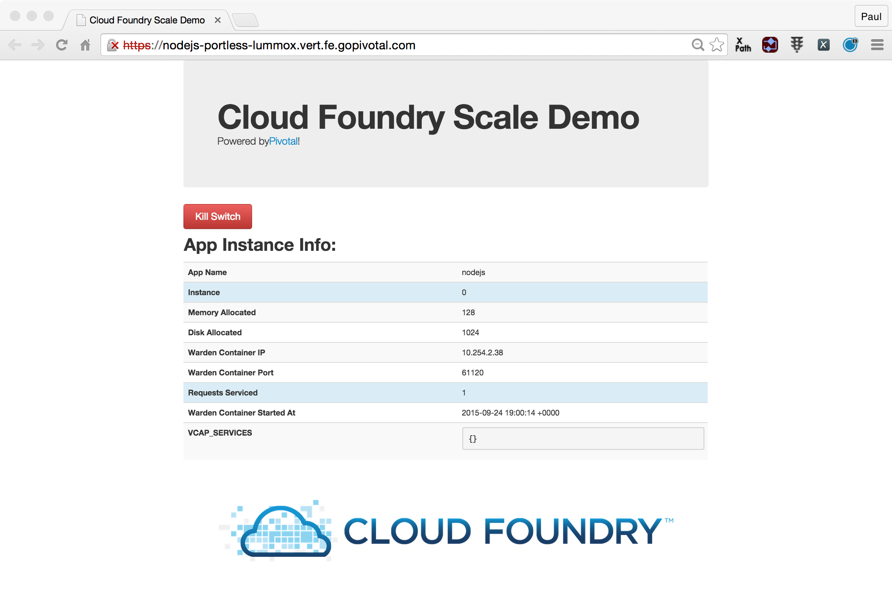

Target the Environment
======================

1.  Follow the instructions to [Get Environment Access](/concepts/setup)

Push It!
========

1.  Clone the repo  [ruby-cf-sample-app](https://github.com/Pivotal-Field-Engineering/ruby-cf-sample-app.git) :

        $ cd $BOOTCAMP_HOME/ruby-cf-sample-app

2.  Push the application!

        $ cf push

    You should see output similar to the following listing. Take a look
    at the listing callouts for a play-by-play of what’s happening:

        Using manifest file /Users/phopper/workspace/NBCU-PCF-Workshop-101/pcf-autoscale/manifest.yml

        Updating app scale-demo in org TELCO / space hopper as phopper@pivotal.io...
        OK

        Creating route scale-nonsynodical-hartal.vert.fe.gopivotal.com...
        OK

        Binding scale-nonsynodical-hartal.vert.fe.gopivotal.com to scale-demo...
        OK

        Uploading scale-demo...
        Uploading app files from: /Users/phopper/workspace/NBCU-PCF-Workshop-101/pcf-autoscale
        Uploading 242.4K, 24 files
        Done uploading
        OK

        Starting app scale-demo in org TELCO / space hopper as phopper@pivotal.io...
        -----> Downloaded app package (2.8M)
        -------> Buildpack version 1.3.1
        -----> Compiling Ruby/Rack
        -----> Using Ruby version: ruby-2.0.0
        -----> Installing dependencies using 1.7.12
               Running: bundle install --without development:test --path vendor/bundle --binstubs vendor/bundle/bin -j4 --deployment
               Using bundler 1.7.12
               Installing tilt 1.3.3
               Installing rack 1.5.1
               Installing rack-protection 1.3.2
               Installing sinatra 1.3.4
               Your bundle is complete!
               Gems in the groups development and test were not installed.
               It was installed into ./vendor/bundle
               Bundle completed (0.71s)
               Cleaning up the bundler cache.
        ###### WARNING:
               You have not declared a Ruby version in your Gemfile.
               To set your Ruby version add this line to your Gemfile:
               ruby '2.0.0'
               # See https://devcenter.heroku.com/articles/ruby-versions for more information.
        ###### WARNING:
               No Procfile detected, using the default web server (webrick)
               https://devcenter.heroku.com/articles/ruby-default-web-server

        -----> Uploading droplet (19M)

        1 of 1 instances running

        App started

        OK

        App scale-demo was started using this command `bundle exec rackup config.ru -p $PORT`

        Showing health and status for app scale-demo in org TELCO / space hopper as phopper@pivotal.io...
        OK

        requested state: started
        instances: 1/1
        usage: 128M x 1 instances
        urls: scale-nonsynodical-hartal.vert.fe.gopivotal.com
        last uploaded: Thu Sep 24 19:48:08 UTC 2015
        stack: cflinuxfs2
        buildpack: Ruby

             state     since                    cpu    memory          disk          details
        #0   running   2015-09-24 01:48:32 PM   0.0%   48.1M of 128M   71.8M of 1G

    -   The CLI is using a manifest to provide necessary configuration
        details such as application name, memory to be allocated, and
        path to the application artifact. Take a look at `manifest.yml`
        to see how.

    -   In most cases, the CLI indicates each Cloud Foundry API call as
        it happens. In this case, the CLI has created an application
        record for *scale-demo* in your assigned space.

    -   All HTTP/HTTPS requests to applications will flow through Cloud
        Foundry’s front-end router called
        [(Go)Router](http://docs.cloudfoundry.org/concepts/architecture/router.html).
        Here the CLI is creating a route with random word tokens
        inserted (again, see `manifest.yml` for a hint!) to prevent
        route collisions across the default `devcloudwest.inbcu.com`
        domain.

    -   Now the CLI is *binding* the created route to the application.
        Routes can actually be bound to multiple applications to support
        techniques such as [blue-green
        deployments](http://www.mattstine.com/2013/07/10/blue-green-deployments-on-cloudfoundry).

    -   The CLI finally uploads the application bits to Pivotal Cloud
        Foundry. Notice that it’s uploading *24 files*! This is because
        Cloud Foundry actually explodes a ZIP artifact before uploading
        it for caching purposes.

    -   Now we begin the staging process. The [Ruby
        Buildpack](https://github.com/cloudfoundry/ruby-buildpack) is
        responsible for assembling the runtime components necessary to
        run the application.

    -   Here we see the version of the Ruby that has been chosen and
        installed.

    -   And here we see our apps dependencies that have been discovered
        and installed.

    -   The complete package of your application and all of its
        necessary runtime components is called a *droplet*. Here the
        droplet is being uploaded to Pivotal Cloudfoundry’s internal
        blobstore so that it can be easily copied to one or more
        *[Droplet Execution Agents
        (DEA’s)](http://docs.cloudfoundry.org/concepts/architecture/execution-agent.html)*
        for execution.

    -   The CLI tells you exactly what command and argument set was used
        to start your application.

    -   Finally the CLI reports the current status of your application’s
        health.

3.  Visit the application in your browser by hitting the route that was
    generated by the CLI:

    

Interact with App from CF CLI
=============================

1.  Get information about the currently deployed application using CLI
    apps command:

        $ cf apps

    Note the application name for next steps

2.  Get information about running instances, memory, CPU, and other
    statistics using CLI instances command

        $ cf app <<app_name>>

3.  Stop the deployed application using the CLI

        $ cf stop <<app_name>>

4.  Delete the deployed application using the CLI

        $ cf delete <<app_name>>

On to the next Lab!
===================

[Push a NodeJS Application](/demos/lab-node)
