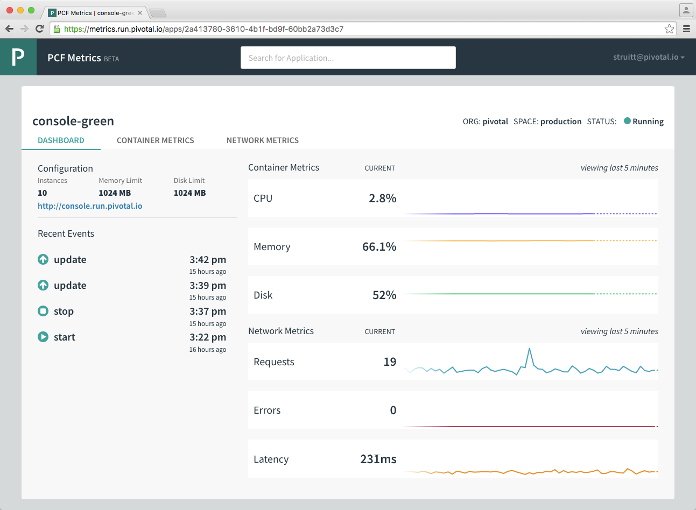
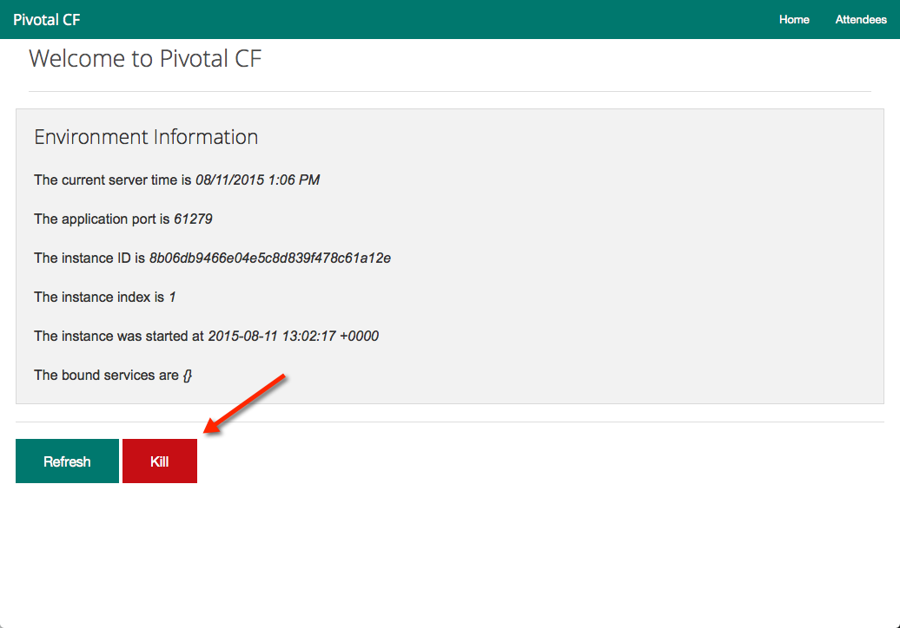
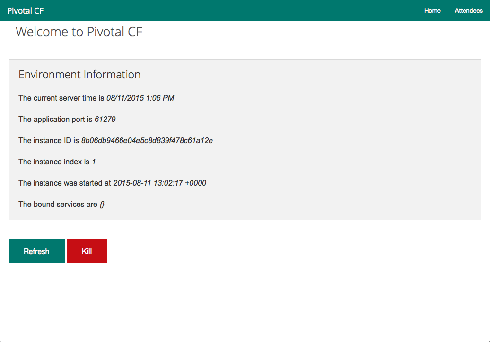

> Pivotal Cloudfoundry makes the work of performing operations actions,
> such as scaling, doing a zero-downtime deploy, and managing
> application health very easy. In the this labs we’ll continue to
> explore Pivotal Cloudfoundry application operations.

Applciation Container and Network Monitoring with PCF Metrics
=============================================================

PCF Metrics helps developers better understand the health and
performance of their apps by providing a near real-time view of critical
data. Developers can see performance issues within two to three seconds,
learn about events like an app crash as they occur, and look back in
time to see what happened while they were away.

For developers, there’s nothing to install or configure, just select an
app and watch the data stream.

*PCF Metrics provides the following data on app health and performance*

-   Container metrics: CPU, memory, and disk percentages (updated every
    30 seconds)

-   HTTP metrics: requests per second, HTTP errors per second, and
    request latency (updated every second)

-   App events: create, update, start, stop, and crash (updated as they
    happen)

**To get started, browse to the Metrics URL:**

    https://metrics.sys.px-npe01.cf.t-mobile.com

Tailing Application Logs
========================

One of the most important enablers of visibility into application
behavior is logging. Effective management of logs has historically been
very difficult. Cloud Foundry’s [log
aggregation](https://github.com/cloudfoundry/loggregator) components
simplify log management by assuming responsibility for it. Application
developers need only log all messages to either `STDOUT` or `STDERR`,
and the platform will capture these messages.

For Developers
--------------

Application developers can view application logs using the CF CLI.

1.  Let’s view recent log messages for the application. For this lab you
    can use the Java, Ruby, or Node.js sample app. In each of the
    commands below replace *workshop* with the name of your deployed
    application:

        $ cf logs workshop --recent

    Here are two interesting subsets of one output from that command:

        2015-02-13T14:45:39.40-0600 [RTR/0]      OUT cf-scale-boot-stockinged-rust.cfapps.io - [13/02/2015:20:45:39 +0000] "GET /css/bootstrap.min.css HTTP/1.1" 304 0 "http://cf-scale-boot-stockinged-rust.cfapps.io/" "Mozilla/5.0 (Macintosh; Intel Mac OS X 10_9_5) AppleWebKit/537.36 (KHTML, like Gecko) Chrome/40.0.2214.111 Safari/537.36" 10.10.66.88:50372 x_forwarded_for:"50.157.39.197" vcap_request_id:84cc1b7a-bb30-4355-7512-5adaf36ff767 response_time:0.013115764 app_id:7a428901-1691-4cce-b7f6-62d186c5cb55 
        2015-02-13T14:45:39.40-0600 [RTR/1]      OUT cf-scale-boot-stockinged-rust.cfapps.io - [13/02/2015:20:45:39 +0000] "GET /img/LOGO_CloudFoundry_Large.png HTTP/1.1" 304 0 "http://cf-scale-boot-stockinged-rust.cfapps.io/" "Mozilla/5.0 (Macintosh; Intel Mac OS X 10_9_5) AppleWebKit/537.36 (KHTML, like Gecko) Chrome/40.0.2214.111 Safari/537.36" 10.10.66.88:24323 x_forwarded_for:"50.157.39.197" vcap_request_id:b3e2466b-6a41-4c6d-5b3d-0f70702c0ec1 response_time:0.010003444 app_id:7a428901-1691-4cce-b7f6-62d186c5cb55
        2015-02-13T15:04:33.09-0600 [API/1]      OUT Tried to stop app that never received a start event 
        2015-02-13T15:04:33.51-0600 [DEA/12]     OUT Starting app instance (index 2) with guid 7a428901-1691-4cce-b7f6-62d186c5cb55 
        2015-02-13T15:04:33.71-0600 [DEA/4]      OUT Starting app instance (index 3) with guid 7a428901-1691-4cce-b7f6-62d186c5cb55

    -   An “Apache-style” access log event from the (Go)Router

    -   An API log event that corresponds to an event as shown in
        `cf events`

    -   A DEA log event indicating the start of an application instance
        on that DEA.

    <!-- -->

        2015-02-13T16:01:50.28-0600 [App/0]      OUT 2015-02-13 22:01:50.282  INFO 36 --- [       runner-0] o.s.b.a.e.jmx.EndpointMBeanExporter      : Located managed bean 'autoConfigurationAuditEndpoint': registering with JMX server as MBean [org.springframework.boot:type=Endpoint,name=autoConfigurationAuditEndpoint]
        2015-02-13T16:01:50.28-0600 [App/0]      OUT 2015-02-13 22:01:50.287  INFO 36 --- [       runner-0] o.s.b.a.e.jmx.EndpointMBeanExporter      : Located managed bean 'shutdownEndpoint': registering with JMX server as MBean [org.springframework.boot:type=Endpoint,name=shutdownEndpoint]
        2015-02-13T16:01:50.29-0600 [App/0]      OUT 2015-02-13 22:01:50.299  INFO 36 --- [       runner-0] o.s.b.a.e.jmx.EndpointMBeanExporter      : Located managed bean 'configurationPropertiesReportEndpoint': registering with JMX server as MBean [org.springframework.boot:type=Endpoint,name=configurationPropertiesReportEndpoint]
        2015-02-13T16:01:50.36-0600 [App/0]      OUT 2015-02-13 22:01:50.359  INFO 36 --- [       runner-0] s.b.c.e.t.TomcatEmbeddedServletContainer : Tomcat started on port(s): 61316/http
        2015-02-13T16:01:50.36-0600 [App/0]      OUT Started...
        2015-02-13T16:01:50.36-0600 [App/0]      OUT 2015-02-13 22:01:50.364  INFO 36 --- [       runner-0] o.s.boot.SpringApplication               : Started application in 6.906 seconds (JVM running for 15.65)

    As you can see, Cloud Foundry’s log aggregation components capture
    both application logs and CF component logs relevant to your
    application. These events are properly interleaved based on time,
    giving you an accurate picture of events as they transpired across
    the system.

2.  To get a running “tail” of the application logs rather than a dump,
    simply type:

        $ cf logs workshop

    You can try various things like refreshing the browser and
    triggering stop/start events to see logs being generated.

Health Management
=================

Cloud Foundry’s [Heatlh
Manager](http://docs.cloudfoundry.org/concepts/architecture/#hm9k)
actively monitors the health of our application processes and will
restart them should they crash.

1.  If you don’t have one already running, start a log tail for
    `workshop`.

        $ cf logs workshop

2.  If you do not have more than one application instance running,
    execute the scale command to scale to 2 or more application
    instances. Visit the application in the browser, and click on the
    “Kill Switch” button. This button will trigger a JVM exit with an
    error code (`System.exit(1)`), causing the Health Manager to observe
    an application instance crash:

    

3.  After clicking the kill switch a couple of interesting things should
    happen. First, you’ll see an error code returned in the browser, as
    the request you submitted never returns a response:

    

    Also, if you’re paying attention to the log tail, you’ll see some
    interesting log messages fly by:

        2015-08-11T09:10:03.25-0400 [App/0]      OUT WARN : com.gopivotal.cf.workshop.web.CloudFoundryWorkshopController - *** The system is shutting down. ***  
        2015-08-11T09:10:03.26-0400 [App/0]      OUT [CONTAINER] org.apache.coyote.http11.Http11NioProtocol         INFO    Pausing ProtocolHandler ["http-nio-61280"]
        2015-08-11T09:10:03.27-0400 [App/0]      OUT [CONTAINER] org.apache.catalina.core.StandardService           INFO    Stopping service Catalina
        2015-08-11T09:10:03.27-0400 [App/0]      OUT [CONTAINER] org.apache.catalina.core.StandardWrapper           INFO    Waiting for 1 instance(s) to be deallocated for Servlet [appServlet]
        2015-08-11T09:10:04.28-0400 [App/0]      OUT [CONTAINER] org.apache.catalina.core.StandardWrapper           INFO    Waiting for 1 instance(s) to be deallocated for Servlet [appServlet]
        2015-08-11T09:10:05.28-0400 [App/0]      OUT [CONTAINER] org.apache.catalina.core.StandardWrapper           INFO    Waiting for 1 instance(s) to be deallocated for Servlet [appServlet]
        ...
        2015-08-11T09:10:05.83-0400 [RTR/0]      OUT adam-app.vert.fe.gopivotal.com - [11/08/2015:13:10:03 +0000] "GET /kill HTTP/1.1" 502 0 "https://adam-app.vert.fe.gopivotal.com/" "Mozilla/5.0 (Macintosh; Intel Mac OS X 10_10_4) AppleWebKit/600.7.12 (KHTML, like Gecko) Version/8.0.7 Safari/600.7.12" 10.68.105.10:38348 x_forwarded_for:"10.68.248.58" vcap_request_id:37fc1845-1745-48bd-68e6-612dc6bcfb00 response_time:2.641058355 app_id:347c3d6b-e386-439f-8fc8-a561d39ea7bb  
        2015-08-11T09:10:05.88-0400 [API/0]      OUT App instance exited with guid 347c3d6b-e386-439f-8fc8-a561d39ea7bb payload: {"cc_partition"=>"default", "droplet"=>"347c3d6b-e386-439f-8fc8-a561d39ea7bb", "version"=>"4f410012-28ec-452e-8ce7-0b460ebb61f9", "instance"=>"daf3174ddf5740069c1ed49f8733d77f", "index"=>0, "reason"=>"CRASHED", "exit_status"=>255, "exit_description"=>"app instance exited", "crash_timestamp"=>1439298605}  

    -   Just before issuing the `System.exit(1)` call, the application
        logs that the kill switch was clicked.

    -   The (Go)Router logs the 502 error.

    -   The API logs that an application instance exited due to a crash.

4.  Wait a few seconds… By this time you should have noticed some
    additional interesting events in the logs:

        2015-08-11T09:12:34.48-0400 [DEA/1]      OUT Starting app instance (index 3) with guid 347c3d6b-e386-439f-8fc8-a561d39ea7bb  
        2015-08-11T09:12:38.06-0400 [App/3]      OUT [CONTAINER] org.apache.coyote.http11.Http11NioProtocol         INFO    Initializing ProtocolHandler ["http-nio-61285"]
        2015-08-11T09:12:38.07-0400 [App/3]      OUT [CONTAINER] org.apache.catalina.startup.Catalina               INFO    Initialization processed in 557 ms
        2015-08-11T09:12:38.08-0400 [App/3]      OUT [CONTAINER] org.apache.catalina.core.StandardService           INFO    Starting service Catalina
        2015-08-11T09:12:38.08-0400 [App/3]      OUT [CONTAINER] org.apache.catalina.core.StandardEngine            INFO    Starting Servlet Engine: Apache Tomcat/8.0.21
        2015-08-11T09:12:38.11-0400 [App/3]      OUT [CONTAINER] org.apache.catalina.startup.HostConfig             INFO    Deploying web application directory /home/vcap/app/.java-buildpack/tomcat/webapps/ROOT  

    -   The DEA indicates that it is starting another instance of the
        application as a result of the Health Manager observing a
        difference between the desired and actual state (i.e. running
        instances = 1 vs. running instances = 0).

    -   The new application instance starts logging events as it starts
        up.

5.  Revisiting the **HOME PAGE** of the application (don’t simply
    refresh the browser as you’re still on the `/killSwitch` endpoint
    and you’ll just kill the application again!) and you should see a
    fresh instance started:

    

Viewing Application *Events*
============================

Cloud Foundry only allows application configuration to be modified via
its API. This gives application operators confidence that all changes to
application configuration are known and auditable. It also reduces the
number of causes that must be considered when problems arise.

All application configuration changes are recorded as *events*. These
events can be viewed via the Cloud Foundry API, and viewing is
facilitated via the CLI.

Take a look at the events that have transpired so far for our deployment
of `workshop`:

    $ cf events workshop
    Getting events for app workshop in org TELCO / space gammon as admin...

    time                          event                 actor      description
    2015-08-11T08:58:57.00-0400   app.crash             workshop   index: 0, reason: CRASHED, exit_description: app instance exited, exit_status: 255  
    2015-08-11T08:58:17.00-0400   audit.app.update      admin      instances: 5 
    2015-08-11T08:58:11.00-0400   audit.app.update      admin
    2015-08-11T08:58:11.00-0400   audit.app.map-route   admin
    2015-08-11T08:54:35.00-0400   audit.app.update      admin      state: STARTED  
    2015-08-11T08:54:22.00-0400   audit.app.update      admin  
    2015-08-11T08:54:22.00-0400   audit.app.map-route   admin  
    2015-08-11T08:54:19.00-0400   audit.app.create      admin      instances: 1, memory: 512, state: STOPPED, environment_json: PRIVATE DATA HIDDEN 

-   Events are sorted newest to oldest, so we’ll start from the bottom.
    Here we see the `app.create` event, which created our application’s
    record and stored all of its metadata (e.g. `memory: 512`).

-   The `app.map-route` event records the incoming request to assign a
    route to our application.

-   This `app.update` event records the resulting change to our
    applications metadata.

-   This `app.update` event records the change of our application’s
    state to `STARTED`.

-   Remember scaling the application up? This `app.update` event records
    the metadata change `instances: 5`.

-   And here’s the `app.crash` event recording that we encountered a
    crash of an application instance.

1.  Let’s explicitly ask for the application to be stopped:

        $ cf stop workshop
        Stopping app workshop in org TELCO / space gammon as admin...
        OK

2.  Now, examine the additional `app.update` event:

        $ cf events workshop
        Getting events for app workshop in org TELCO / space gammon as admin...

        time                          event                 actor      description
        2015-08-11T09:01:35.00-0400   audit.app.update      admin      state: STOPPED
        2015-08-11T08:58:57.00-0400   app.crash             workshop   index: 0, reason: CRASHED, exit_description: app instance exited, exit_status: 255
        2015-08-11T08:58:17.00-0400   audit.app.update      admin      instances: 5
        2015-08-11T08:58:11.00-0400   audit.app.update      admin
        2015-08-11T08:58:11.00-0400   audit.app.map-route   admin
        2015-08-11T08:54:35.00-0400   audit.app.update      admin      state: STARTED
        2015-08-11T08:54:22.00-0400   audit.app.update      admin
        2015-08-11T08:54:22.00-0400   audit.app.map-route   admin
        2015-08-11T08:54:19.00-0400   audit.app.create      admin      instances: 1, memory: 512, state: STOPPED, environment_json: PRIVATE DATA HIDDEN

3.  Start the application again:

        $ cf start workshop
        Starting app workshop in org TELCO / space gammon as admin...

        0 of 5 instances running, 5 starting
        2 of 5 instances running, 3 starting

        App started

        OK

        App workshop was started using this command `JAVA_HOME=$PWD/.java-buildpack/open_jdk_jre JAVA_OPTS="-Djava.io.tmpdir=$TMPDIR -XX:OnOutOfMemoryError=$PWD/.java-buildpack/open_jdk_jre/bin/killjava.sh -Xmx382293K -Xms382293K -XX:MaxMetaspaceSize=64M -XX:MetaspaceSize=64M -Xss995K -Djava.security.egd=file:///dev/urandom -Daccess.logging.enabled=false -Dhttp.port=$PORT" $PWD/.java-buildpack/tomcat/bin/catalina.sh run`

        Showing health and status for app workshop in org TELCO / space gammon as admin...
        OK

        requested state: started
        instances: 5/5
        usage: 512M x 5 instances
        urls: workshop-subhepatic-retiredness.vert.fe.gopivotal.com, adam-app.vert.fe.gopivotal.com
        last uploaded: Tue Aug 11 12:54:33 UTC 2015
        stack: cflinuxfs2
        buildpack: java-buildpack=v3.0-offline-https://github.com/cloudfoundry/java-buildpack.git#3bd15e1 java-opts open-jdk-jre=1.8.0_40 spring-auto-reconfiguration=1.7.0_RELEASE tomcat-access-logging-support=2.4.0_RELEASE tomcat-instance=8.0.21 tomcat-lifecycle-support...

             state      since                    cpu    memory           disk           details
        #0   starting   2015-08-11 09:02:17 AM   0.0%   435.6M of 512M   144.4M of 1G
        #1   running    2015-08-11 09:02:26 AM   0.0%   406.3M of 512M   144.4M of 1G
        #2   running    2015-08-11 09:02:27 AM   0.0%   401.2M of 512M   144.4M of 1G
        #3   running    2015-08-11 09:02:26 AM   0.0%   403.9M of 512M   144.4M of 1G
        #4   starting   2015-08-11 09:02:17 AM   0.0%   398.2M of 512M   144.4M of 1G

4.  And again, view the additional `app.update` event:

        $ cf events workshop
        Getting events for app workshop in org TELCO / space gammon as admin...

        time                          event                 actor      description
        2015-08-11T09:02:17.00-0400   audit.app.update      admin      state: STARTED
        2015-08-11T09:01:35.00-0400   audit.app.update      admin      state: STOPPED
        2015-08-11T08:58:57.00-0400   app.crash             workshop   index: 0, reason: CRASHED, exit_description: app instance exited, exit_status: 255
        2015-08-11T08:58:17.00-0400   audit.app.update      admin      instances: 5
        2015-08-11T08:58:11.00-0400   audit.app.update      admin
        2015-08-11T08:58:11.00-0400   audit.app.map-route   admin
        2015-08-11T08:54:35.00-0400   audit.app.update      admin      state: STARTED
        2015-08-11T08:54:22.00-0400   audit.app.update      admin
        2015-08-11T08:54:22.00-0400   audit.app.map-route   admin
        2015-08-11T08:54:19.00-0400   audit.app.create      admin      instances: 1, memory: 512, state: STOPPED, environment_json: PRIVATE DATA HIDDEN

On to the next Lab!
===================

[Lab5 - Continuous Delivery with Jenkins](../../labs/lab5/README.adoc)
