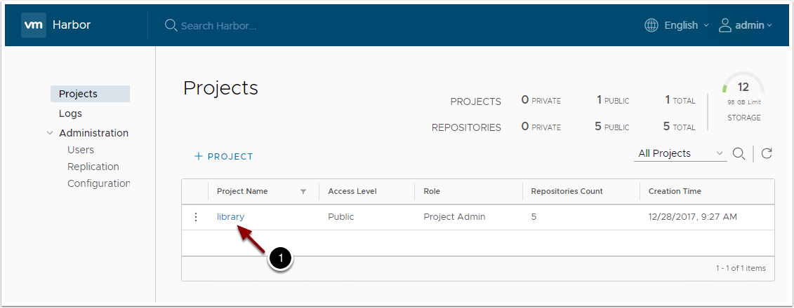
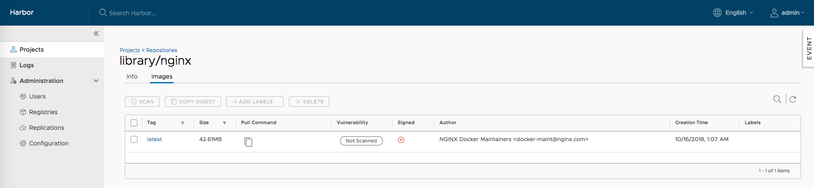
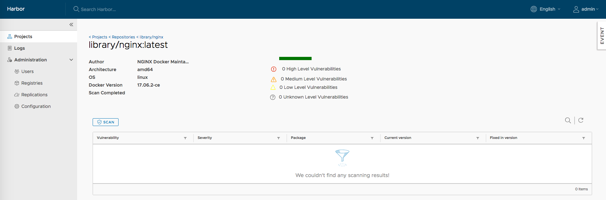
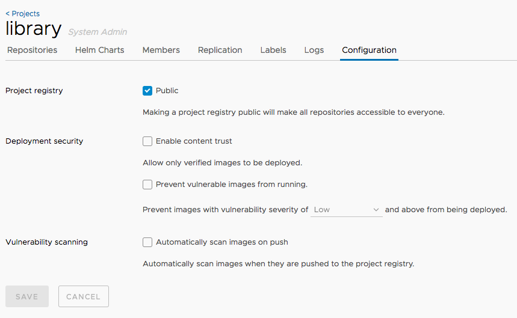

# Harbor (Container Registry)

## Goal
Configure and deploy VMware Harbor within PCF Ops Manager. This will enable us to push and pull docker images to a secured image repository while still being managed, and monitored by the PCF Platform.

## Prerequisites

+ Deployed Pivotal Ops Manager (2.0+)
+ Deployed Pivotal Director Tile
    + Post-deploy scripts enabled
+ Deployed Pivotal Container Service Tile

## Download Harbor Tile

1. Navigate to [Pivotal Network](https://network.pivotal.io/)

1. Register and login.

1. Download the [Harbor Tile](https://network.pivotal.io/products/pivotal-container-service)

1. Accept the EULA

## Upload PKS Tile to Pivotal Ops Manager

1. Navigate to the Pivotal Ops Manager FQDN (hostname).

1. Login.

1. Select `Import a Product`.

1. Browse to the product downloaded earlier.

1. Wait while the product is uploaded, this may take time depending on your connection to the Pivotal Ops Manager. *When completed notice the new product in the side panel of Pivotal Ops Manager.*

## Configure the Harbor Tile

1. Click the green `+` on the product tile.

1. Click the `VMware Harbor Registry` tile. Harbor deploys a vm which contains a docker registry on it which Kubernetes then can utilize to pull images from.

1. Configure the `Assign AZs and Networks` page.
    - Select an `AZ` for both the singleton jobs, and all other jobs to run in.

    - Select `PKS-Management` for `network` if having followed earlier demos. This network is where the Harbor VM itself will live.

1. Configure the `General` page.
    - Enter in the hostname that the the VM will assume. We will use `harbor.pks.<INSERT DOMAIN HERE>`.

1. Configure the `Certificate` page.
    Either generate a self signed certificate for our harbor endpoint or copy/paste in the certificate PEM and private key PEM. This certificate will be used when pushing and pulling docker images to the harbor image repository.
      - The certificate must be valid for the hostname we created above and must be an `*` asterisk record.
      - The certificate must be valid for the above host.
      - We will use the following: `*.pks.<INSERT DOMAIN HERE>`.

1. Configure the `Credentials` page.
    - Enter an admin password that will be set on the Harbor service itself.

1. Configure the `Authentication` Page. This enables us to integrate Harbor with either our PKS users, PAS users, an external LDAP service, or just use local auth.
  - Select Internal as we will be using local auth.

1. Click the Installation Dashboard link to return to the Installation Dashboard.
    - *Notice the tile has changed form orange to green signifying it it ready to be applied!*

1. Click Apply Changes on the right navigation.

## Configure Harbor DNS

1. **IT FAILED**...But thats expected. The first deployment attempt we did not know the IP that BOSH would assign our Harbor VM. Therefore we did not setup the DNS resolution. Lets set that up now.

1. Navigate to the Pivotal Ops Manager FQDN.

1. Login.

1. Click on the VMware Harbor Tile.

1. Click the tab labeled `status`. Here is the list of VMs deployed by the platform and the current status.

1. Note the IP of the `harbor-app` job down, this is the Harbor VM.

1. Configure your dns to resolve the hostname we specified in the earlier steps to the above IP.

---

# Repository Management

## Prerequisites

+ Deployed Pivotal Ops Manager (2.0+)
+ Deployed Pivotal Director Tile
    + Post-deploy scripts enabled
+ Deployed Pivotal Container Service Tile
+ vmWare Harbor Installed
+ Docker

## Goal
The application deployments in this workshop make use of a private container registry.  We are using software from a VMware opensource project called Harbor as our registry.  Harbor is included as an enterprise supported product with Pivotal Container Service (PKS).  In this section, you will become familiar with the core capability of Harbor.  You will create a project and see how to push and pull images from the repos.  You will also enable content trust so that images are signed by the publisher and only signed images may be pulled from the project repo.  You will also be introduced to the vulnerability scanning capability of Harbor.   Most organizations will use a private registry rather than public Docker hub to improve security and latency for their applications.  Although Harbor can be deployed as a highly available application, we have not done that for this workshop.

## Login to Harbor UI

1. Click on `Google Chrome`

1. Navigate to the Harbor URL

1. Login to Harbor with the username and password

## View Projects and Repositories

Harbor organizes images into a set of projects and repositories within those projects. Repositories can have one or more images associated with them.  Each of the images are tagged.  Projects can have RBAC (Role Based Access Control) and replication policies associated with them so that administrators can regulate access to images and create image distribution pipelines across registries that might be geographically dispersed.  You should now be at a summary screen that shows all of the projects in this registry.  There is only a single project called library.

The library project contains four repositories and has no access control.  It is available to the public.

1. Click on `library` to see the repos

There are currently no repositories in the library, so let's add one using Docker.

**NOTE:** If you are using self-signed certs in Harbor, you will need to add an insecure registry to your local Docker daemon.  Go to 'Docker -> Preferences -> Daemon' and add your registry to the list of insecure registries.  Then click 'Apply & Restart'.

In a terminal, type:

1. `docker pull nginx`

1. `docker tag nginx <YOUR_HARBOR_FQDN>/library/nginx`

1. `docker push <YOUR_HARBOR_FQDN>/library/nginx`

Refresh Harbor and you should see your new repository.

1. Click on the name of the repository `library/nginx` to view details

1. On the `Images` tab we can see that this image is unsigned and has not yet been scanned for vulnerabilities.

## Vulnerability Scans

In order to view an image vulnerability report, we must first perform an image scan.  

1. Click on the tag `latest` to drill down to the vulnerability report page

1. Click on the `Scan` button to perform an image scan.  You should see the progress change from `Queued` to `Scanning`.  

1. After the scan is complete, you should see a full report with no vulnerabilities!  Our image is now safe to deploy to Kubernetes.

## Configuration Options
There are additional security policies that can be enforced from Harbor through configurations.

1. Click on the default project: `Projects -> library`

1. Click on the `Configuration` tab

1. Here you will see several options for additional security implementation:

    - **Project Registry:** Toggling the `Public` checkbox will allow access to everyone or keep the registry private.

    - **Deployment Security:**

        - **Enable Content Trust:** Allows only signed images to be deployed.

        - **Prevent Vulnerable Images From Running:** Images with vulnerabilities cannot be run.  Severity tolerance can be set as well.

    - **Vulnerability Scanning:** Set this value to automatically scan images when they are pushed to the registry.
