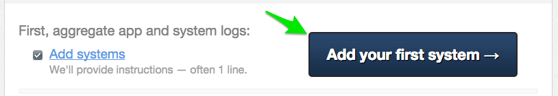
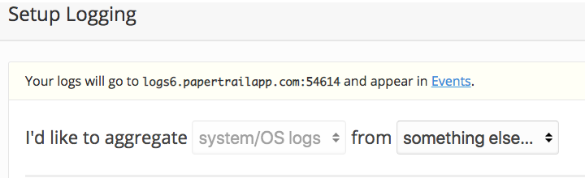
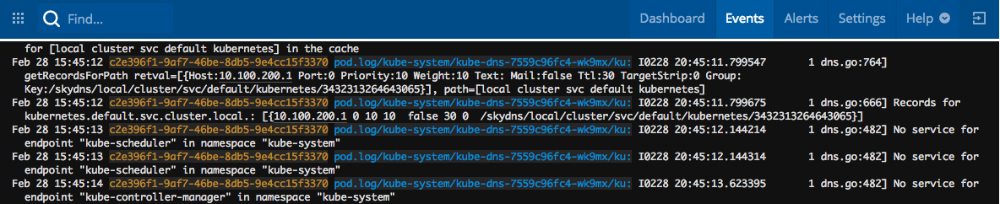

# Monitoring and Logging

## command line
`kubectl logs` command can be used to dump or stream stdout logs. Try some commands:
```
$ kubectl logs pod-name                        # dump pod logs (stdout)
$ kubectl logs pod-name -c container-name      # dump pod container logs (stdout, multi-container case)

$ kubectl logs -f pod-name                     # stream pod logs (stdout)
$ kubectl logs -f pod-name -c container-name   # stream pod container logs (stdout, multi-container case)
```

## Ingest logs to a third-party log management service
Application operators are often interested in long-term retention, indexing, and analysis of logs.

In this section, we'll drain logs to a very simple provider called `Papertrail`.

- Visit https://papertrailapp.com and create a free account.

- Login to your account and add your first system:


- Click on `Add your first system`:


- We'll use sink resources to configure destinations for logs transported following the Syslog Protocol. 
    - create sink resource configuration for clusters and name file as `cluster_sink.yml`
    ```
    apiVersion: apps.pivotal.io/v1beta1
    kind: ClusterSink
    metadata:
      name: demo-cluster-sink
    spec:
      type: syslog
      host: logs6.papertrailapp.com
      port: 54614
      enable_tls: true
    ``` 
    - create sink resource configuration for namespaces and name file as `sink.yml`
    ```
    apiVersion: apps.pivotal.io/v1beta1
    kind: Sink
    metadata:
      name: demo-default-sink
      namespace: default
    spec:
      type: syslog
      host: logs6.papertrailapp.com
      port: 54614
      enable_tls: true
    ``` 
- Apply the resources to your cluster (use `-n NAMESPACE` to specify your namespace if yo are not working in default namespace)
    ```
    $ kubectl apply -f cluster_sink.yml
    clustersink.apps.pivotal.io/demo-cluster-sink created

    $ kubectl apply -f sink.yml
    sink.apps.pivotal.io/demo-default-sink created
    ```

- Go back to papertrail site and check the Events page. We should be able to see logs being streamed in.


## All sink log entries use the following format:

`APP-NAME/NAMESPACE/POD-ID/CONTAINER-NAME`

 - Pod logs entries are distinguished by the string `pod.log` in the APP-NAME field
 - Kubernetes API Event entries are distinguished by the string `k8s.event` in the APP-NAME field.
