# PKS Networking with NSX-T
PKS includes software defined networking with NSX.  NSX supports logical networking from the Kubernetes cluster VMs to the pods themselves providing a single network management and control plane for your container based applications.  This section will not be an exhaustive look at all of the NSX Kubernetes integration but will focus on a few examples.  Also, this section assumes some knowledge of kubernetes, kubectl and yaml configuration files.  

## Pre-Requisites

- Pivotal Ops Manager
- Pivotal Container Service Tile
- NSX-T

## Goal
Familiarize users with NSX Manager functionalities and successfully view NSX-T networking objects.

## Create a namespace
We will now create a new namespace and set the context so that the cli is pointed to the new namespace.

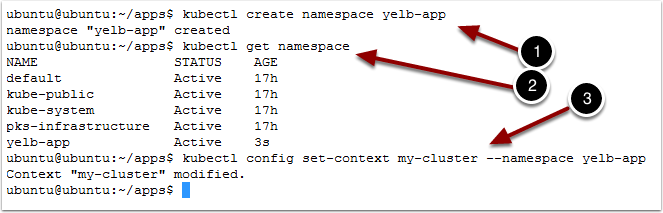

1. Type `kubectl create namespace yelb-app`

1. Type `kubectl get namespace`

1. Type `kubectl config set-context my-cluster --namespace yelb-app`

This command changes the context for kubectl so that the default namespace to use is the new yelb-app.  It keeps you from having to specify the namespace on each command.

## View new objects with NSX-Manager

1. Open your browser

1. Navigate to NSX-Manager

1. Enter the username and password

1. Click Log In

## View logical router created automatically

1. Click on `Routing`

1. Click on `T1 Router` created for the yelb-app namespace

There are T1 routers created for each of our namespaces and the yelb-app T1 router was automatically added when we created the Namespace.  If you click on Switching you would see a similar list of Logical Switches.  When pods are deployed, Ports are created on the appropriate switch and an IP from the pool is assigned to the pod.

## Kubernetes network policy and microsegmentation
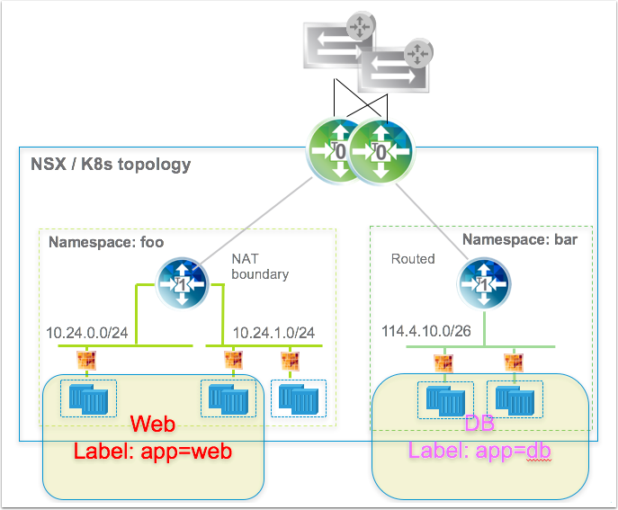

Using Network Policy, users can define firewall rules to allow traffic into a Namespace and between Pods. The network policy is a Namespace property.  Network Admins can define policy in NSX through labels that can then be applied to pods or namespaces.  Here we will show how the Kubernetes Network Policy definition causes the firewall rules to be automatically generated in NSX.  By default, pods are non-isolated; they accept traffic from any source.  Pods become isolated by having a NetworkPolicy that selects them.  Once there is any NetworkPolicy in a namespace selecting a particular pod, that pod will reject any connections that are not allowed by any NetworkPolicy. Other pods in the namespace that are not selected by any NetworkPolicy will continue to accept all traffic. In our case, we will add a policy to only allow access to our nginx app from pods in a namespace with label app:db.

## Create a network policy
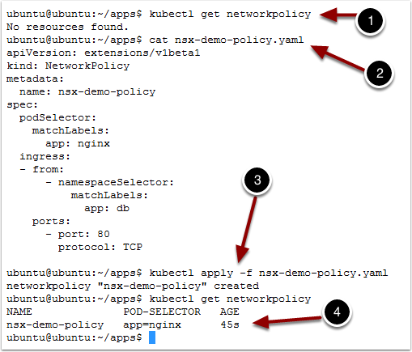

We will first check that there are no Network Policies created for this Namespace

1. Type `kubectl get NetworkPolicy`

Next we look at the network policy we want to create.  This one establishes a rule about connectivity to pods with label app:nginx from namespaces with label app:db.  Pods that are not in a namespace that matches the label will not be able to connect.

2. Type `cat nsx-demo-policy.yaml`

    {{codebase-file codebase="pks-workshop" path="nsx-demo-policy.yaml" lang="yaml" ref="master" hidden="false"}}

Let's apply that network policy

3. Type `kubectl apply -f nsx-demo-policy.yaml`

Let's see what we created

4. Type `kubectl get NetworkPolicy`

## View firewall rules created automatically
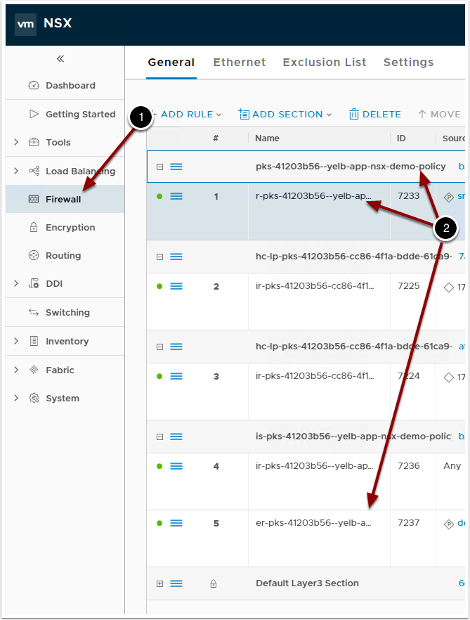

From NSX-Mgr we can see that rules have been created based on our policy.  NSX has dynamically created Source and Destination security groups and will apply the right policy

1. Click on `Firewall`

1. Note the Network Policy Name and the scope being the Namespace we created it from.

## Traceflow
NSX provides the capability to do detailed packet tracing across VMs and between pods.  You can tell where a packet might have been dropped between two pods that you have deployed.  We will deploy two pods in our namespace.  We did not add any labels to our namespace when we created it, so our network policy should prevent communication between the two.  Let's create the pods.

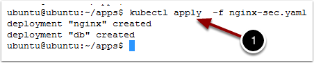

1. Type `kubectl apply -f /home/ubuntu/apps/nginx-sec.yaml`

## Configure Traceflow source
Return to NSX-Mgr in the Browser

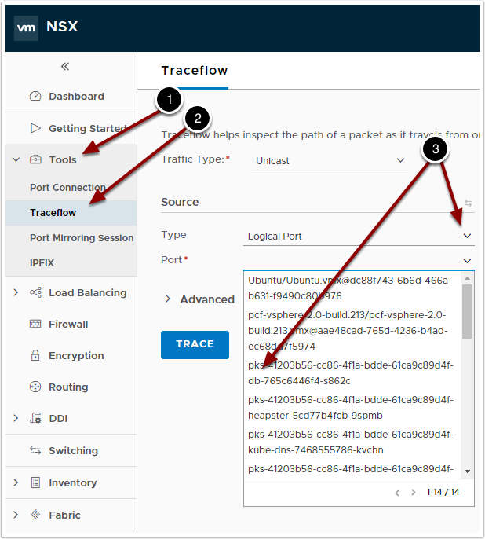

1. Click on `Tools`

1. Select `Traceflow`

1. Choose the Logical Port and find a port with "`db`" in the name as the source

## Configure Traceflow destination
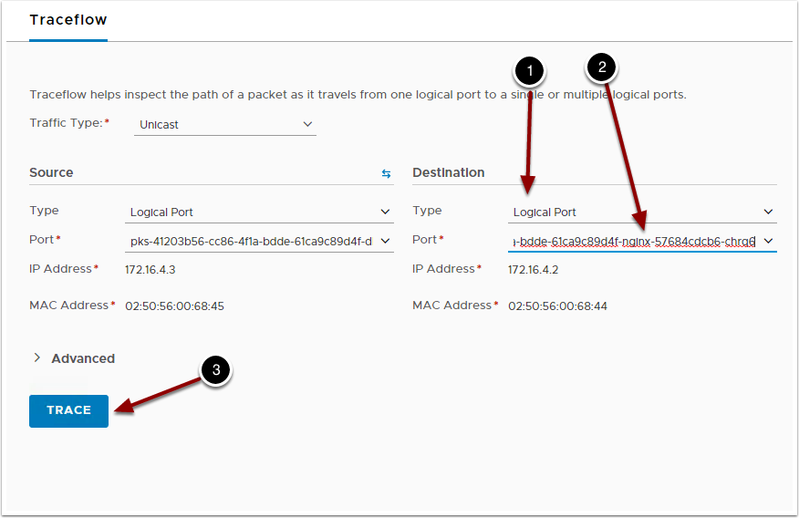

1. Under Destination, choose `Logical Port`

1. Choose one of the Ports with `Nginx` in the name

1. Click `Trace`

## Verify packets are dropped
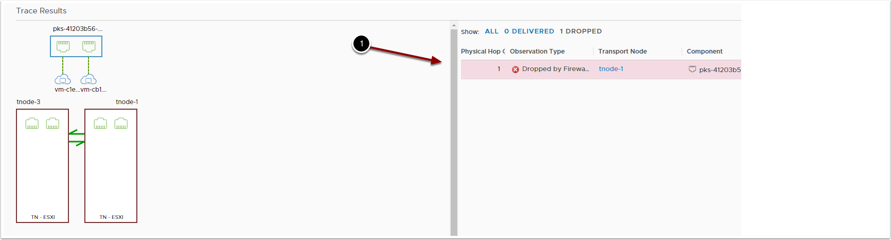

1. The packet was dropped by the firewall

Let's remove the network policy and try this again.

## Remove network policy
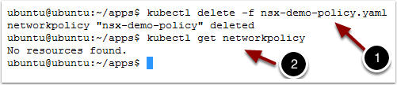

Return to the command line

1. Type `kubectl delete -f nsx-demo-policy.yaml`

1. Type `kubectl get networkpolicy`

## Re-trace your application

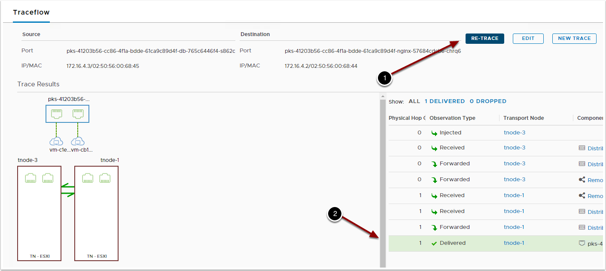

1. Click the `Re-Trace` button

1. Once the network policy was removed, the network packet made it to its destination succesfully

Traceflow is a very powerful capability that can also trace from VM to pod, VM to VM and IP to IP.  Try out a few more traces on your own.

## Cleanup deployments

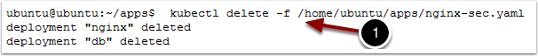

1. Type `kubectl delete -f /home/ubuntu/apps/nginx-sec.yaml`

1. Type `kubectl config set-context my-cluster --namespace default`

Returns the kubectl context to the default namespace.
