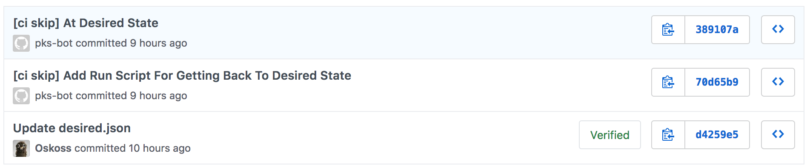

# PKS and Kubernetes via Pipelines

In order to control the sprawl of kubernetes, and to guarantee
each kubernetes cluster is deployed with the exact same configuration
both [concourse](https://concourse-ci.org/) and [PKS](https://pivotal.io/platform/pivotal-container-service) are recommended to be used.

## Pre-Requisites

- `Concourse` Deployed
- `PKS` Deployed
- `git` Compatible Repository Available
- `fly` CLI to communicate with concourse
- Access to `github.com` to retrieve Pivotal created pipelines

## (Basic) Creating PKS Clusters

In this part of the demo a simple concourse pipeline is used to deploy K8s with PKS in a pre-configured way.

### Setup the Create-Cluster Pipeline

1. Clone `https://github.com/Pivotal-Field-Engineering/pks-workshop.git` to obtain
`create-pks-clusters-pipeline.yml` and `params.yml`.

1. Open the `params.yml` in your text editor. Read the comments and supply the values requested under **CREATE PKS CLUSTERS PIPELINE**.

1. Login to your concourse instance with `fly`.

    ```bash
    fly -t <YOUR-TARGET> login -k --concourse-url=<YOUR-CONCOURSE-URL>
    ```

1. Set the Pipeline with both `create-pks-clusters-pipeline.yml` and `params.yml` to begin monitoring your PKS Config.

    ```bash
    fly -t <YOUR-TARGET> set-pipeline -p pks-clusters-create -c create-pks-clusters-pipeline.yml -l params.yml
    ```

1. Notice all clusters are manually deployed by triggering the create-cluster step. Lets do this now!
  - Log into the concourse GUI by navigating to your concourse URL.
  - Un-pause the pipeline
  - Click on the `create-cluster` job.
  - Click the `+` icon in the upper right hand corner.

1. If all was successful you should see the output of your `kube.conf` which you can now use with `kubectl` to login to your newly create K8s cluster.

## (Advanced) Monitor Desired PKS Clusters vs Current PKS Clusters

Building on the above we now understand how Concourse can deploy a single PKS cluster in a pre-configured way,
but as an enterprise we will have many that change constantly overtime.

In this part of the demo a concourse pipeline is used to track the desired state of PKS and resolve any differences.
This enables us to scale clusters, add clusters, delete clusters, all while maintaining a change log,
and audit log for who owns each cluster.

### Store Desired PKS State

For storing our desired PKS clusters state we will utilize `git`.
This demo utilizes `github` but any compatible repository should work.

1. Create a repository for storing your PKS clusters.
  - An example can be found [here](https://github.com/Oskoss/peters-pks-clusters)

1. Create a basic PKS configuration similar to below, name it `desired.json` and
place it in the root of the repository. This will be your PKS clusters configuration JSON.
It will store all clusters this PKS install will deploy, how many workers each one has,
and which plan each one was created with. Ensure your `PKS` environment has been configured with the `small` plan
otherwise choose the correct plan names for your `PKS` environment.

    ```JSON
    [
        {
            "name": "dev-cluster",
            "plan_name": "small",
            "parameters": {
            "kubernetes_worker_instances": 3
            }
        }
    ]
    ```

*Note: The JSON format complies with the format determined from the PKS CLI: `pks clusters --json`*

1. Commit, and push the `desired.json` file.

### Setup the Monitor PKS Clusters Pipeline

1. Clone `https://github.com/Pivotal-Field-Engineering/pks-workshop.git` to obtain
`monitor-pks-clusters-pipeline.yml` and `params.yml`.

1. Open the `params.yml` in your text editor. Read the comments and supply the values requested under both **CREATE PKS CLUSTERS PIPELINE** and **MONITOR PKS CLUSTERS PIPELINE**.

1. Login to your concourse instance with `fly`.

    ```bash
    fly -t <YOUR-TARGET> login -k --concourse-url=<YOUR-CONCOURSE-URL>
    ```

1. Set the Pipeline with both `monitor-pks-clusters-pipeline.yml` and `params.yml` to begin monitoring your PKS Config.

    ```bash
    fly -t <YOUR-TARGET> set-pipeline -p pks-clusters-monitor -c monitor-pks-clusters-pipeline.yml -l params.yml
    ```

1. Notice since our `desired.json` contained a single PKS cluster definition Concourse has kicked PKS off to create a new K8s cluster for us.

### Create a New PKS Cluster with our External Configuration

1. Inside our `PKS State` git repository open `desired.json` in your text editor.

1. Add a new cluster by adding the following block to the JSON.

    ```JSON
    {
        "name": "prod-cluster",
        "plan_name": "medium",
        "parameters": {
            "kubernetes_worker_instances": 5
        }
    }
    ```

1. The end result should look similar to the following. Ensure your `PKS` environment has been configured with `small` and `medium` plans
otherwise rename them to the correct plan names for your `PKS` environment.

    ```JSON
    [    
        {
            "name": "dev-cluster",
            "plan_name": "small",
            "parameters": {
            "kubernetes_worker_instances": 3
            }
        },
        {
            "name": "prod-cluster",
            "plan_name": "medium",
            "parameters": {
            "kubernetes_worker_instances": 5
            }
        }
    ]
    ```

1. Commit, and push the new `desired.json` file.

1. Watch as your pipeline automatically detects the new changes and creates the new PKS cluster for us.

1. Once all clusters have been created examine the git log of the `PKS State` git repository. It should look similar to the below.

  

  - Notice our commit adding the `prod-cluster` to the `desired.json` file. Followed by a commit that added a `runPKS.sh` script,
  and finally by a commit that removed that script. While the first commit was our commit the second and third commits were done by our pipeline!

### Scale and Delete Existing PKS Clusters with our External Configuration

1. Inside our `PKS State` git repository open `desired.json` in your text editor.

1. Lets delete the `prod-cluster` and scale our `dev-cluster` by editing the JSON parameters.

1. The end result should look similar to the following. Ensure your `PKS` environment has been configured with the `small` plan
otherwise rename it to the correct plan name for your `PKS` environment.

    ```JSON
    [
        {
            "name": "dev-cluster",
            "plan_name": "small",
            "parameters": {
            "kubernetes_worker_instances": 3
            }
        }
    ]
    ```

1. Commit, and push the new `desired.json` file.

1. Watch as your pipeline automatically detects the new changes, deletes our `prod-cluster` and scales our `dev-cluster` for us.
