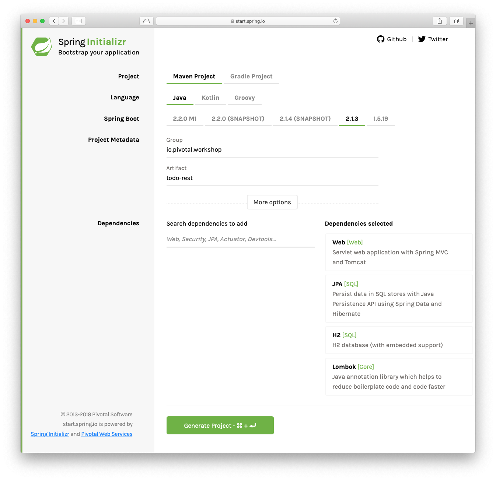

# Spring Boot Primer

The following lab will show you how to create a Spring Boot project. The exampls is a simple ToDo app that exposes the list of tasks as REST API.

**Estimated Time**: 15 min.


## ToDo Rest API project.

1. Open a window browser and point to: [https://start.spring.io](https://start.spring.io)

2. Set the following values:

   | Field        | Value                      |
   | ------------ | -------------------------- |
   | Group        | ***io.pivotal.workshop***  |
   | Artifact     | ***todo-rest***            |
   | Dependencies | ***Web, JPA, H2, Lombok*** |

   

   **IMPORTANT** Install the [Lombok](https://projectlombok.org/download) in your IDE.

3. Click "Generate Project" button. Unzip the code generated. Import it into your favorite IDE.

4. Create the ***ToDo*** class that will hold the information about any To-Do item. Add the folliwing content:

   ```java
   package io.pivotal.workshop.todorest;
   
   import java.time.LocalDateTime;
   
   import javax.persistence.Column;
   import javax.persistence.Entity;
   import javax.persistence.GeneratedValue;
   import javax.persistence.Id;
   import javax.persistence.PrePersist;
   import javax.persistence.PreUpdate;
   
   import org.hibernate.annotations.GenericGenerator;
   
   import lombok.Data;
   import lombok.NoArgsConstructor;
   import lombok.NonNull;
   import lombok.RequiredArgsConstructor;
   
   
   @Entity
   @RequiredArgsConstructor
   @NoArgsConstructor(force=true)
   @Data
   public class ToDo {
   	
   	  @Id
   	  @GeneratedValue(generator="system-uuid")
   	  @GenericGenerator(name="system-uuid", strategy = "uuid2")
       private String id;
       
   	  @NonNull
   	  private final String description;
       private boolean complete;
       
       @Column(insertable=true,updatable=false)
       private LocalDateTime created;
       @Column(insertable=true,updatable=true)
       private LocalDateTime modified;
       @Column(insertable=false,updatable=true)
       private LocalDateTime completed;
       
       
       @PrePersist
       public void onPrePersist() {
       	this.created = LocalDateTime.now();
       	this.modified = LocalDateTime.now();
       }
       
       @PreUpdate
       public void onPreUpdate() {
        	this.modified = LocalDateTime.now();
       }
   }
   ```

   The ***ToDo*** class is using several annotations that play together with *JPA* and *Hibernate*. Also is using some of the *Lombok* library that created the setters, getters and the toString methods.

5. Create the ***ToDoRepository*** interface.

   ```java
   package io.pivotal.workshop.todorest;
   
   import org.springframework.data.repository.CrudRepository;
   
   public interface ToDoRepository extends CrudRepository<ToDo,String> { }
   ```

   This is a *Spring Data* interface that will have all the necessary CRUD actions needed.

6. Create the ***ToDoController*** class.

   ```java
   package io.pivotal.workshop.todorest;
   
   import java.net.URI;
   
   import org.springframework.http.ResponseEntity;
   import org.springframework.web.bind.annotation.GetMapping;
   import org.springframework.web.bind.annotation.PathVariable;
   import org.springframework.web.bind.annotation.PostMapping;
   import org.springframework.web.bind.annotation.RequestBody;
   import org.springframework.web.bind.annotation.RestController;
   import org.springframework.web.util.UriComponentsBuilder;
   
   import lombok.AllArgsConstructor;
   
   @AllArgsConstructor
   @RestController
   public class ToDoController {
   
   	private ToDoRepository toDoRepository;
   	
   	@GetMapping("/todos")
   	public ResponseEntity<Iterable<ToDo>> getAll(){
   		return ResponseEntity.ok(this.toDoRepository.findAll());
   	}
   	
   	@GetMapping("/todos/{id}")
   	public ResponseEntity<ToDo> findById(@PathVariable String id){
   		return ResponseEntity.ok(this.toDoRepository.findById(id).orElse(null));
   	}
   	
   	@PostMapping("/todos")
   	public ResponseEntity<ToDo> save(@RequestBody ToDo toDo, UriComponentsBuilder uriBuilder){
   		ToDo toDoCreated = this.toDoRepository.save(toDo);
   		URI location = uriBuilder.path("/todos/{id}")
                   .buildAndExpand(toDoCreated.getId())
                   .toUri();
   		return ResponseEntity.created(location).body(toDoCreated);
   	}
   }
   ```

7. Rename the ***src/main/java/resources/application.properties*** to a ***application.yml*** file and add the following content.

   ```yaml
   spring:
     jpa:
       generate-ddl: true
       hibernate:
         ddl-auto: create-drop
     h2:
       console:
         enabled: true
   ```

   

8. Create a ***ToDoConfiguration*** class that will initialize some of the data:

   ```java
   package io.pivotal.workshop.todorest;
   
   import java.util.Arrays;
   
   import org.springframework.boot.ApplicationRunner;
   import org.springframework.context.annotation.Bean;
   import org.springframework.context.annotation.Configuration;
   
   @Configuration
   public class ToDoConfiguration {
   
   	@Bean
   	ApplicationRunner init(ToDoRepository toDoRepository) {
   		return args -> {		
   			if (toDoRepository.count() == 0) {
   				toDoRepository.saveAll(Arrays.asList(
   						new ToDo("Walk the Dog"),
   						new ToDo("Read the Pro Spring Boot 2 book"),
   						new ToDo("Make dinner")));
   			}				
   		};
   	}	
   }
   ```

9. Run the **ToDo** project and execute some *cURL* and [jq](https://stedolan.github.io/jq/) commands:

   ```shell
   $ curl -s localhost:8080/todos | jq
   [
     {
       "id": "596a5d64-df68-45db-aecf-f911dc57f8d3",
       "description": "Walk the Dog",
       "complete": false,
       "created": "2019-03-17T19:43:13.239",
       "modified": "2019-03-17T19:43:13.24",
       "completed": null
     },
     {
       "id": "f0ebe0f6-e360-4250-adcc-0e84f469bea4",
       "description": "Read the Pro Spring Boot 2 book",
       "complete": false,
       "created": "2019-03-17T19:43:13.249",
       "modified": "2019-03-17T19:43:13.249",
       "completed": null
     },
     {
       "id": "8a7740f1-f67f-402b-81ef-616b59fe8131",
       "description": "Make dinner",
       "complete": false,
       "created": "2019-03-17T19:43:13.249",
       "modified": "2019-03-17T19:43:13.249",
       "completed": null
     }
   ]
   ```

   

   

## Challenges

- [ ] Add new To-Do's using the *cURL* command.
- [ ] Find by ID using the *cURL* command.
- [ ] Implement the *DELETE* method in the ***ToDoController*** class.
- [ ] Add a ***findByDescription*** that *contains* a certain text in the ***ToDoRepository*** interface.