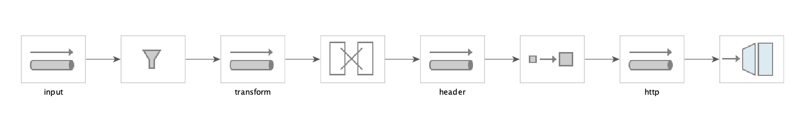
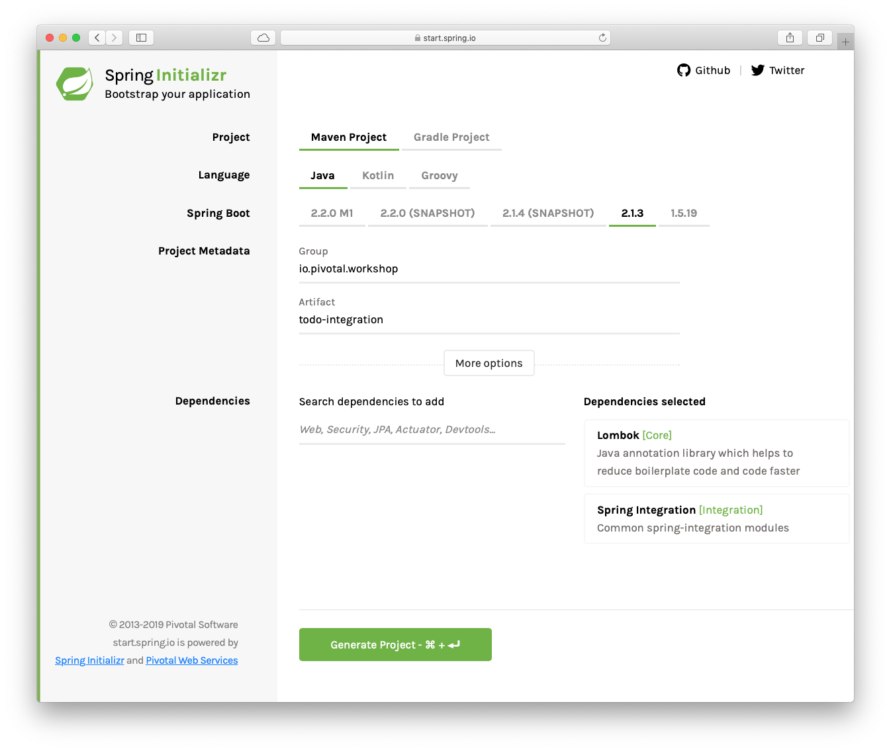

# Spring Integration Primer

The objective of this labs is to understand how Messages, Channels and Integration patterns are im portant to create flows for the systems.

**Estimated Time**: 15 minutes.


## ToDo Integration Project

**App Requirements**:

- This app will send a Message (as ToDo), example: *Clean the room today*.

- The message will get filtered if contains the word: "*today*".

- The message will be transformed to a JSON form, example:

  ```json
  {
    "description":"Clean the room today"
  }
  ```

- The message will be sent (POST) to the ToDo Rest endpoint: http://localhost:8080/todos


**Integration Diagram**:




1. Open a window browser and point to: [https://start.spring.io](https://start.spring.io)

    Set the following values:

    | Field        | Value                     |
    | ------------ | ------------------------- |
    | Group        | ***io.pivotal.workshop*** |
    | Artifact     | ***todo-integration***    |
    | Dependencies | ***Integration, Lombok*** |

    

2. Click "Generate Project" button. Unzip the code generated. Import it into your favorite IDE.
3. Add the following extra dependencies to the pom.xml file:

    ```xml
   		<dependency>
   			<groupId>org.springframework.integration</groupId>
   			<artifactId>spring-integration-http</artifactId>
   		</dependency>

   		<dependency>
   			<groupId>com.fasterxml.jackson.core</groupId>
   			<artifactId>jackson-databind</artifactId>
   		</dependency>
    ```

    The first dependency will help to integrate and send messages to the ToDo Rest endpoint; and the second dependency will help for the convertion to JSON object.

4. Create the ToDoTransformer class that will transform the message to a JSON format:
    ```java
    package io.pivotal.workshop.todointegration;

    import com.fasterxml.jackson.core.JsonProcessingException;
    import com.fasterxml.jackson.databind.ObjectMapper;
    import lombok.AllArgsConstructor;
    import lombok.Data;
    import org.springframework.integration.transformer.GenericTransformer;

    public class ToDoTransformer implements GenericTransformer<String, String> {

	@AllArgsConstructor
	@Data
	class ToDo {
		private String description;
	}

   	@Override
   	public String transform(String source) {
   		ObjectMapper objectMapper = new ObjectMapper();
   		try {
   			return objectMapper.writeValueAsString(new ToDo(source));
   		} catch (JsonProcessingException e) {
   			e.printStackTrace();
   			return null;
   		}
   	 }
    }
    ```

    This class implements the ***GenericTransformer*** interface that allows to add any custom code.

5. Create the ToDoIntegrationFlow class that will hold all the integration flow.
    ```java
    package io.pivotal.workshop.todointegration;

   import org.springframework.beans.factory.annotation.Value;
   import org.springframework.boot.ApplicationRunner;
   import org.springframework.context.annotation.Bean;
   import org.springframework.context.annotation.Configuration;
   import org.springframework.http.HttpMethod;
   import org.springframework.http.MediaType;
   import org.springframework.integration.dsl.IntegrationFlow;
   import org.springframework.integration.dsl.IntegrationFlows;
   import org.springframework.integration.dsl.MessageChannels;
   import org.springframework.integration.http.dsl.Http;
   import org.springframework.integration.support.MessageBuilder;
   import org.springframework.messaging.MessageChannel;

   @Configuration
   public class ToDoIntegrationFlow {

   	@Bean
   	public ApplicationRunner init(MessageChannel input) {
   		return args -> {
   			input.send(MessageBuilder.withPayload("Clean my room today").build());
   		};
   	}

   	@Bean
   	public MessageChannel input() {
   		return MessageChannels.direct().get();
   	}

   	@Bean
   	public IntegrationFlow simpleFlow(@Value("${todo.rest.url}")String url) {
   		return IntegrationFlows.from("input")
   		        .filter("payload.toUpperCase().contains('TODAY')")
   	    			.transform(new ToDoTransformer())
   	    			.enrichHeaders(c -> c.header("Content-Type", MediaType.APPLICATION_JSON))
   	    	    .handle(Http.outboundGateway(url)
                   .httpMethod(HttpMethod.POST)
                   .expectedResponseType(String.class))
   	    			.handle(System.out::println)
   	    			.get();
   	}
   }

    ```

    The important part is the last method that defines the *Integration Flow*. It will receive a message from the input channel, then it will get filtered, then it will be transformed to JSON, then it will add the content-type header (necessary for the Rest endpoint) and last it will send the JSON to the endpoint specified in the **todo.rest.url** properties (defined in the application.yml file).

4. Add the following property to the application.yml file. (Remember to change the extension to .yml)

    ```yaml
   todo:
     rest:
       url: http://localhost:8080/todos
    ```

5. You can run your application and see that the message get posted. You should see in the logs the "*Location*" header as response. Another way to check is to exectue a cURL command over the endpoint.


## Challenges

- [ ] Send more than one message and see if the filter works as expected.

- [ ] Create a JAR and use application arguments to send a To-Do. Example:
   ```shell
   $ java -jar todo-integration-0.0.1-SNAPSHOT.jar --todo="Learn Spring today"
   ```
