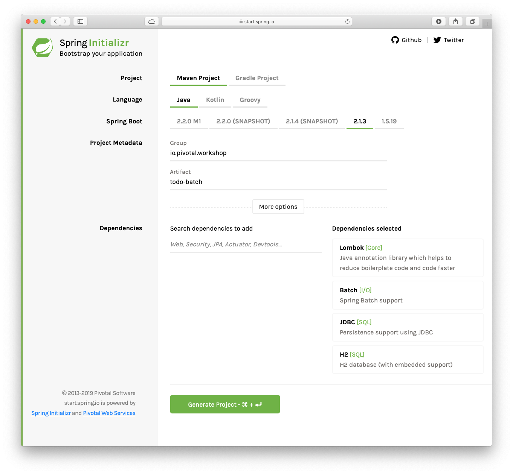

# Spring Batch Lab

The objective is to get an introduction on how Spring Batch works and how you can create in an easy way an enterprise ready ETL apps.

**Estimated Time**: 15 min.

## Requirements

- The app will read ToDos from a Database
- All the records will be converted into XML


## ToDo Batch project

1. Open a window browser and point to: [https://start.spring.io](https://start.spring.io)

    Set the following values:

    | Field        | Value                         |
    | ------------ | ----------------------------- |
    | Group        | ***io.pivotal.workshop***     |
    | Artifact     | ***todo-batch***              |
    | Dependencies | ***Batch, JDBC, H2, Lombok*** |

    

2. Click "Generate Project" button. Unzip the code generated. Import it into your favorite IDE.
3. Add the following extra dependencies to the pom.xml file:

    ```xml
      		<dependency>
         			<groupId>org.springframework</groupId>
         			<artifactId>spring-oxm</artifactId>
         		</dependency>

         		<dependency>
         			<groupId>com.thoughtworks.xstream</groupId>
         			<artifactId>xstream</artifactId>
         			<version>1.4.11.1</version>
         		</dependency>
    ```

    These dependencies will help to convert the ToDos into an **XML** format.

4. Create the **ToDo** domain class:

    ```java

   package io.pivotal.workshop.todobatch;

   import lombok.*;

   import java.time.LocalDateTime;


   @Data
   @AllArgsConstructor
   @NoArgsConstructor
   public class ToDo {

       private String id;
       private  String description;
       private boolean complete;
       private LocalDateTime created;
       private LocalDateTime modified;
       private LocalDateTime completed;
   }

    ```

5. Create a **ToDoRowMapper** class that will hold each Database record
    ```java

   package io.pivotal.workshop.todobatch;

   import org.springframework.jdbc.core.RowMapper;

   import java.sql.ResultSet;
   import java.sql.SQLException;
   import java.time.LocalDateTime;
   import java.time.format.DateTimeFormatter;

   public class ToDoRowMapper implements RowMapper<ToDo> {

       DateTimeFormatter formatter = DateTimeFormatter.ofPattern("yyyy-MM-dd HH:mm:ss");

       @Override
       public ToDo mapRow(ResultSet resultSet, int i) throws SQLException {

           return new ToDo(
                   resultSet.getString("id"),
                   resultSet.getString("description"),
                   resultSet.getBoolean("complete"),
                   LocalDateTime.parse(resultSet.getString("created"),formatter),
                   LocalDateTime.parse(resultSet.getString("modified"),formatter),
                   LocalDateTime.parse(resultSet.getString("completed"),formatter));
       }
   }
    ```

6. Create the **ToDoJoBConfiguration** class. This class is the Spring Batch definition and delcaration for the different steps.

    ```java

   package io.pivotal.workshop.todobatch;

   import org.springframework.batch.core.Job;
   import org.springframework.batch.core.Step;
   import org.springframework.batch.core.configuration.annotation.EnableBatchProcessing;
   import org.springframework.batch.core.configuration.annotation.JobBuilderFactory;
   import org.springframework.batch.core.configuration.annotation.StepBuilderFactory;
   import org.springframework.batch.item.database.JdbcPagingItemReader;
   import org.springframework.batch.item.database.Order;
   import org.springframework.batch.item.database.support.H2PagingQueryProvider;
   import org.springframework.batch.item.database.support.MySqlPagingQueryProvider;
   import org.springframework.batch.item.file.FlatFileItemWriter;
   import org.springframework.batch.item.xml.StaxEventItemWriter;
   import org.springframework.beans.factory.annotation.Autowired;
   import org.springframework.context.annotation.Bean;
   import org.springframework.context.annotation.Configuration;
   import org.springframework.core.io.FileSystemResource;
   import org.springframework.oxm.xstream.XStreamMarshaller;

   import javax.sql.DataSource;
   import java.io.File;
   import java.util.HashMap;
   import java.util.Map;

   @Configuration
   @EnableBatchProcessing
   public class ToDoJobConfiguration {


       @Bean
       public JdbcPagingItemReader<ToDo> pagingItemReader() {
           JdbcPagingItemReader<ToDo> reader = new JdbcPagingItemReader<>();

           reader.setDataSource(dataSource);
           reader.setFetchSize(10);
           reader.setRowMapper(new ToDoRowMapper());

           H2PagingQueryProvider queryProvider = new H2PagingQueryProvider();
           queryProvider.setSelectClause("id, description, complete, created, modified, completed");
           queryProvider.setFromClause("from to_do");

           Map<String, Order> sortKeys = new HashMap<>(1);
           sortKeys.put("id", Order.ASCENDING);
           queryProvider.setSortKeys(sortKeys);

           reader.setQueryProvider(queryProvider);

           return reader;
       }

       @Bean
       public StaxEventItemWriter<ToDo> xmlItemWriter() throws Exception {

           XStreamMarshaller marshaller = new XStreamMarshaller();

           Map<String, Class> aliases = new HashMap<>();
           aliases.put("todo", ToDo.class);

           marshaller.setAliases(aliases);

           StaxEventItemWriter<ToDo> itemWriter = new StaxEventItemWriter<>();

           itemWriter.setRootTagName("todos");
           itemWriter.setMarshaller(marshaller);
           String customerOutputPath = File.createTempFile("toDoOutput", ".xml").getAbsolutePath();
           System.out.println(">> Output Path: " + customerOutputPath);
           itemWriter.setResource(new FileSystemResource(customerOutputPath));

           itemWriter.afterPropertiesSet();

           return itemWriter;
       }


       @Autowired
       StepBuilderFactory stepBuilderFactory;

       @Autowired
       public JobBuilderFactory jobBuilderFactory;

       @Autowired
       public DataSource dataSource;

       @Bean
       public Step step1() throws Exception {
           return this.stepBuilderFactory.get("step1")
                   .<ToDo, ToDo>chunk(10)
                   .reader(pagingItemReader())
                   .writer(xmlItemWriter())
                   .build();
       }

       @Bean
       public Job job() throws Exception {
           return this.jobBuilderFactory.get("job")
                   .start(step1())
                   .build();
       }

   }

    ```

    Analyze the class. See that it defines 1 step that will read a chunk of 10 records at a time and it will write the result into an **XML** format. Take a look at the bean definitions like the ***pagingItemReader*** and the ***xmlItemWriter***, The importat part here it the usage of the **@EnableBatchProcessing** annotation, that will setup all the underlaying infrastructure so the ETL works.

7. Add the ***schema.sql*** in the ***src/main/java/resources*** folder:

    ```sql

   drop table to_do if exists;
   create table to_do (
     id varchar(36) not null,
     complete boolean not null,
     completed timestamp,
     created timestamp,
     description varchar(255) not null,
     modified timestamp,
   primary key (id));

    ```

8. Add the ***data.sql*** in the ***src/main/java/resources*** folder:

    ```sql

   insert into to_do (id, description, complete, created, modified, completed)
   values ('0deb1765-69ba-4038-b944-4a02284b47b2', 'Buy milk', false, '2019-03-19T11:14:20', '2019-03-19T11:14:20', '2019-03-19T11:14:20');
   insert into to_do (id, description, complete, created, modified, completed)
   values ('0deb1765-69ba-4038-b944-4a02284b47b3', 'Read a Book', false, '2019-03-19T11:14:20', '2019-03-19T11:14:20', '2019-03-19T11:14:20');
   insert into to_do (id, description, complete, created, modified, completed)
   values ('0deb1765-69ba-4038-b944-4a02284b47b4', 'Clean the Living Room', false, '2019-03-19T11:14:20', '2019-03-19T11:14:20', '2019-03-19T11:14:20');
   insert into to_do (id, description, complete, created, modified, completed)
   values ('0deb1765-69ba-4038-b944-4a02284b47b5', 'Buy ice cream', true, '2019-03-19T11:14:20', '2019-03-19T11:14:20', '2019-03-19T11:14:20');
   insert into to_do (id, description, complete, created, modified, completed)
   values ('0deb1765-69ba-4038-b944-4a02284b47b6', 'Learn Kubernetes', false, '2019-03-19T11:14:20', '2019-03-19T11:14:20', '2019-03-19T11:14:20');

    ```

    This is just a dummy data, you can add more if needed.

9. Now, you can run the app. In the logs you shuld have something like:

    ```shell
    >> Output Path: /var/folders/50/64gwwq9n7yz8kfsg3_whrd7m0000gn/T/toDoOutput12231575617867408170.xml
    ```

    and if you take a look at the content, you should see:

    ```xml
    
   <?xml version="1.0" encoding="UTF-8"?>
   <todos>
   	<todo>
   		<id>0deb1765-69ba-4038-b944-4a02284b47b2</id>
   		<description>Buy milk</description>
   		<complete>false</complete>
   		<created>2019-03-19T11:14:20</created>
   		<modified>2019-03-19T11:14:20</modified>
   		<completed>2019-03-19T11:14:20</completed>
   	</todo>
   	<todo>
   		<id>0deb1765-69ba-4038-b944-4a02284b47b3</id>
   		<description>Read a Book</description>
   		<complete>false</complete>
   		<created>2019-03-19T11:14:20</created>
   		<modified>2019-03-19T11:14:20</modified>
   		<completed>2019-03-19T11:14:20</completed>
   	</todo>
   	<todo>
   		<id>0deb1765-69ba-4038-b944-4a02284b47b4</id>
   		<description>Clean the Living Room</description>
   		<complete>false</complete>
   		<created>2019-03-19T11:14:20</created>
   		<modified>2019-03-19T11:14:20</modified>
   		<completed>2019-03-19T11:14:20</completed>
   	</todo>
   	<todo>
   		<id>0deb1765-69ba-4038-b944-4a02284b47b5</id>
   		<description>Buy ice cream</description>
   		<complete>true</complete>
   		<created>2019-03-19T11:14:20</created>
   		<modified>2019-03-19T11:14:20</modified>
   		<completed>2019-03-19T11:14:20</completed>
   	</todo>
   	<todo>
   		<id>0deb1765-69ba-4038-b944-4a02284b47b6</id>
   		<description>Learn Kubernetes</description>
   		<complete>false</complete>
   		<created>2019-03-19T11:14:20</created>
   		<modified>2019-03-19T11:14:20</modified>
   		<completed>2019-03-19T11:14:20</completed>
   	</todo>
   </todos>
    ```
