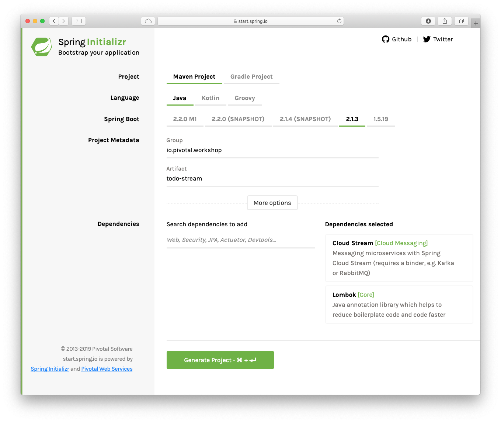

## Spring Cloud Stream

The objective of this lab is to understand how the Spring Cloud Stream works and how to create apps that connect each other without worrying about the transport layer.

**Estimated Time**: 15 min.

## Requirements

- Create a Source that listens form a JMS Queue for any new ToDos.
- Create a Sink that logs the ToDos.
- You will required the ActiveMQ and RabbitMQ brokers up and running.


## ToDo Stream Cloud Project

1. Open a window browser and point to: [https://start.spring.io](https://start.spring.io)

    Set the following values:

    | Field        | Value                      |
    | ------------ | -------------------------- |
    | Group        | ***io.pivotal.workshop***  |
    | Artifact     | ***todo-stream***          |
    | Dependencies | ***Cloud Stream, Lombok*** |

    

2. Click "Generate Project" button. Unzip the code generated. Import it into your favorite IDE.
3. Add the following extra dependencies to the pom.xml file:

     ```xml
          <dependency>
      			<groupId>org.springframework.cloud</groupId>
      			<artifactId>spring-cloud-starter-stream-rabbit</artifactId>
      		</dependency>
      		<dependency>
      			<groupId>org.springframework.boot</groupId>
      			<artifactId>spring-boot-starter-activemq</artifactId>
      		</dependency>
      		<dependency>
      			<groupId>org.springframework.integration</groupId>
      			<artifactId>spring-integration-jms</artifactId>
      		</dependency>
      		<dependency>
      			<groupId>com.fasterxml.jackson.datatype</groupId>
      			<artifactId>jackson-datatype-jsr310</artifactId>
      		</dependency>
     ```

      These dependencies will help read from **JMS** and format the **LocalDateTime** classes.

4. Create the **ToDo** domain class:
    ```java
     package io.pivotal.workshop.todostream;
  
     import com.fasterxml.jackson.databind.annotation.JsonDeserialize;
     import com.fasterxml.jackson.databind.annotation.JsonSerialize;
     import com.fasterxml.jackson.datatype.jsr310.deser.LocalDateTimeDeserializer  ;
     import com.fasterxml.jackson.datatype.jsr310.ser.LocalDateTimeSerializer;
     import lombok.AllArgsConstructor;
     import lombok.Data;
     import lombok.NoArgsConstructor;
  
     import java.time.LocalDateTime;
  
  
     @Data
     @AllArgsConstructor
     @NoArgsConstructor
     public class ToDo {
  
         private String id;
         private  String description;
         private boolean complete;
  
         @JsonSerialize(using = LocalDateTimeSerializer.class)
         @JsonDeserialize(using = LocalDateTimeDeserializer.class)
         private LocalDateTime created;
         @JsonSerialize(using = LocalDateTimeSerializer.class)
         @JsonDeserialize(using = LocalDateTimeDeserializer.class)
         private LocalDateTime modified;
         @JsonSerialize(using = LocalDateTimeSerializer.class)
         @JsonDeserialize(using = LocalDateTimeDeserializer.class)
         private LocalDateTime completed;
  
     }

    ```


5. Create the **ToDoJmsProducer** class. This class will help as client to send some ToDos to the QUEUE.
    ```java
    package io.pivotal.workshop.todostream;


    import lombok.AllArgsConstructor;
    import org.springframework.jms.core.JmsTemplate;

    @AllArgsConstructor
    public class ToDoJmsProducer {

        public static final String QUEUE = "TODO";
        private JmsTemplate template;

        public void sendToDo(ToDo toDo) {
            this.template.convertAndSend(QUEUE,toDo);
        }
    }

    ```


6. Create the **ToDoJmsConfiguration** class that will configure the **JmsTemplate** and it will define a **MessageConverter**, becasue we are going to send a ToDo as **JSON** format.
    ```java
     package io.pivotal.workshop.todostream;
  
     import org.springframework.context.annotation.Bean;
     import org.springframework.context.annotation.Configuration;
     import org.springframework.jms.core.JmsTemplate;
     import org.springframework.jms.support.converter.  MappingJackson2MessageConverter;
     import org.springframework.jms.support.converter.MessageConverter;
     import org.springframework.jms.support.converter.MessageType;
  
     import javax.jms.ConnectionFactory;
  
     @Configuration
     public class ToDoJmsConfiguration {
  
         @Bean
         public MessageConverter jacksonJmsMessageConverter() {
             MappingJackson2MessageConverter converter = new   MappingJackson2MessageConverter();
             converter.setTargetType(MessageType.TEXT);
             converter.setTypeIdPropertyName("_class_");
             return converter;
         }
  
         @Bean
         public JmsTemplate jmsTemplate(ConnectionFactory connectionFactory,   MessageConverter jacksonJmsMessageConverter){
             JmsTemplate template = new JmsTemplate(connectionFactory);
             template.setMessageConverter(jacksonJmsMessageConverter);
             return template;
         }
  
         @Bean
         public ToDoJmsProducer toDoJmsProducer(JmsTemplate jmsTemplate){
             return new ToDoJmsProducer(jmsTemplate);
         }
     }

    ```


7. Create the **ToDoSender** class. This class will send a **ToDo** into the *ActiveMQ Broker Queue* "**TODO**"
    ```java
     package io.pivotal.workshop.todostream;
  
     import org.springframework.boot.ApplicationRunner;
     import org.springframework.context.annotation.Bean;
     import org.springframework.context.annotation.Configuration;
  
     import java.time.LocalDateTime;
  
     @Configuration
     public class ToDoSender {
  
         @Bean
         public ApplicationRunner send(ToDoJmsProducer toDoJmsProducer){
             return args -> {
                 toDoJmsProducer.sendToDo(new ToDo("  0deb1765-69ba-4038-b944-4a02284b47b6",
                         "Learn SCDF",
                         false,
                         LocalDateTime.now(),
                         LocalDateTime.now(),
                         LocalDateTime.now()));
             };
         }
     }

    ```


8. Create the **ToDoCloudStream** class. This class will define the ***Source*** and the ***Sink***.
    ```java
     package io.pivotal.workshop.todostream;
  
     import org.springframework.cloud.stream.annotation.EnableBinding;
     import org.springframework.cloud.stream.annotation.StreamListener;
     import org.springframework.cloud.stream.messaging.Sink;
     import org.springframework.cloud.stream.messaging.Source;
     import org.springframework.context.annotation.Bean;
     import org.springframework.context.annotation.Configuration;
     import org.springframework.integration.dsl.IntegrationFlow;
     import org.springframework.integration.dsl.IntegrationFlows;
     import org.springframework.integration.dsl.Pollers;
     import org.springframework.integration.jms.dsl.Jms;
     import org.springframework.jms.core.JmsTemplate;
  
     @Configuration
     public class ToDoCloudStream {
  
         @EnableBinding(Source.class)
         public static class JmsSource {
  
             @Bean
             public IntegrationFlow jmsListenerFlow(JmsTemplate jmsTemplate){
                 return IntegrationFlows.from(Jms.inboundAdapter(jmsTemplate).  destination("TODO"),
                         c -> c.poller(Pollers.fixedRate(100)))
                         .channel(Source.OUTPUT)
                         .get();
             }
  
         }
  
         @EnableBinding(Sink.class)
         public static class LogSink {
  
             @StreamListener(Sink.INPUT)
             public void log(ToDo item){
                 System.out.println(String.format("CLOUD STREAM: " + item));
             }
         }
     }
    ```

    See the usage of the **@EnableBinding** annotation, that declares a ***Source*** and a ***Sink***. The ***Source*** will send the message received into the channle **OUTPUT** and the ***Sink*** will be listening into the **INPUT** channel. So, how actually they connect??

9. In the ***src/main/java/resources/application.yml*** add the following content (rename the *application.properties* file into a *yml* file):
    ```yaml
    # ACTIVEMQ - JMS
    spring:
      activemq:
        pooled: false
        broker-url: tcp://localhost:61616
        user: admin
        password: admin

    # Spring Cloud Stream
      cloud:
        stream:
          bindings:
            output:
              destination: todo
            input:
              destination: todo

    ```

   See that the connection will be the command destination: **todo**.

10. Make sure you have ActiveMQ and RabbitMQ up and running.
11. Run you application and you should see in the logs:

     ```shell
      CLOUD STREAM: ToDo(id=0deb1765-69ba-4038-b944-4a02284b47b6, description=Learn SCDF, complete=false, created=2019-03-19T22:01:30.405, modified=2019-03-19T22:01:30.406, completed=2019-03-19T22:01:30.406)

     ```
