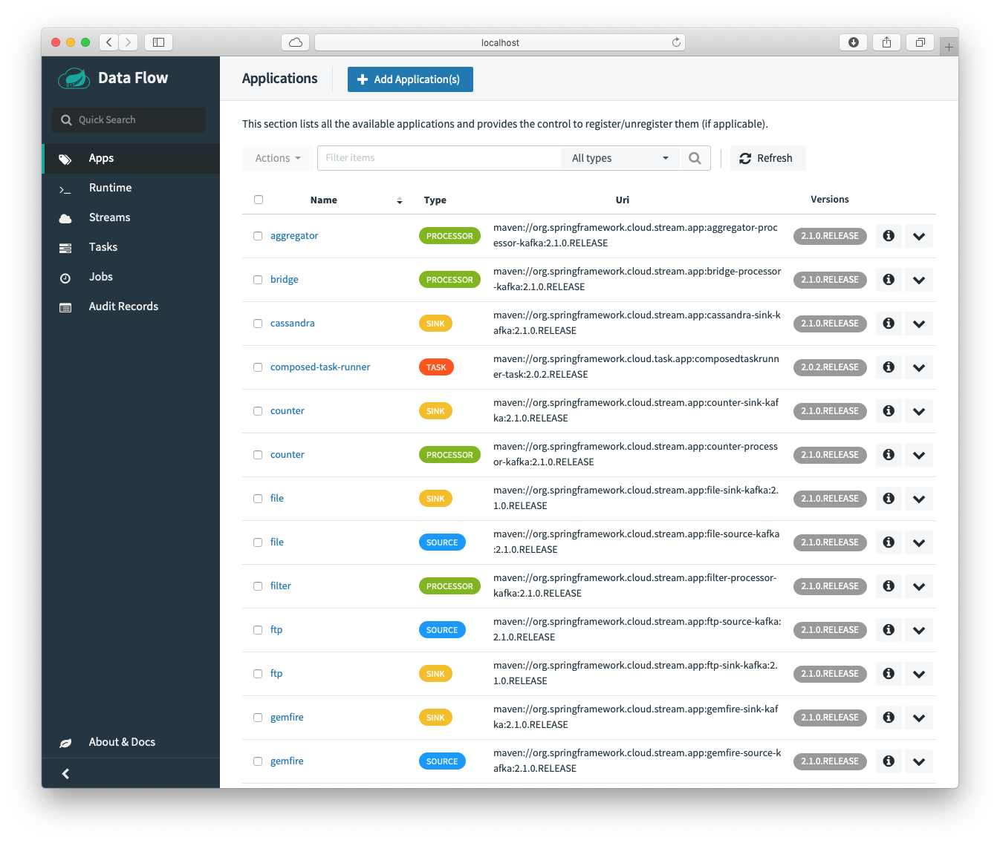
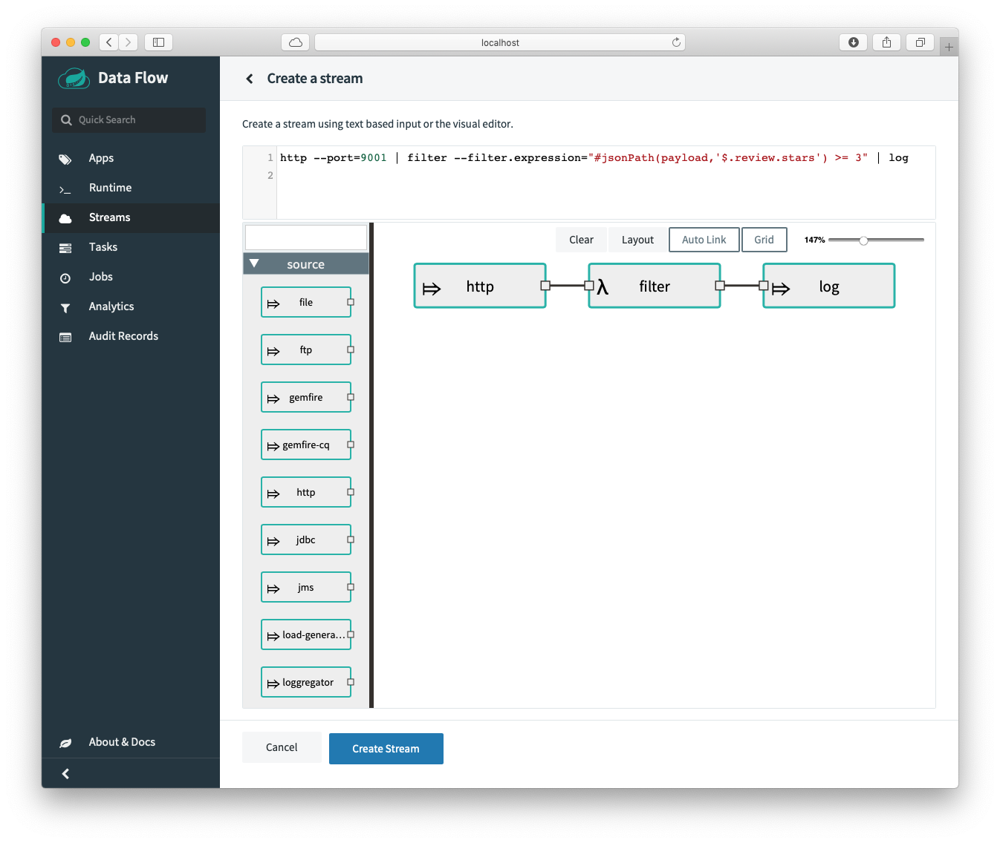
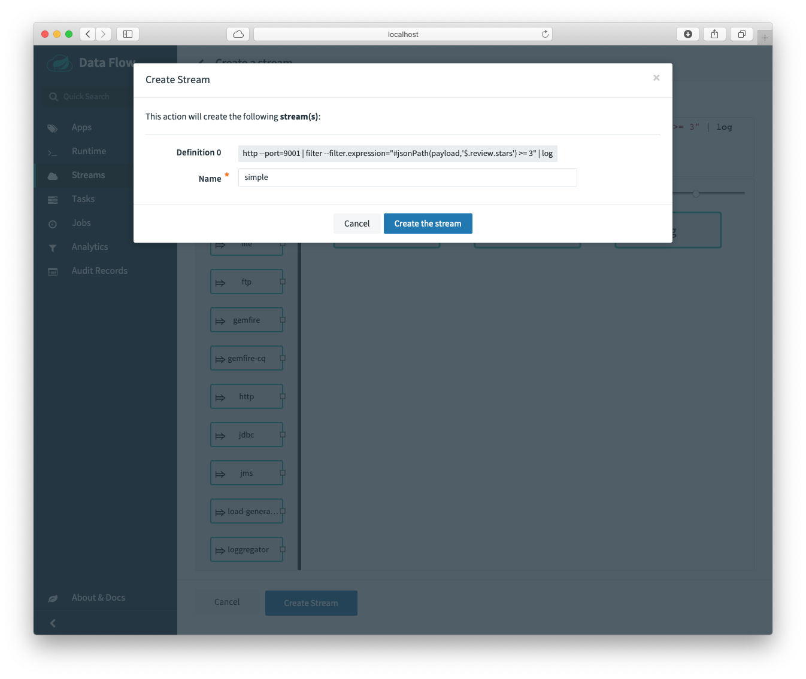
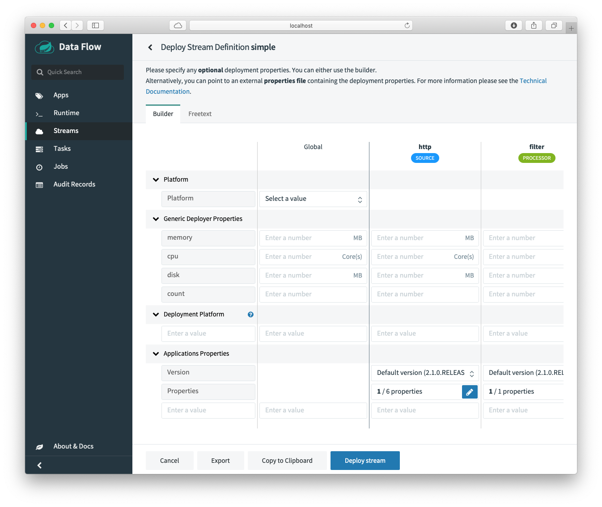

# Spring Cloud Data Flow - Local

In this lab, you will use the Spring Cloud Data Flow as a Local Development.

## **Requirements**

The best way to start with a local development is to use the Docker Desktop or Docker Engine (if you are using Linux). Is necessary to have the `docker-compose` command.

- Install [Docker Desktop](https://www.docker.com/products/docker-desktop)


## Start Spring Cloud Data Flow Server

1. To start the Spring Cloud Data Flow server create the following `docker-compose.yml` file:

   ```yaml
   version: '3'
   
   services:
     kafka:
       image: wurstmeister/kafka:2.11-0.11.0.3
       expose:
         - "9092"
       environment:
         - KAFKA_ADVERTISED_PORT=9092
         - KAFKA_ZOOKEEPER_CONNECT=zookeeper:2181
         - KAFKA_ADVERTISED_HOST_NAME=kafka
       depends_on:
         - zookeeper
     zookeeper:
       image: wurstmeister/zookeeper
       expose:
         - "2181"
     dataflow-server:
       image: springcloud/spring-cloud-dataflow-server:2.0.1.RELEASE
       container_name: dataflow-server
       ports:
         - "9393:9393"
       environment:
         - spring.cloud.dataflow.applicationProperties.stream.spring.cloud.stream.kafka.binder.brokers=kafka:9092
         - spring.cloud.dataflow.applicationProperties.stream.spring.cloud.stream.kafka.binder.zkNodes=zookeeper:2181
         - spring.cloud.skipper.client.serverUri=http://skipper-server:7577/api
         - spring.cloud.dataflow.applicationProperties.stream.management.metrics.export.influx.enabled=true
         - spring.cloud.dataflow.applicationProperties.stream.management.metrics.export.influx.db=myinfluxdb
         - spring.cloud.dataflow.applicationProperties.stream.management.metrics.export.influx.uri=http://influxdb:8086
         - spring.cloud.dataflow.grafana-info.url=http://localhost:3000
       depends_on:
         - kafka
     app-import:
       image: springcloud/openjdk:latest
       depends_on:
         - dataflow-server
       command: >
         /bin/sh -c "
           while ! nc -z dataflow-server 9393;
           do
             sleep 1;
           done;
           wget -qO- 'http://dataflow-server:9393/apps' --post-data='uri=http://bit.ly/Einstein-GA-stream-applications-kafka-maven&force=true';
           echo 'Stream apps imported'
           wget -qO- 'http://dataflow-server:9393/apps' --post-data='uri=http://bit.ly/Dearborn-SR1-task-applications-maven&force=true';
           echo 'Task apps imported'"
     skipper-server:
       image: springcloud/spring-cloud-skipper-server:2.0.0.RELEASE
       container_name: skipper
       ports:
       - "7577:7577"
       - "9000-9010:9000-9010"
   
     influxdb:
       image: influxdb:1.7.4
       container_name: 'influxdb'
       ports:
         - '8086:8086'
   
     grafana:
       image: springcloud/spring-cloud-dataflow-grafana-influxdb:2.0.1.RELEASE
       container_name: 'grafana'
       ports:
         - '3000:3000'
   volumes:
     scdf-targets:
   
   ```

   

2. Execute:

   ```shell
   docker-compuse up
   ```

3. Open a Browser a navigate to: http://localhost:9393/dashboard

   


## Create a Simple Stream

1. In the Dashboard, go to the **Stream** Tab (Left pane) and click the "**+ Create stream(s)**" button.

2. In the text are add the following stream:

   ```groovy
   http --port=9001 | filter --filter.expression="#jsonPath(payload,'$.review.stars') >= 3" | log
   
   ```

   

   Click the "**Create Stream**" button, and add the name to the stream: ***simple***, then click "**Create the stream**" button. 

   

   Then click the ">" deploy stream button. This will show you the next screen:

    

   Click the "Deploy Stream" . This will create 3 micro services, the **http** app (running on port *9001*), the **filter** app and the **log** app.

3. Take a look at the logs of the `docker-compose` and locate the **log** app log. Copy the whole path, because you will neded that in the next step. For example: `/tmp/spring-cloud-deployer-726956403502997341/simple-1552966862875/simple.log-v1`

4. Execute the following command to attach a tail to the log from previous step. Example:

   ```shell
   docker exec -it dataflow-server tail -f  /tmp/spring-cloud-deployer-726956403502997341/simple-1552966862875/simple.log-v1/stdout_0.log
   ```

   Modify it accordingly.

5. Now, you can send some data using the cURL command and see the logs:

   ```shell
   curl -XPOST -H "Content-Type: application/json" -d '{"review":{"topic":"spring","comment":"this is amazing","stars":2}}' http://localhost:9001
   ```


## Challenges

- [ ] Verify that if you send a different "**star**" value if will get filtered.