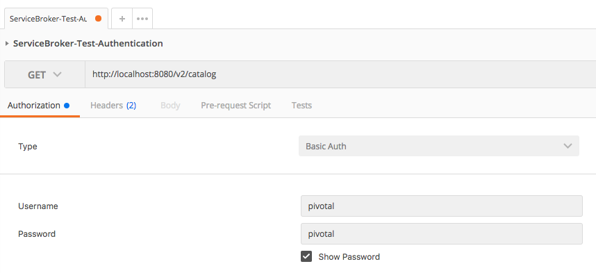
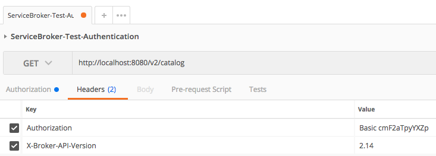

# Creating Your First Service Broker

## Get Service Broker Skeleton Project

1. Install Golang, setup $GOPATH and $GOROOT. Golang has great documentation on how to do this [here](https://golang.org/doc/install).

1. Create a local copy of the service broker API by cloning https://github.com/Pivotal-Field-Engineering/service-broker.
    - `git clone https://github.com/Pivotal-Field-Engineering/service-broker`.

## Run the Service Broker

1. Change directory into the `service-broker` folder.
    - `cd service-broker`

1. Run the Service Broker with golang.
    - `go run main.go`.

**Note:** By default the service broker runs on port `8080` and with basic authentication credentials of `pivotal`/`pivotal`

## View the Service Broker Catalog

Choose one of the following:

- Using `curl` hit the `/v2/catalog` endpoint via `curl -X GET -h '' localhost:8080/v2/catalog`

- Using Postman
    - *AUTH_HEADER* - Username: `pivotal`, Password: `pivotal`
    - *HEADER* - `X-Broker-API-Version`: `2.14`
    - *HTTP TYPE* - `GET`
    - *ADDRESS* - `http://localhost:8080/v2/catalog`
    - 
    - 

