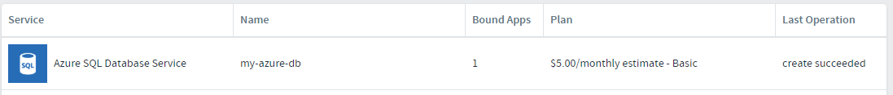

# Bind the Microsoft Azure Service Broker

## Goal

Locate the Azure SQL in the Marketplace and make an instance of it available for binding in your space.

## Prerequisites

- Internet Access
- Web Browser (Chrome, Firefox, Edge, Safari)(Not Internet Explorer)

## Bind the Azure SQL service to your space

1. Open the App Manager website in a browser.

1. Navigate to the "Marketplace" in the left navigation.

1. Local the "Azure SQL Database Service" and click.
  

1. Choose the "Basic" plan and click the "Select This Plan" button.

1. Provide the following for Instance Configuration
  Instance Name: my-azure-db
  Add To Space: <choose your student space>
  Bind To App: [do not bind]

1. Click the "Create" button to create the instance and make it available for binding.

1. Navigate the to the home page of your space and click the "Services" tab. You should see the Azure SQL Database Service listed. Confirm everything as successful by noting the right column message "create succeeded".
  

1. There is no further configuration required! You are ready to consume the database in an application.

## Bind the SQL service to your application

1. Back in Visual Studio, open the `manifest.yml` file by double clicking and add the following to the services section. (create that section if it's not there)
  ```yml
  ...
  services:
    - my-azure-db
  ```

## Complete

You have taken a service offered in the Marketplace and associated an instance of it, with your space. Now apps within the space can bind to the service and this consume it. Let's say you had a "Dev" space and a "QA" space. If you bound the Azure SQL Database Service to each space and named each instance the same, your app could move to either space with no config changes! All it depends on is the serivce to be available for binding, no evironment or web.config dependencies.

By the way using the cf cli, we could have accomplished everything above in powershell with:

```bash
cf create-service azure-sqldb basic my-azure-db
```