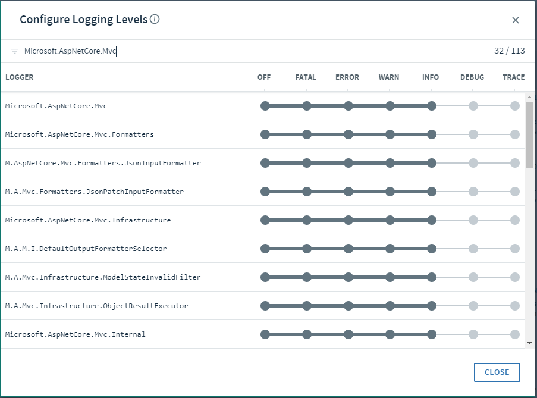
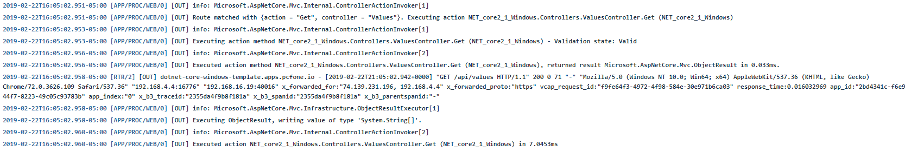

# Steeltoe Dynamic Logging

## Goal

Assuming you have already pushed an app based on the Steeltoe Cloud Foundry templates, this lab will review what additions were made in the project to enable dynamic logging and the automatic benefits in App Manager.

## Prerequisites

- Visual Studio Code
- .Net Core 2.2
- Internet Access
- Web Browser (Chrome, Firefox, Edge, Safari)(Not Internet Explorer)

## Enable Steeltoe dynamic logging

1. Add the `Steeltoe.Management.CloudFoundry` nuget package to the project: `$> dotnet add package Steeltoe.Extensions.Logging.DynamicLogger`

1. Add the following using statement and WebHost configuration to the `Program.cs` file
```cs
using Steeltoe.Extensions.Logging;

...
WebHost.CreateDefaultBuilder(args)
...
    .ConfigureLogging((builderContext, loggingBuilder) => {
        // Add Steeltoe Dynamic Logging Provider
        loggingBuilder.AddDynamicConsole();
    })
```

1. Open the `ValuesController.cs` file in the "Controllers" folder. Add the following line to the constructor to write a log message on class initialization.
  ```cs
  _logger.LogInformation("Hi There");
  ```

  You can write log entries with no special packages, using the C# `Microsoft.Extensions.Logging.ILogger` package. There are options like logging Critical, Error, Warning, Info entries. Because Steeltoe DynamicLogger has been enabled to monitor these custom app logs, everything is written within App Manager and Metrics for review - automatically!

## Discover and use dynamic logging in App Manager

1. Open the App Manager website in a browser.

1. Navigate to your app's home page.

1. Now click the `Logs` tab at the top of the panel.

1. Adjust the logging level by clicking the "Configure Logging Levels" button. This window gives you the ability to turn logging verbosity up or down, depending on the package.
  

  In the above screen shot, logging was enabled for the "Microsoft.AspNetCore.Mvc" package. Now as new requests are made, you can see deeper log detail with every request about how the route template was calculated - see the log entry `Route matched with {action = "Get", controller = "Values"}.` in the below image.
  

## Complete

Dynamic logging is a very powerful tool while in development and even more powerful for production. Now you can turn things up when there's a issue and consume those messages not only in App Manager but also in whatever logging platform the foundation has been provided (splunk, etc). Then turn it back down when everything is ok.
