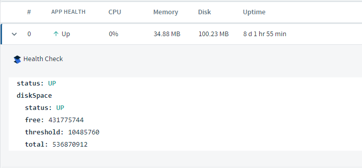
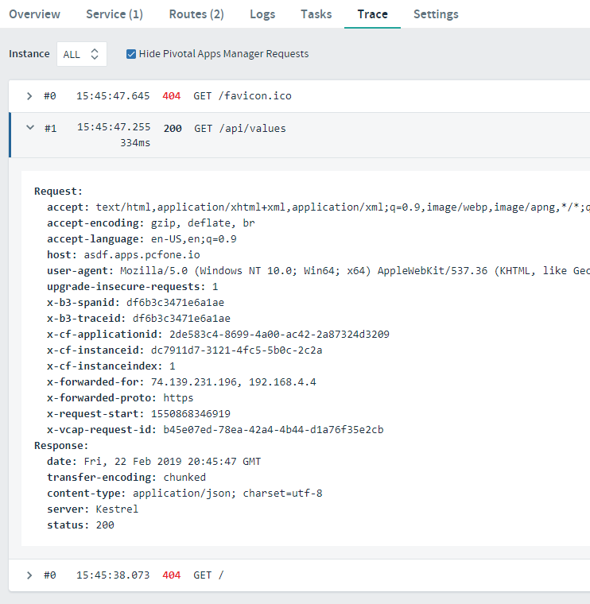
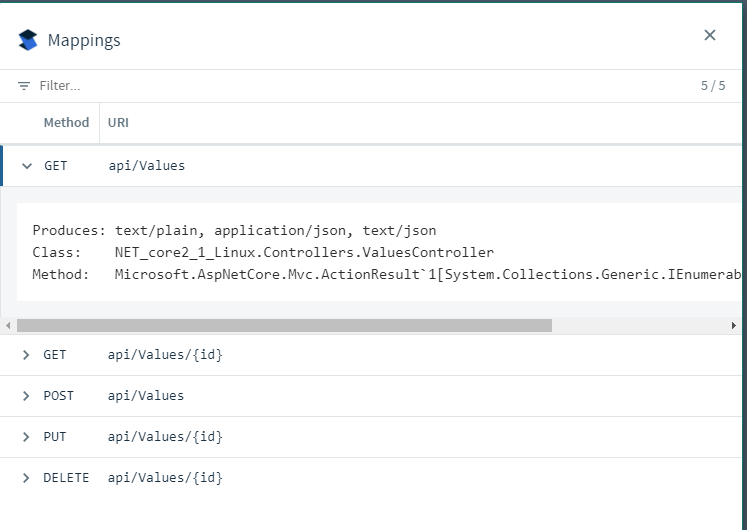

# App Manager with Management Actuators

## Goal

Now that you have pushed an app to the foundation that implments Steeltoe Actuators, lets explore how App Manager makes that data available for debugging and analysis.

## Prerequisites

- Internet Access
- Web Browser (Chrome, Firefox, Edge, Safari)(Not Internet Explorer)

## Discover how App Manager works with each actuator endpoint

1. Open the App Manager website in a browser.

1. Navigate to your app's home page.

1. Notice your app has been given the Steeltoe icon. Congratulations! This is because the app registered CloudFoundry aware endpoints with the platform, so App Manager automatically hooked everything up.

1. On the app's home page, locate the "web" area where your running app instances are listed. Notice there is now an option to expand each app instance to review its health, and the custom health check added previously is listed.
  

1. Now click the `Trace` tab at the top of the panel.

1. If you were to send a few GET requests to the app and refresh this area, you would see a trace of those requests. Information incldes the resulting HTTP status and the Request/Response headers.
  

1. Locate the `Settings` tab at the top of the panel and click.

1. Find the `Mappings` area and click the "View Mappings" button. This will popup a list of all the dicovered routes and route templates within the app. 
  

## Complete

There's one more piece of Steeltoe and it's integrations with App Manager to discover and that's around message logging. The next lab will over that topic.