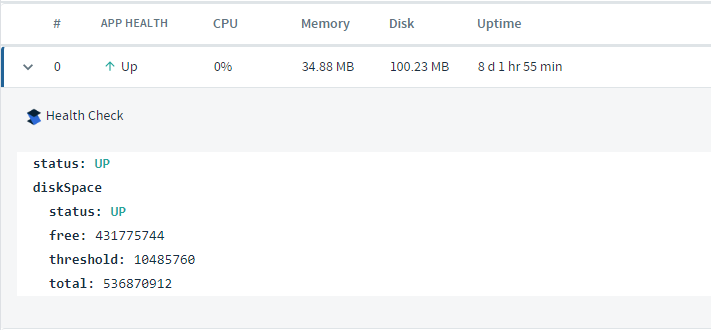
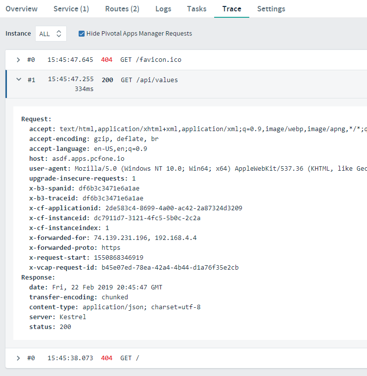
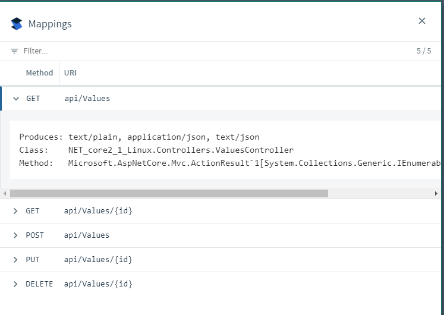

# App Manager with Management Actuators

## Goal

xxxxxxx
This lab assumes a beginning knowledge of App Manager and how to navigate through it.

## Prerequisites

- Internet Access
- Web Browser (Chrome, Firefox, Edge, Safari)(Not Internet Explorer)

## Discover how App Manager works with each actuator endpoint

1. Open the App Manager website in a browser.

1. Navigate to your app's home page.

1. Notice your app has been given the Steeltoe icon! Congratulations! This is because the app registered CloudFoundry aware endpoints with the platform, so App Manager automatically hooked everything up.

1. On the app's home page, locate the "web" area where your running app instances are listed. Notice there is now an option to expand each app instance to review its health, and the custom health check added previously is listed!
  

1. Now click the `Trace` tab at the top of the panel.

1. If you were to send a few GET requests to the app and refresh this area, you would see a trace of those requests that include the resuling HTTP status and the Request/Response headers.
  

1. Locate the `Settings` tab at the top of the panel and click.

1. Find the `Mappings` area and click the "View Mappings" button. This will popup a list of all the dicovered routes and route templates within the app. 
  

1. You can adjust logging levels of the application by going to the `Logs` tab in the top panel, and clicking the "Configure Logging Levels" button. This window gives you the ability turn logging verbosity up or down, depending on the monitored package.
  

In the above screen shot, logging was enabled for the "Microsoft.AspNetCore.Mvc" package. Now as new requests are made, you can see deeper log detail with every request about how the route template was calculated - see the log entry below `Route matched with {action = "Get", controller = "Values"}.`.
