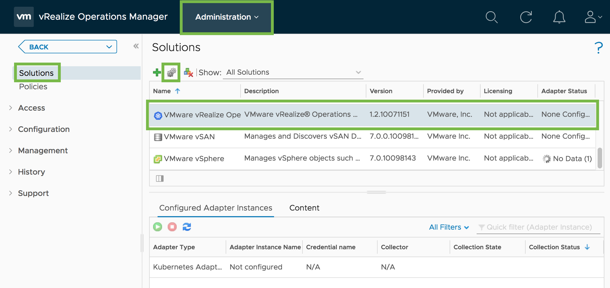
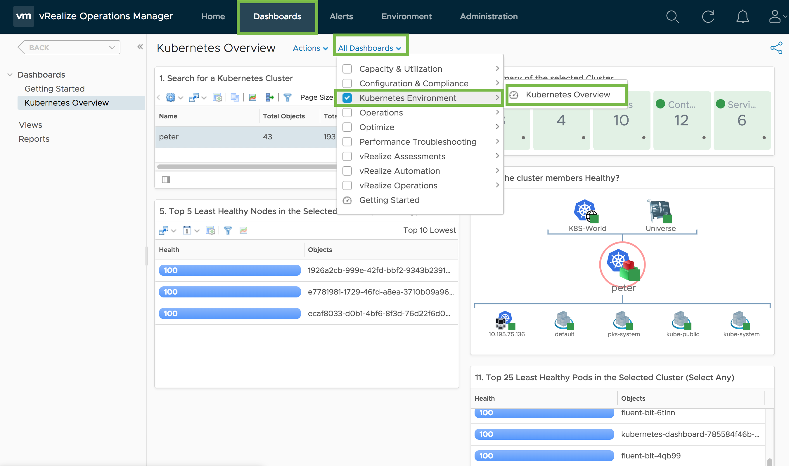

# Kubernetes Monitoring with vRealize Operations

For a operations team to provide production ready Kubernetes clusters a key aspect is monitoring 
and alerting based on the underlying infrastructure (compute,storage & network). This demo is 
focused on using VMware vRealize Operations Manager (vROps) to help with monitoring and alerting 
of exactly this which can be useful when debugging and for visibility for development teams.

## Pre-Requisites

- Pivotal Ops Manager deployed
- Pivotal Director Tile deployed
  - Post-deploy scripts enabled
- Pivotal Container Service Tile
- Kubernetes Cluster deployed 
- VMware vRealize Operations Manager deployed
  - vROps [Management Pack for Container Monitoring](https://marketplace.vmware.com/vsx/solutions/vrealize-operations-management-pack-for-container-monitoring)
- base64 cli installed

## Goal

Monitor PKS and its deployed Kubernetes clusters with vRealize Operations

## Setup vRealize Operations (vROPs) Management Pack For Containers

To monitor individual PKS managed K8S Clusters that have been deployed by PKS, we will need enable and configure vROPs pull metrics from our clusters. Today while adding clusters is manual (and can be pipelined) in future releases this will be automated for us.

### Create a Kubernetes Service Account for vROPs

1. Create a basic Kubernetes `ServiceAccount`, `Role`, and `RoleBinding` similar to below, name it `vrops-service-account.yaml`. Notice we are actually creating two objects with a single yaml file, this is possible by separating each object with `---`. This `ServiceAccount` will have the ability to pull metrics in from our cluster.

    ```yaml
        apiVersion: v1
        kind: ServiceAccount
        metadata:
        name: vrops-service-account
        ---
        kind: ClusterRoleBinding
        apiVersion: rbac.authorization.k8s.io/v1
        metadata:
        name: vrops-service-account-access
        roleRef:
        kind: ClusterRole
        name: cluster-admin
        apiGroup: rbac.authorization.k8s.io
        subjects:
        - kind: ServiceAccount
        name: vrops-service-account
        namespace: default
    ```
    
1. Apply the object to Kubernetes using `kubectl apply -f vrops-service-account.yaml`.

### Obtain the ServiceAccount Bearer Token 

Instead of basic auth vROPs and K8s support the use of bearer tokens for user identification.

1.  When creating the `ServiceAccount` earlier, K8s automatically created a token for the account. Since these tokens are essentially a username/password K8s stores them inside of a `Secret`. First obtain the secret name with `kubectl describe serviceaccounts vrops-service-account`. The `Secret` name identified by the `Tokens:` field will be used in the following step.

        $ kubectl describe serviceaccounts vrops-service-account
            Name:         vrops-service-account
            Namespace:    default
            Labels:       <none>
            Annotations:  kubectl.kubernetes.io/last-applied-configuration={"apiVersion":"v1","kind":"ServiceAccount","metadata":{"annotations":{},"name":"vrops-service-account","namespace":"default"}}

            Image pull secrets:  <none>
            Mountable secrets:   vrops-service-account-token-crwcp
            Tokens:              vrops-service-account-token-crwcp
            Events:              <none>

1. Obtain the `ServiceAccount` bearer token from the `Secret` with `kubectl describe secret <SECRET-NAME>`. The `token` will be used in the following step.

        $ kubectl describe secret vrops-service-account-token-crwcp
            Name:         vrops-service-account-token-crwcp
            Namespace:    default
            Labels:       <none>
            Annotations:  kubernetes.io/service-account.name=vrops-service-account
                        kubernetes.io/service-account.uid=f805692d-d6b1-11e8-833c-005056abc992

            Type:  kubernetes.io/service-account-token

            Data
            ====
            namespace:  7 bytes
            token:      eyJhbGciOiJSUzI1NiIsImtpZCI6IiJ9.eyJpc3MiOiJrdWJlcm5ldGVzL3NlcnZpY2VhY2NvdW50Iiwia3ViZXJuZXRlcy5pby9zZXJ2aWNlYWNjb3VudC9uYW1lc3BhY2UiOiJkZWZhdWx0Iiwia3ViZXJuZXRlcy5pby9zZXJ2aWNlYWNjb3VudC9zZWNyZXQubmFtZSI6InZyb3BzLXNlcnZpY2UtYWNjb3VudC10b2tlbi1jcndjcCIsImt1YmVybmV0ZXMuaW8vc2VydmljZWFjY291bnQvc2VydmljZS1hY2NvdW50Lm5hbWUiOiJ2cm9wcy1zZXJ2aWNlLWFjY291bnQiLCJrdWJlcm5ldGVzLmlvL3NlcnZpY2VhY2NvdW50L3NlcnZpY2UtYWNjb3VudC51aWQiOiJmODA1NjkyZC1kNmIxLTExZTgtODMzYy0wMDUwNTZhYmM5OTIiLCJzdWIiOiJzeXN0ZW06c2VydmljZWFjY291bnQ6ZGVmYXVsdDp2cm9wcy1zZXJ2aWNlLWFjY291bnQifQ.o_QG3m-kmykmWErRHSLZEHNSnS1rNVGwhGuOJQNm5Y8g7atQyQlDxxZcPtqmQj8ZJHzfkkR9EJu4kb9QZ5yJK1PKlxklIseny0h8k5pDN3rrRE-WWSYtnDc2DoyjQIzBMhg6SDvR5qCRbO_mOn8ia3bhWIhoTVY0YBP9RhgeaaOO8gZX-GAXFMqVOkpPxkZcBm1LSANvP6XY5zCmH1kEvKbAP8QCg61rnqTcDRqpVcQIu_-f0_2k-jGSgXcrULxVmjzhdnwoJb5jaam4ZFSJLNQo4asvHycIG9LHdHEu__NZ4kf8Rn0QoiMOzwgfA5qOU6vw_eYIk6nB-wRTeko4Ww
            ca.crt:     1151 bytes

1. Great you have the `ServiceAccount` bearer token! Now if you want a one liner to do everything we just did you're in luck (only on macOS/Linux)! `kubectl describe secret $(kubectl get secret | awk '/^vrops-service-account/{print $1}') | awk '$1=="token:"{print $2}'`

### Setup vROPs

1. If the vROps Management Pack for Containers is not installed, download it here, import it under the Solutions section by clicking on the "+" icon and then select the *.pak file. Follow the wizard for installation instructions.

1. From the vROPs Solutions screen select the container management pack and click on the gear box to add the K8s Cluster to vROPs.

    

1. Enter values for the desired K8s cluster to monitor. 
    - **Master URL:**  PKS deployed K8s master URL `pks cluster <PKS-CLUSTER-NAME>`. Remember the master is only accessible over `https://` and port `8443.
    - **cAdvisor Service:** Kubelet
1. Click the green `+` next to credential to add the `ServiceAccount` bearer token created earlier.
    - **Credential Kind:** Token Auth
    - **Credential Name:** <PKS-CLUSTER-NAME>
    - **Bearer Token:** <SERVICEACCOUNT-TOKEN>

1.  `SAVE SETTINGS` and `CLOSE`!

## Use vRealize Operations for K8s

1. Explore the vRealize integration by clicking `Dashboards -> All Dashboards -> Kubernetes Environments -> Kubernetes Overview`.

    

1. Now you should see the cluster we registered before, the heath of the Nodes, Namespaces, Pods, Containers, and Services. 

1. The data may take some time to populate but overtime you will be able to monitor the performance of the nodes themselves, utilization. and more. 